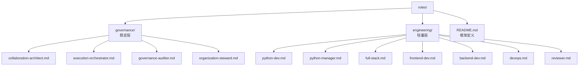

# Roles

本目录承载协作元模型中的 `Role` 实例，用于定义职责模板、默认规则绑定、权限边界和协作期望。

## 双层目录结构

角色按"演化速率与治理强度"分为两层：稳定层（governance）与轻量层（engineering）。

| 层 | 目录 | 定位 | 演化速率 | 准入流程 |
|---|---|---|---|---|
| 稳定层 | `governance/` | 协作语义角色，定义元模型边界与治理职责 | 慢（需审查） | 走 `.agents/workflows/role-review.md` 四道门禁 |
| 轻量层 | `engineering/` | 路由预设/工程角色，随技术栈自由演进 | 快（直接增删） | 直接提交，受 schema 校验 |

### governance/（稳定层）

承载**协作元模型**所定义的稳定角色——它们描述"世界如何治理自身"，与具体技术栈解耦。

- **变更门槛高**：新增/修改/删除须通过 `.agents/workflows/role-review.md` 的四道门禁审批
- **schema 字段** `layer = "governance"`
- **职责示例**：协作架构、执行编排、治理审计、组织代理人

### engineering/（轻量层）

承载**路由预设**——为常见工程意图（前端、后端、Python、DevOps、Code Review 等）准备的轻量角色容器。

- **变更门槛低**：随技术栈自由增删，仅受 `role.schema.json` 校验
- **schema 字段** `layer = "engineering"`
- **职责示例**：python-dev、python-manager、frontend-dev、backend-dev、full-stack、devops、reviewer
- **不承担**协作元模型的语义稳定性责任——这一点由 governance/ 层负责

## 目录边界

- 不存放执行日志
- 不存放临时上下文
- 不直接复制 `skills/` 内容
- 每个角色文件保持声明式语义，不堆叠长篇自由提示词

## 角色文件约定

每个角色文件使用 `+++` 分隔符包裹 TOML 前置元数据（frontmatter），下方为 Markdown 描述正文。

### Frontmatter 字段

| 字段 | 类型 | 必填 | 说明 |
|---|---|---|---|
| `id` | string | 是 | 角色唯一标识（kebab-case），必须与文件名一致 |
| `domain` | string | 是 | 所属领域 |
| `layer` | string | 否 | 所属层（`governance` 或 `engineering`），与目录归属一致 |
| `bindings.rules` | array | 否 | 默认绑定的规则路径列表（相对 `.agents/`） |
| `bindings.references` | array | 否 | 默认绑定的参考文档路径列表 |
| `bindings.skills` | array | 否 | 默认绑定的技能 id 列表 |
| `constraints.rules_must_exist` | boolean | 否 | 治理型角色是否要求绑定规则路径必须存在 |
| `constraints.non_goals_enforced` | boolean | 否 | 治理型角色是否将声明的非目标视为硬约束 |
| `non_goals.items` | array | 否 | 治理型角色的机器可解析非目标列表 |
| `permissions.can_modify` | array | 否 | 可修改的文件 glob 列表 |
| `permissions.cannot_modify` | array | 否 | 禁止修改的文件 glob 列表 |

Markdown body 保留三个节：Description、Responsibilities、Non-Goals。

### Frontmatter 与 body 的职责分界

- **frontmatter** = 机器可解析的声明（`id`、`domain`、`layer`、`bindings`、`constraints`、`non_goals`、`permissions`），供运行时路由和校验工具消费
- **Markdown body** = 人类可读的描述（Description、Responsibilities、Non-Goals），供评审和文档使用
- JSON Schema 校验定义见 `.agents/schemas/role.schema.json`

## 当前角色清单

### governance/（稳定层）

| 文件 | 角色 | 领域 | 状态 |
|---|---|---|---|
| `governance/collaboration-architect.md` | Collaboration Architect | governance+knowledge | 已审查 |
| `governance/execution-orchestrator.md` | Execution Orchestrator | execution | 已审查 |
| `governance/governance-auditor.md` | Governance Auditor | governance | 已审查 |
| `governance/organization-steward.md` | Organization Steward | organization | 已审查 |

### engineering/（轻量层）

| 文件 | 角色 | 领域 | 状态 |
|---|---|---|---|
| `engineering/python-dev.md` | Python Dev | engineering | 占位 |
| `engineering/python-manager.md` | Python Manager | engineering | 占位 |
| `engineering/full-stack.md` | Full Stack | engineering | 占位 |
| `engineering/frontend-dev.md` | Frontend Dev | engineering | 占位 |
| `engineering/backend-dev.md` | Backend Dev | engineering | 占位 |
| `engineering/devops.md` | DevOps | infrastructure | 占位 |
| `engineering/reviewer.md` | Reviewer | governance | 占位 |

## 审查流程

`governance/` 层新增/修改角色须通过 `.agents/workflows/role-review.md` 定义的四道门禁审批。提案模板见 `.agents/workflows/role-review/templates/proposal.md`。

`engineering/` 层角色仅受 `role.schema.json` 校验，可直接增删。

当前 governance 层四个角色已通过试运行自审查，审查记录见 `.agents/workflows/role-review/verification/`。
