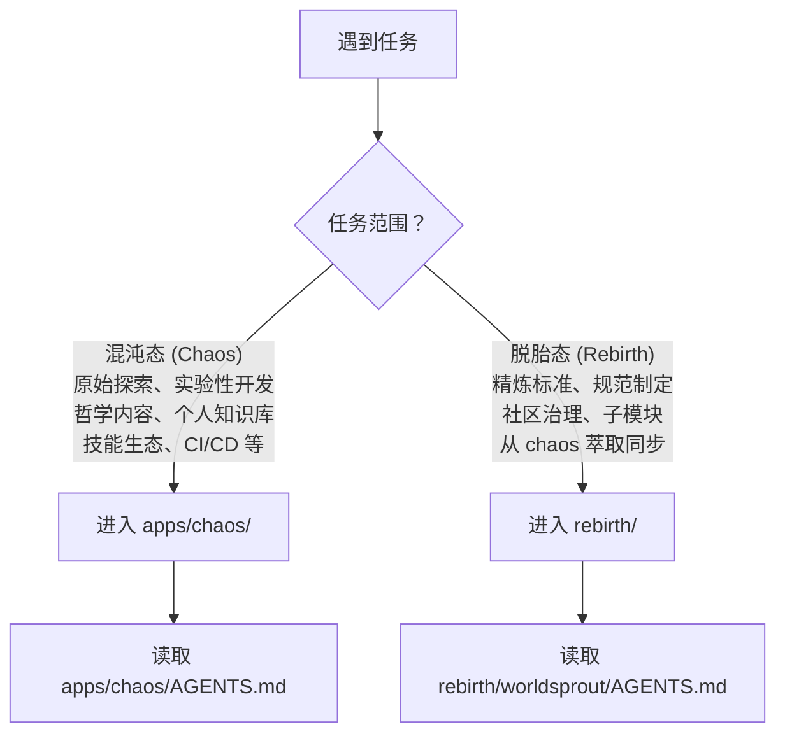

# 上下文路由规则

本文档定义 AgentForge 仓库中 AI 智能体的任务路由策略：根据任务类型选择正确的工作区，并按优先级顺序读取对应的规范文件。

## 1. 工作区选择

## 2. 嵌套 AGENTS.md 规则

AGENTS.md 标准支持嵌套，"就近优先"——子项目 AGENTS.md 覆盖根级 AGENTS.md。当你在 `apps/chaos/` 内工作时，优先遵循 `apps/chaos/AGENTS.md`。

## 3. 详细路由表

| 任务类型 | 工作区 | 必读入口 |
|---|---|---|
| **chaos 内所有开发/探索任务** | `apps/chaos/` | `apps/chaos/AGENTS.md` |
| Python 开发、依赖管理、taolib 代码 | `apps/chaos/` | `apps/chaos/AGENTS.md` → `.agents/rules/python.md` |
| 文档新增、归档、迁移、目录边界 | `apps/chaos/` | `apps/chaos/AGENTS.md` → `.agents/rules/documentation.md` |
| 技能开发或技能规范调整 | `apps/chaos/` | `apps/chaos/AGENTS.md` → `.agents/rules/skills.md` |
| 协作元模型、Role/Team 定义、多智能体规范 | `apps/chaos/` | `apps/chaos/AGENTS.md` → `.agents/docs/references/agent-collaboration-metamodel.md` |
| 上下文节省、token 优化 | `apps/chaos/` | `apps/chaos/AGENTS.md` → `.agents/rules/context-economy.md` |
| CI/CD 流水线、构建配置 | `apps/chaos/` | `.github/workflows/ci.yml`、`apps/chaos/pyproject.toml` |
| **AgentForge Spec 规范查阅、Layer 归属判断** | `apps/chaos/` | `apps/chaos/specs/agentforge-spec-v0.2.md` |
| **从 chaos 萃取内容同步至 rebirth** | 跨区 | 先确认 chaos 中内容已稳定 → 按脱胎规则处理 → 同步至对应 rebirth 子模块 |
| **WorldSprout 规范制定、脱胎迁移** | `rebirth/` | `rebirth/README.md`、`rebirth/worldsprout/AGENTS.md` |
| **WorldSprout 子模块管理** | `rebirth/` | `rebirth/README.md` |
| **项目复盘、脱胎历史查阅** | `rebirth/` | `rebirth/RETROSPECTIVE.md` |
| **容器化环境、PDF 工具评估** | `apps/chaos/` | `apps/chaos/AGENTS.md` → `.agents/rules/containerization.md` |

## 4. 相关规则

- 全局核心原则见 [`.agents/rules/core-principles.md`](core-principles.md)
- 上下文节省策略见 [`.agents/rules/context-economy.md`](context-economy.md)
- 世界层级嵌套规则见 [`.agents/rules/world-hierarchy.md`](world-hierarchy.md)
