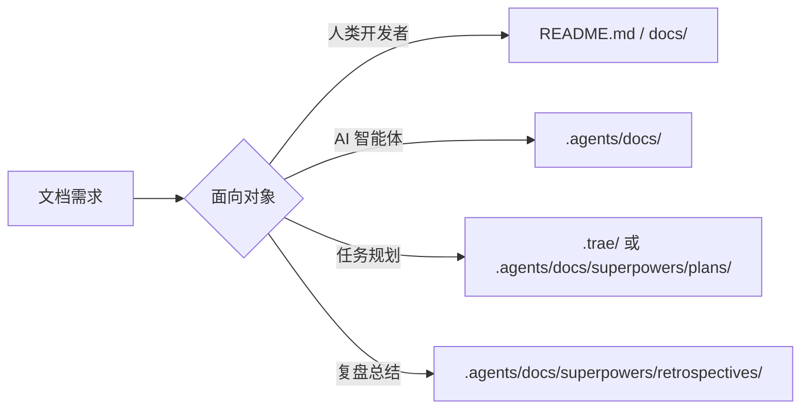

# 文档治理规则

本文档定义项目中文档边界、归档位置、临时产物和同步机制。处理文档相关任务时，应先判断文档面向对象和生命周期，再选择写入位置。

## 1. 文档边界



- `README.md` 与 `docs/` 面向人类开发者。
- `.agents/docs/` 面向 AI 智能体，用于知识库、架构分析、参考资料和长期沉淀。
- `.agents/rules/` 面向 AI 智能体，用于高频执行规则。
- `.agents/workflows/` 面向 AI 智能体，用于流程化任务指南。

## 2. 归档规则

| 文档类型 | 归档位置 |
|---|---|
| 技能设计 spec | `.agents/docs/superpowers/specs/<skill-name>/` |
| 通用技术方案 | `.agents/docs/` 下对应主题目录 |
| 实施计划 | `.agents/docs/superpowers/plans/` |
| 复盘报告 | `.agents/docs/superpowers/retrospectives/` |
| AI 参考资料 | `.agents/docs/references/` 或 `.agents/docs/sources/` |
| 人类说明文档 | `README.md` 或 `docs/` |

### 2.1 命名审计

向正式目录新增文件或目录时，在写入前必须执行一步命名审计：**扫描目标目录下的既有命名模式，确保新增项的命名风格与之对齐**。

具体操作：
- 目录名：检查同层目录是否使用英文 kebab-case（如 `agents-design-system/`、`five-dimension-review-framework/`）。禁止使用中文目录名以避免跨平台路径问题。
- 文件名：检查同层文件的命名模式（如 `task-summary-{topic}-{date}.md`、`{topic}-{date}.md`），新增文件遵循既有模式。

**来源**：`task-summary-framework-archive-20260611.md` 复盘记录。初次归档时因未执行命名审计，导致中文文件名写入正式目录，后续需重命名修正。

**自检锚点**：在每次 `Write` 工具调用正式目录之前，必须自问以下两个问题并显式自答（将答案写入本次 tool call 的理由/说明中）：

1. 文件名是否包含非 ASCII 字符（中文、emoji 等）？—— **必须为纯 ASCII**。
2. 文件名格式是否与同层既有文件一致？—— 如不一致，须说明理由。

这两问的目的是将命名审计从"扫描目录"的认知重操作转化为"自问自答"的认知轻操作。扫描目录可能因认知负荷被跳过，但两个问题的回答成本极低、难以忽略。

**违规记录**：`task-summary-rename-and-rule-evolution-20260611.md` 复盘报告。§2.1 写入后同一会话中即被违反——生成了中文命名的 `task-summary-命名规范化与规则演化-20260611.md`，后修正。说明规则在长会话中仅靠"写入前扫描目录"不足以形成拦截，需要本段自检锚点作为补充。

### 2.2 文件去重

当发现疑似重复文件需合并删除时，在删除操作前必须执行**结构级等价性验证**——禁止仅依靠关键词匹配或主题相似性判断"已覆盖"。

具体操作：
1. 列出两文件的所有一级/二级标题，逐节确认对应关系。
2. 对每项比对结果分类：✅ 完全覆盖 / ⚠️ 部分覆盖（需合并） / ❌ 缺失（禁止删除）。
3. 仅当所有项均为 ✅ 时，方可直接删除冗余文件；存在 ⚠️ 的项必须先完成内容合并，再删除；存在 ❌ 的项则不可删除。

**自检锚点**：在每次因"内容重复"而删除文件之前，必须自问并显式自答：
1. 目标文件的每个章节是否在保留文件中存在**同等深度**的对应内容？—— 关键词提及 ≠ 章节级覆盖。
2. 保留文件中是否存在目标文件**完全没有**的章节或结构化数据（表格、清单、列表、代码块等）？—— 独有结构化数据尤其容易遗漏。

若任一问题答案为"否"，则必须先合并再删除。

**来源**：`task-summary-rename-and-rule-evolution-20260611.md` 延伸。在 python315-adaptation 双文件合并中，因仅做关键词匹配（`grep "核心语言特性"` 命中背景描述行）就判定"已覆盖"，忽略了 §4「关键发现」的章节级差异（PEP 价值评估表、标准库影响分析、CVE 清单），导致合并遗漏，后经用户指出才补全。

## 3. 临时产物

任务执行过程中产生的中间文件、调试输出、缓存数据、截图、测试草稿和一次性脚本应放入 `.temp/`。

`.temp/` 内容为临时性质，任务结束后可安全清理。不得将 `.temp/` 中的文件作为长期文档引用目标。

**浏览器代理截图**：调度浏览器代理时，截图输出路径必须显式指定为 `.temp/{task}-{序号}.png`（如 `.temp/zhihu-dev-01.png`）。禁止依赖代理默认路径，否则截图将落到根目录污染项目结构。详见 `.agents/rules/browser-agent.md`。

## 4. 复盘闭环

复盘报告不应只记录执行结果，还应驱动可复用资产沉淀。

复盘任务完成时，应检查是否至少产出以下一种可复用资产：

- 高频执行规则：写入 `.agents/rules/`。
- 流程化任务指南：写入 `.agents/workflows/`。
- 可复用命令、检查清单或风险清单：写入对应规则、工作流或复盘报告。
- 长期案例材料：归档到 `.agents/docs/superpowers/retrospectives/`。

若复盘建议已被执行，应同步更新复盘报告状态，区分“建议”“已完成”“仍需跟踪”。`.temp/` 中的复盘或交付物若需要长期保留，必须迁移到正式文档目录后再作为引用目标。

## 5. 路径与引用

- 项目内引用必须使用相对路径。
- 持久化文档中禁止写入本地绝对路径或包含个人用户名的路径。
- 外部资料优先引用官方永久链接。
- 临时抓取文件、临时日志和中间产物不得作为长期引用来源。

## 6. 双向同步

当 `AGENTS.md`、`.agents/README.md` 或 `.agents/` 目录结构发生结构性变化时，应评估是否需要同步更新面向人类的 `README.md` 或 `docs/`。

同步判断标准：

- 是否改变了项目入口说明。
- 是否改变了目录职责或导航路径。
- 是否影响人类开发者理解项目结构。
- 是否只是 AI 内部规则微调。

仅 AI 内部规则微调通常不需要更新人类文档；若变更影响项目公共说明，则应同步更新。

## 7. 真实源与镜像页

部分文档同时存在于"真实数据源"与"Sphinx 镜像页"两类位置，应明确区分：

| 类别 | 位置示例 | 性质 | 编辑约束 |
|---|---|---|---|
| **真实源 (SSOT)** | `tests/project_changelogs/CHANGELOG_<年月>.md`、`.agents/skills/<skill>/CHANGELOG.md` | 实际编辑与维护点 | ✅ 仅在此处编辑变更内容 |
| **Sphinx 镜像页** | `docs/tech/changelogs/<topic>.md` | 通过 `{include}` 引用真实源进行文档站渲染 | ❌ 禁止直接编辑内容；仅维护 include 路径与标题 |
| **导航索引页** | 根 `CHANGELOG.md`、`docs/tech/changelog.md` | 指向真实源或镜像页的入口表格 | ⚠️ 修改时遵循「指向规则」 |

### 7.1 指向规则

- **根目录索引**（`CHANGELOG.md`、`README.md`）→ 必须指向**真实源**，确保 GitHub 浏览体验直达数据。
- **Sphinx 站内索引**（`docs/tech/changelog.md`）→ 指向同站镜像页（相对路径），借助 Sphinx 渲染管线。
- **同一字段不要同时挂两条链接**，避免维护双份引用。

### 7.2 新增镜像页流程

为新模块新增变更日志时：

1. 在真实源位置创建 `CHANGELOG.md`（或月度文件）。
2. 在 `docs/tech/changelogs/<topic>.md` 创建镜像页，仅含一级标题 + `{include}` 块。
3. 在 `docs/tech/changelog.md` 索引表追加镜像页相对路径。
4. 在根 `CHANGELOG.md` 索引表追加**真实源**绝对/相对路径。
5. 在 `docs/tech/changelog.md` 顶部 `toctree` 中登记镜像页。

### 7.3 禁止事项

- ❌ 不得在根 `CHANGELOG.md`、`README.md` 中将链接指向 `docs/tech/changelogs/` 镜像页。
- ❌ 不得在 `docs/tech/changelogs/<topic>.md` 镜像页中直接添加变更内容（应改写真实源）。
- ❌ 不得删除真实源而仅保留镜像页，会导致 Sphinx 构建失败。

## 8. `docs/` 双轨分类

`docs/` 下采用「项目技术文档」与「通用知识」双轨分类，两类内容物理隔离、互不混入：

| 子目录 | 承载内容 | 边界 |
|---|---|---|
| `docs/tech/` | 项目源码相关：API 参考、集成指南、部署、构建约定、变更日志等 | 与本项目源码/工程化直接相关 |
| `docs/general/` | 通用知识：传统文化（如《道德经》映射）、数学、跨学科常识等 | 与项目无直接耦合，但对协作或开发哲学有滋养 |

### 8.1 入口结构

- `docs/index.md` 是父入口，仅引用两个子入口（嵌套 toctree）。
- `docs/tech/index.md` 与 `docs/general/index.md` 是子入口，各自展开自己的 toctree。
- 子入口 **不得带 `orphan: true`**，必须进入主导航。

### 8.2 新增文档流程

1. 判定归属类目（技术 / 通用）。
2. 放入对应子目录（必要时按领域再建子目录，如 `philosophy/`、`math/`）。
3. 在所在目录的 `index.md` 的 `toctree` 中追加文档名（**不带子目录前缀**，因为 toctree 项相对当前 `index.md` 解析）。
4. 不得直接在 `docs/index.md` 父级 toctree 中添加业务文档。

### 8.3 边界隔离原则

- 技术资产（源码、配置、API、构建与发布）严禁进入 `docs/general/`。
- 通用知识（哲学、数学、传统文化）严禁进入 `docs/tech/`。
- 跨轨互链使用相对路径（如 `../tech/index.md` ↔ `../general/index.md`）。

### 8.4 `general/` 子目录命名约定

为防止 `docs/general/` 发散后出现命名分歧，统一采用「单数英文小写 · 学科/领域名 · 不缩写」三原则：

| 子目录 | 承载内容 | 状态 |
|---|---|---|
| `philosophy/` | 哲学与传统文化（帛书《道德经》、《周易》等） | ✅ 已使用 |
| `math/` | 算法、概率、信息论、范畴论 | 预留 |
| `linguistics/` | 语言学、术语对照、词源 | 预留 |
| `history/` | 历史与制度沿革 | 预留 |
| `science/` | 跨学科科学常识 | 预留 |

- 允许在领域子目录内再嵌套主题子目录（如 `philosophy/daoism/`、`math/probability/`）。
- 禁止使用缩写（`phil/`、`ling/`）或复数名（`philosophies/`）。
- 禁止使用中文目录名（`哲学/`）以避免跨平台路径问题。
- 超出上述领域表的新领域需在本节补充后再使用。

## 9. MyST 跨目录引用三段式校验

在 `docs/` 内进行文档迁移、重命名或跨目录互链时，必须分别校验三类引用——它们的解析规则不同：

| 引用类型 | 路径解析 | 跨 docs 树外文件 | 典型陷阱 |
|---|---|---|---|
| `{doc}` 指令 | docname（无后缀），相对当前文档目录或源根 | ❌ 不允许 | 跨目录后绝对/相对 docname 易混淆 |
| `{include}` 指令 | 文件系统相对路径 | ✅ 允许 | 上移/下移目录后 `../` 层级需调整 |
| Markdown hyperlink | 必须指向 docs 源树内的 `.md` 文档 | ❌ 触发 `myst.xref_missing` | `.agents/`、`src/` 等树外文件不能用 hyperlink |

### 9.1 跨 docs 树外文件的引用约定

- ❌ 禁止：`[规则](.agents/rules/context-economy.md)` —— 触发 `myst.xref_missing`。
- ✅ 推荐：内联代码 `` `.agents/rules/context-economy.md` ``。
- ✅ 推荐：纯路径文本（不加链接）。

### 9.2 迁移后需同步调整的引用点

| 场景 | 校验动作 |
|---|---|
| 文档上移一层目录 | `{include}` 路径 `../` 层级 -1 |
| 文档下移一层目录 | `{include}` 路径 `../` 层级 +1 |
| 跨目录互链 `.md` | 确认目标仍在 docs 树内；否则改为内联代码 |
| `{doc}` 引用 | 首选相对当前目录的 docname（如 `<api/taolib/index>`而非 `<tech/api/...>`）|

### 9.3 已知工具链兼容性

- `{contents}` 指令在 mystx 5.1 + Sphinx 9.1 下触发 `KeyError: 'anchorname'`，应直接移除，由章节标题自然导航替代。
- mermaid 代码栅栏应使用 `` ```{mermaid} `` 指令式写法，避免 Pygments lexer 缺失警告。
- 跨目录迁移后必须运行 `mise run docs-strict` 即时验证，不让警告积累。

### 9.4 中文标题锚点规则

- **强制**：所有中文标题必须使用显式 MyST 锚点 `(锚点名)=`，不可依赖自动 slug。
- **原因**：中文标题自动 slug 化行为不可预测，跨文档 `{ref}` 引用会因 slug 不匹配而失败。
- **格式**：

  ```markdown
  (my-anchor-name)=
  ## 我的中文标题
  ```

- **跨文档引用**：使用 `{ref}` 角色而非 `#slug` 形式：

  ```markdown
  详见 {ref}`my-anchor-name`
  ```

- **命名约定**：锚点名使用英文小写 + 连字符（kebab-case），语义应与标题含义对应。

## 10. AutoAPI 输出路径与嵌套 toctree 口径

### 10.1 AutoAPI 输出路径

- `docs/conf.py` 中 `autoapi_root` 决定 sphinx-autoapi 的输出位置，应与技术文档子目录路径对齐：`autoapi_root = "tech/api"`。
- API 生成产物位于 `docs/tech/api/`，必须在 `.gitignore` 中排除，不得提交进仓。
- 调整 `autoapi_root` 后无需手工迁移生成产物，下次构建会自动重生成。

### 10.2 嵌套 toctree docname 口径

| 位置 | toctree 项写法 | 例 |
|---|---|---|
| `docs/index.md`（父入口） | 相对源根 | `tech/index`、`general/index` |
| `docs/tech/index.md`（子入口） | 相对当前目录（**不加 `tech/` 前缀**） | `intro`、`api/taolib/index` |
| `docs/general/index.md`（子入口） | 相对当前目录（**不加 `general/` 前缀**） | `philosophy/tao-minimalist-principles` |

### 10.3 README → index 升级时机

- 占位 README（`orphan: true`）适用于骨架预设阶段。
- 一旦目录有正式内容并需要进入主导航，应升级为 `index.md`：重命名同时移除 `orphan: true` 并加入子 `toctree`。
- 不允许 README.md 与 index.md 同时存在于同一子目录（避免入口歧义）。
