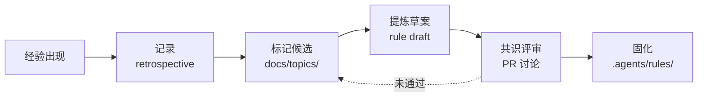
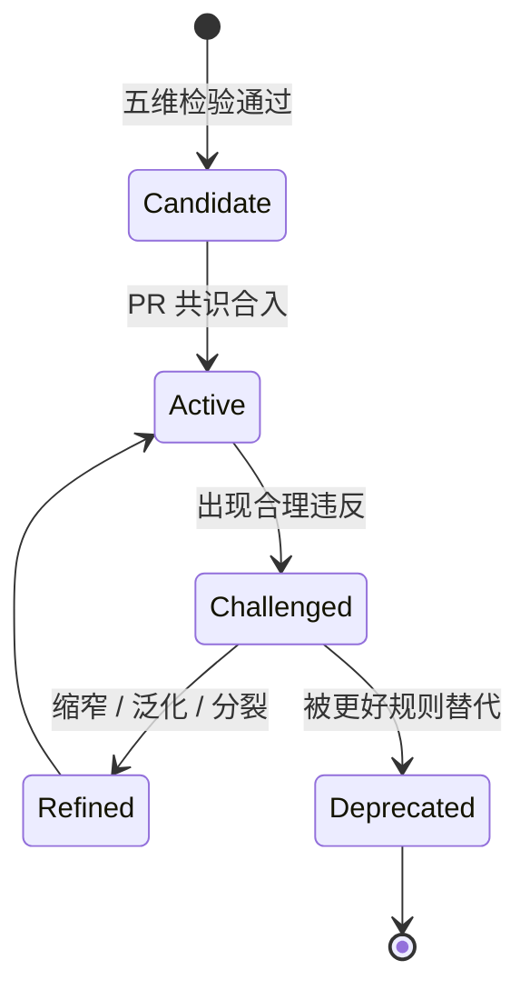

---
paths:
  - ".agents/rules/**"
  - "docs/topics/**"
---

# 规则演化与生长通道

本文档定义经验上升为规则的准入标准（生长通道）以及规则自身的演化机制（元规则），用于约束 `.agents/rules/` 与 `docs/topics/` 之间的双向流动。

## 1. 生长通道准入标准

并非所有经验都应固化为规则。一条经验只有同时通过**五维准入检验**，才允许进入 `.agents/rules/`。

### 1.1 五维准入检验

| 维度 | 问题 | 判定标准 | 反例 |
|------|------|---------|------|
| 频率 | 是否反复出现？ | **≥ 3 次独立触发** | 仅偶然遇到一次 |
| 普适性 | 跨人 / 跨场景是否仍有效？ | **不依赖特定个体偏好** | "我习惯把 import 写两行" |
| 可执行性 | 能否写成明确约束？ | **MUST / MUST NOT / SHOULD 句式** | "代码要写得优雅" |
| 无害性 | 是否阻碍创新？ | **只约束已知反模式，不预设解法** | "所有对象必须用工厂模式" |
| 可验证性 | 违反时能否检测？ | **CI / review / 自动化脚本可查** | "要有全局视野" |

> 五维**全部满足**方可进入候选；缺一即应停留在 `docs/topics/` 经验层。

### 1.2 操作流程

| 阶段 | 产物位置 | 退出条件 |
|------|---------|---------|
| 记录 | `.temp/` 或 retrospective | 触发次数累积 ≥ 3 |
| 标记 | `docs/topics/` | 五维检验初判通过 |
| 提炼 | PR 中的草案文件 | 句式可机读，路径范围清晰 |
| 共识 | PR review | 至少一名核心维护者批准 |
| 固化 | `.agents/rules/*.md` | 含 frontmatter `paths` 与交叉引用 |

### 1.3 反模式（不应上升为规则）

- **个人风格偏好**：缩进、命名喜好等无客观对错的项。
- **一次性救火经验**：仅适用于某次事故的 workaround。
- **预设解法**：强制使用某种设计模式或库，而非约束反模式。
- **无法检测的口号**：如"保持优雅""注意性能"。
- **绑定具体人 / 时间**：如"X 离职前的临时约定"。

## 2. 元规则：规则如何演化

### 2.1 三条元规则

| 元规则 | 内容 | 哲学依据 |
|--------|------|---------|
| **慢变原则** | 宇宙层（Kernel）规则变更周期 **≥ 10x** 世界层迭代周期 | 治大国若烹小鲜 |
| **替代原则** | **不可简单删除**，只能用更好的规则替代或显式标记 deprecated | 有生于无 |
| **溯源原则** | 每条规则必须**可追溯到具体世界层教训**（链接 retrospective / topic） | 道法自然 |

### 2.2 规则生命周期

### 2.3 演化触发条件

进入 `Challenged` 状态并启动演化，需**同时满足**：

- 规则与现实持续冲突，**合理违反 ≥ 5 次**。
- 社区 / 团队形成共识，**非单人决策**。
- 存在**明确的替代方案**或更精细的边界划分。

### 2.4 演化方式

| 方式 | 含义 | 典型场景 |
|------|------|---------|
| **缩窄** | 通过 `paths` 或前置条件收紧适用范围 | 规则在边缘场景产生噪声 |
| **泛化** | 抽象出更上位的约束，覆盖多条同源规则 | 多条规则重复表达同一意图 |
| **废弃** | 标记 `deprecated` 并指向替代规则，**保留链接** | 被新规则完全包含 |
| **分裂** | 拆分为多条带条件的子规则 | 单一规则承载了互斥意图 |

## 3. 哲学映射

> **为学日益，为道日损。**

- **为学日益**：经验在 `docs/topics/` 持续累积，对应生长通道的"加法"。
- **为道日损**：规则在 `.agents/rules/` 通过演化不断收敛精炼，对应元规则的"减法"。

加减之间，规则系统保持自指稳定（Ψ=Ψ(Ψ)）：经验喂养规则，规则反哺经验筛选。

## 参见

- [`world-hierarchy.md`](world-hierarchy.md)
- [`core-principles.md`](core-principles.md)
- [`../../../../docs/topics/code-architecture-insights.md`](../../../../docs/topics/code-architecture-insights.md)
