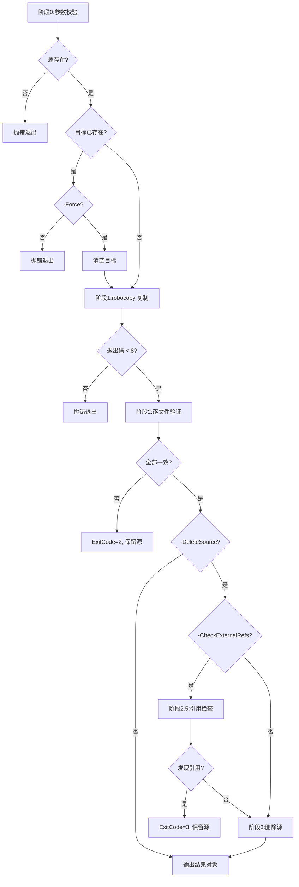

# Archive Folder Skill

## Skill Name

`archive-folder`

## 功能描述

本 Skill 实现 **"Windows 文件归档三段式"** 方法论,提供可验证、可回滚、可审计的文件夹归档能力:

1. **复制阶段**:使用 `robocopy /E /COPY:DAT /DCOPY:DAT` 保留目录结构、文件属性、时间戳与空目录
2. **验证阶段**:逐文件对比 `Size` + `LastWriteTime`,可选 `SHA256` 哈希校验
3. **引用检查阶段**(可选):删除源之前,扫描指定范围检查是否有外部文件引用源内资源,避免误删被引用的文件
4. **清理阶段**:验证通过且引用检查通过后,可选删除源文件夹(失败时绝不删除)

适用于:文档资产归档、备份迁移、版本发布物归档、`.archive/` → `docs/` 资产提升等场景。

## 快速开始

`{baseDir}` 是 agent 框架在运行时自动替换的变量,指向当前 skill 目录的绝对路径。

### 基础归档(保留源)

```powershell
powershell -ExecutionPolicy Bypass -File "{baseDir}/scripts/Archive-Folder.ps1" -Source "D:\work\react-survey" -Destination "D:\archive\docs"
```

### 归档 + 删除源

```powershell
powershell -ExecutionPolicy Bypass -File "{baseDir}/scripts/Archive-Folder.ps1" -Source "D:\work\react-survey" -Destination "D:\archive\docs" -DeleteSource
```

### 关键资产归档(带 SHA256 校验)

```powershell
powershell -ExecutionPolicy Bypass -File "{baseDir}/scripts/Archive-Folder.ps1" -Source "D:\critical" -Destination "D:\backup" -IncludeHash -DeleteSource
```

### 归档 + 引用检查 + 删除源(推荐用于项目内归档)

```powershell
powershell -ExecutionPolicy Bypass -File "{baseDir}/scripts/Archive-Folder.ps1" -Source "D:\project\module-a" -Destination "D:\project\archive" -DeleteSource -CheckExternalRefs -RefCheckRoot "D:\project"
```

### 预演模式(不实际执行)

```powershell
powershell -ExecutionPolicy Bypass -File "{baseDir}/scripts/Archive-Folder.ps1" -Source "D:\src" -Destination "D:\dst" -WhatIf
```

## 输入输出参数定义 (I/O Parameters)

### 输入 (Input)

| 参数 | 类型 | 必填 | 默认值 | 说明 |
|---|---|---|---|---|
| `-Source` | string | ✅ 是 | — | 源文件夹绝对路径,必须存在 |
| `-Destination` | string | ✅ 是 | — | 目标父目录绝对路径,脚本会在其下创建与 Source 同名的子目录 |
| `-DeleteSource` | switch | ❌ 否 | `$false` | 验证通过后删除源文件夹 |
| `-IncludeHash` | switch | ❌ 否 | `$false` | 额外进行 SHA256 哈希校验(更严格但更慢) |
| `-Force` | switch | ❌ 否 | `$false` | 若目标子目录已存在,先清空再归档 |
| `-CheckExternalRefs` | switch | ❌ 否 | `$false` | 删除源之前,扫描 `-RefCheckRoot` 检查是否有外部文件引用源内资源 |
| `-RefCheckRoot` | string | ❌ 否 | Source 父目录 | 外部引用检查的扫描根目录,仅在 `-CheckExternalRefs` 启用时生效 |
| `-WhatIf` | switch | ❌ 否 | `$false` | 仅预演,不实际执行复制和删除 |

**Destination 语义**:Destination 是**父目录**,最终归档路径为 `Join-Path $Destination (Split-Path $Source -Leaf)`。例如 `-Source "D:\a\react-survey" -Destination "D:\docs"` 会归档到 `D:\docs\react-survey`。

### 输出 (Output)

脚本返回一个 `PSCustomObject`,同时输出结构化日志到 stdout:

```powershell
[PSCustomObject]@{
    Source          = "D:\work\react-survey"      # 源路径
    Destination     = "D:\archive\docs"            # 目标父目录
    TargetPath      = "D:\archive\docs\react-survey" # 实际归档路径
    FilesCopied     = 14                            # 复制文件数
    DirsCopied      = 4                             # 复制目录数
    BytesCopied     = "5.37 MB"                     # 复制字节数(可读格式)
    Verified        = $true                         # 验证是否通过
    Mismatches      = @()                           # 不一致清单(空数组表示全部一致)
    SourceDeleted   = $true                         # 源是否已删除
    ExternalRefs    = @()                           # 外部引用清单(空数组表示无引用)
    RefCheckSkipped = $true                         # 是否跳过了引用检查
    Duration        = [timespan]"00:00:01.234"      # 总耗时
    ExitCode        = 0                             # 0=成功, 1=错误, 2=验证失败, 3=引用检查阻止删除
}
```

**Mismatches 数组元素结构**(验证失败时):

```powershell
[PSCustomObject]@{
    Path   = "\_shared\js\echarts.min.js"  # 相对路径
    Issue  = "SizeMismatch"                  # Missing|Extra|SizeMismatch|TimeMismatch|HashMismatch|DirMissing|DirExtra
    Detail = "源=1030900 目标=1030899"       # 详细描述
}
```

**ExternalRefs 数组元素结构**(引用检查发现引用时):

```powershell
[PSCustomObject]@{
    RefFile   = "D:\project\other\index.html"  # 引用源内资源的外部文件
    MatchType = "FolderName"                     # FolderName|FileName
    Pattern   = "module-a"                       # 匹配的模式(源文件夹名或文件名)
}
```

## 依赖项说明 (Dependencies)

| 依赖 | 类型 | 说明 |
|---|---|---|
| `powershell` | 系统命令 | PowerShell 5.1+ 或 PowerShell 7+(Windows 自带) |
| `robocopy` | 系统命令 | Windows 内置文件复制工具(Vista+ 标配) |
| `Get-FileHash` | PowerShell cmdlet | 仅 `-IncludeHash` 时需要(PS 4+ 内置) |

**无外部依赖**:不依赖 Python、Node.js 或任何第三方库,纯 Windows 系统工具实现。

## 部署要求 (Deployment)

### 安装

无需安装。脚本为单文件 PowerShell,直接调用即可。

### 执行策略

若遇到执行策略限制,使用 `-ExecutionPolicy Bypass` 参数绕过:

```powershell
powershell -ExecutionPolicy Bypass -File "scripts/Archive-Folder.ps1" ...
```

或在本机永久允许本地脚本:

```powershell
Set-ExecutionPolicy -Scope CurrentUser RemoteSigned
```

### 跨平台说明

本技能仅支持 **Windows**(依赖 `robocopy`)。Linux/macOS 等效工具为 `rsync -a --delete`,但不在本技能范围内。

## 错误处理规范 (Error Handling)

### 退出码

| ExitCode | 含义 | 处理建议 |
|---|---|---|
| 0 | 成功 | 归档完成,验证通过(若启用引用检查且通过,源已删除) |
| 1 | 一般错误 | 参数错误、源不存在、robocopy 失败、删除失败等,查看日志 |
| 2 | 验证失败 | 复制完成但验证未通过,**源未删除**,需人工排查目标 |
| 3 | 引用检查阻止删除 | 发现外部引用,**源已保留**,需人工确认引用后再决定是否删除 |

### 常见错误场景

| 场景 | 现象 | 解决方案 |
|---|---|---|
| 源不存在 | `Source 不存在或不是目录` | 检查 `-Source` 路径拼写 |
| 目标已存在 | `目标已存在: ... (使用 -Force 覆盖)` | 加 `-Force` 或手动清理 |
| robocopy 退出码 ≥8 | `robocopy 失败,退出码 N` | 查看 robocopy 输出,常见为权限不足或路径过长 |
| 验证失败 | `ExitCode=2`,输出 Mismatches 清单 | 检查清单,可能是文件被占用、磁盘损坏或时间戳被改 |
| 外部引用阻止删除 | `ExitCode=3`,输出 ExternalRefs 清单 | 检查引用清单,确认引用是否有效;若引用已失效,可移除引用后重试 |
| 源删除失败 | `源删除失败,仍存在` | 可能有文件被占用,关闭相关进程后重试 |

### 安全保证

- **验证失败时绝不删除源**:`-DeleteSource` 仅在 `Verified=$true` 时执行
- **引用检查阻止删除**:启用 `-CheckExternalRefs` 时,发现外部引用即阻止删除(ExitCode=3)
- **WhatIf 支持**:`-WhatIf` 预演模式不执行任何写操作
- **不覆盖已有目标**:默认遇到目标已存在即报错,需 `-Force` 显式覆盖

## 执行流程 (Execution Flow)



## 最佳实践 (Best Practices)

### ✅ 推荐用法

1. **关键资产加 `-IncludeHash`**:文档资产用 Size+MTime 足够,二进制/可执行文件建议加哈希校验
2. **项目内归档加 `-CheckExternalRefs`**:归档项目内文件夹时,启用引用检查避免误删被其他模块引用的资源
3. **先预演再执行**:首次使用时加 `-WhatIf` 确认路径与行为
4. **批量归档用循环**:多个文件夹归档可在外层包 `foreach`,脚本输出对象便于聚合统计
5. **保留源作备份**:重要归档建议先不加 `-DeleteSource`,确认无误后手动清理

### ⚠️ 注意事项

- **空目录会被保留**:`/E` 参数确保 `_shared\fonts` 等空目录被复制,前端资源路径不破坏
- **ACL 不被复制**:`/COPY:DAT` 仅保留数据+属性+时间戳,不保留安全 ACL(文档资产无需)
- **长路径支持**:robocopy 原生支持 `\\?\` 长路径,但 PowerShell `Test-Path` 可能受限
- **符号链接**:默认不跟随,如需归档链接目标需改用 `/COPYALL` 并加 `/SL`
- **引用检查的性能**:大项目(>1000 文件)扫描可能较慢,建议指定合理的 `-RefCheckRoot` 范围
- **引用检查的误报**:按文件名匹配可能误报(如 `index.html` 是通用名),误报仅阻止删除,用户可手动确认后重试

### FAQ

**Q1: 为什么不用 `Copy-Item -Recurse`?**
A: `Copy-Item` 不保留时间戳(会重置为当前时间),且大文件性能差。robocopy 是 Windows 文件归档的最佳实践。

**Q2: 为什么默认不删除源?**
A: 安全优先。验证通过后用户可显式 `-DeleteSource`,或第二次调用时再加该参数。

**Q3: 验证失败后目标会保留吗?**
A: 会保留。便于人工排查不一致项,确认后用 `-Force` 重新归档或手动清理。

**Q4: 引用检查发现引用后怎么办?**
A: 检查 `ExternalRefs` 清单,确认引用是否有效。若引用已失效(如注释掉的代码、废弃的配置),可移除引用后重试;若引用有效,考虑不删除源或调整归档策略。

**Q5: 引用检查会扫描哪些文件?**
A: 扫描 `-RefCheckRoot` 下所有文本文件(.html/.htm/.md/.css/.js/.json/.xml/.txt/.ts/.jsx/.tsx/.vue/.py/.yaml/.yml/.toml/.ini/.cfg/.conf/.svg),排除源文件夹本身,跳过 >5MB 的大文件。

**Q6: 可以归档到网络路径吗?**
A: 可以,但需确保网络稳定。建议先归档到本地临时目录,再 `Move-Item` 到网络路径。

## 版本记录 (Changelog)

| 版本 | 日期 | 变更 |
|---|---|---|
| 1.0.0 | 2026-06-22 | 初始版本:实现三段式归档(复制+验证+可选删除),支持 SHA256 校验、WhatIf 预演、Force 覆盖 |
| 1.1.0 | 2026-06-22 | 新增引用检查阶段:`-CheckExternalRefs` + `-RefCheckRoot`,删除源前扫描外部引用,避免误删被引用的文件;新增 ExitCode=3 |

## 参考链接

- 方法论来源:[task-summary-archive-migration-20260622.md](../../../docs/tech/task-summary-archive-migration-20260622.md)
- robocopy 文档:[Microsoft Learn](https://learn.microsoft.com/windows-server/administration/windows-commands/robocopy)
- 技能规范:[`.agents/rules/skills.md`](../../rules/skills.md)
