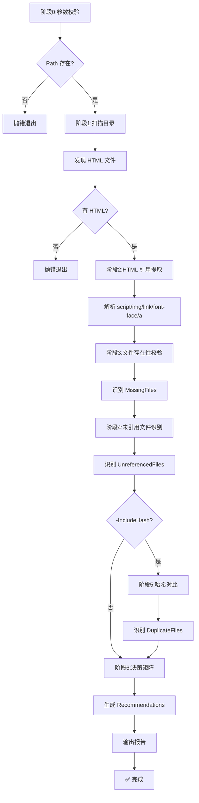

# Asset Redundancy Analyzer Skill

## Skill Name

`asset-redundancy-analyzer`

## 功能描述

本 Skill 实现 **"静态资产冗余分析三步法"** 方法论,提供静态站点的冗余资源识别能力:

1. **HTML 引用提取**:解析 HTML 中的 `<script src>`、``、`<link href>`、`@font-face url()`、`<a href>` 等引用声明
2. **文件存在性校验**:对每个声明引用,检查文件是否实际存在,识别"声明但缺失"问题(如 react-survey 的 NotoSansSC 字体)
3. **未引用文件识别**:对目录中每个文件,检查是否被任何 HTML 引用,识别"存在但未引用"问题(如模板自动包含的 echarts/mermaid)
4. **哈希对比**(可选):计算所有文件的 SHA256,识别完全重复的文件
5. **决策矩阵**:根据"重复度 + 引用状态"自动给出建议(删除/合并/保留)

适用于:静态站点归档前清理、模板冗余识别、Trae Work 生成产物的质量校验、docs 目录定期巡检。

## 快速开始

`{baseDir}` 是 agent 框架在运行时自动替换的变量,指向当前 skill 目录的绝对路径。

### 基础分析(仅引用检查)

```powershell
powershell -ExecutionPolicy Bypass -File "{baseDir}/scripts/Analyze-Redundancy.ps1" -Path "D:\project\docs\react-survey"
```

### 完整分析(含哈希对比)

```powershell
powershell -ExecutionPolicy Bypass -File "{baseDir}/scripts/Analyze-Redundancy.ps1" -Path "D:\project\docs\react-survey" -IncludeHash
```

### 预演模式(不实际执行删除,仅输出建议)

```powershell
powershell -ExecutionPolicy Bypass -File "{baseDir}/scripts/Analyze-Redundancy.ps1" -Path "D:\project\docs\react-survey" -IncludeHash -WhatIf
```

### 批量分析多个站点

```powershell
$sites = @("react-survey", "agent-insight")
foreach ($site in $sites) {
    powershell -ExecutionPolicy Bypass -File "{baseDir}/scripts/Analyze-Redundancy.ps1" -Path "D:\project\docs\$site" -IncludeHash
}
```

## 输入输出参数定义 (I/O Parameters)

### 输入 (Input)

| 参数 | 类型 | 必填 | 默认值 | 说明 |
|---|---|---|---|---|
| `-Path` | string | ✅ 是 | — | 静态站点目录绝对路径,必须存在 |
| `-IncludeHash` | switch | ❌ 否 | `$false` | 启用 SHA256 哈希对比,识别完全重复的文件 |
| `-WhatIf` | switch | ❌ 否 | `$false` | 仅预演,输出建议但不执行任何删除操作(本技能默认不删除,此参数仅影响输出格式) |
| `-Format` | string | ❌ 否 | `"text"` | 输出格式:`text`(人类可读)或 `json`(机器可读) |

### 输出 (Output)

脚本返回一个 `PSCustomObject`,同时输出结构化报告到 stdout:

```powershell
[PSCustomObject]@{
    Path              = "D:\docs\react-survey"     # 分析路径
    HtmlFiles         = @("react-survey.html")      # 发现的 HTML 文件
    TotalFiles        = 12                           # 目录中文件总数
    DeclaredRefs      = 8                            # HTML 声明的引用总数
    MissingFiles      = @(...)                       # 声明但缺失的文件清单
    UnreferencedFiles = @(...)                       # 存在但未引用的文件清单
    DuplicateFiles    = @(...)                       # 重复文件清单(启用 -IncludeHash 时)
    Recommendations   = @(...)                       # 建议操作清单
    ExitCode          = 0                            # 0=成功, 1=错误
}
```

**MissingFiles 数组元素结构**(声明但缺失):

```powershell
[PSCustomObject]@{
    RefFile   = "react-survey.html"                  # 声明引用的 HTML 文件
    RefType   = "font-face"                          # script|img|link|font-face|a
    Declared  = "./_shared/fonts/NotoSansSC-Regular.ttf"  # 声明的路径
    Issue     = "FileNotFound"                       # 问题类型
    Suggestion = "移除声明或补全文件"                  # 建议操作
}
```

**UnreferencedFiles 数组元素结构**(存在但未引用):

```powershell
[PSCustomObject]@{
    File       = "./_shared/js/echarts.min.js"       # 文件相对路径
    Size       = 1030900                              # 文件大小(字节)
    SizeReadable = "1006.74 KB"                      # 可读大小
    Issue      = "NotReferenced"                      # 问题类型
    Suggestion = "删除"                               # 建议操作
}
```

**DuplicateFiles 数组元素结构**(重复文件,启用 `-IncludeHash` 时):

```powershell
[PSCustomObject]@{
    Hash    = "DBC15E9B..."                          # SHA256 哈希
    Files   = @("./js/echarts.min.js", "./lib/echarts.min.js")  # 重复文件列表
    Suggestion = "合并到公共目录或删除冗余副本"          # 建议操作
}
```

**Recommendations 数组元素结构**(决策矩阵输出):

```powershell
[PSCustomObject]@{
    File       = "./_shared/js/echarts.min.js"
    Action     = "Delete"                             # Delete|Keep|Merge|FixDecl
    Reason     = "未被引用且无重复"                     # 决策依据
    Priority   = "High"                               # High|Medium|Low
}
```

## 依赖项说明 (Dependencies)

| 依赖 | 类型 | 说明 |
|---|---|---|
| `powershell` | 系统命令 | PowerShell 5.1+ 或 PowerShell 7+(Windows 自带) |
| `Get-FileHash` | PowerShell cmdlet | 仅 `-IncludeHash` 时需要(PS 4+ 内置) |

**无外部依赖**:不依赖 Python、Node.js 或任何第三方库,纯 PowerShell 实现。

## 部署要求 (Deployment)

### 安装

无需安装。脚本为单文件 PowerShell,直接调用即可。

### 执行策略

若遇到执行策略限制,使用 `-ExecutionPolicy Bypass` 参数绕过:

```powershell
powershell -ExecutionPolicy Bypass -File "scripts/Analyze-Redundancy.ps1" ...
```

### 跨平台说明

本技能的 HTML 解析与文件校验逻辑跨平台,但脚本使用 PowerShell 语法,主要面向 Windows。Linux/macOS 可通过 `pwsh` 运行。

## 错误处理规范 (Error Handling)

### 退出码

| ExitCode | 含义 | 处理建议 |
|---|---|---|
| 0 | 成功 | 分析完成,查看输出报告 |
| 1 | 一般错误 | 路径不存在、参数错误等,查看错误信息 |

### 常见错误场景

| 场景 | 现象 | 解决方案 |
|---|---|---|
| 路径不存在 | `Path 不存在或不是目录` | 检查 `-Path` 路径拼写 |
| 无 HTML 文件 | `未找到 HTML 文件` | 确认目录中包含 .html/.htm 文件 |
| HTML 编码异常 | 引用提取不完整 | 确保 HTML 为 UTF-8 编码 |

### 安全保证

- **只读分析**:本技能不修改任何文件,仅输出分析报告与建议
- **WhatIf 支持**:`-WhatIf` 参数仅影响输出格式(增加"预演"标记),因本技能默认就是只读
- **无副作用**:可安全地对生产环境目录运行

## 执行流程 (Execution Flow)



## 最佳实践 (Best Practices)

### ✅ 推荐用法

1. **归档前必跑**:归档静态站点前先跑本技能,避免冗余文件进入 docs
2. **加 `-IncludeHash`**:完整分析时启用哈希对比,识别跨目录重复
3. **批量巡检**:对 docs/ 下所有静态站点循环调用,定期清理冗余
4. **结合 archive-folder**:先分析冗余,清理后再用 archive-folder 归档
5. **关注 MissingFiles**:"声明但缺失"是技术债,应优先修复

### ⚠️ 注意事项

- **HTML 解析限制**:使用正则提取引用,非完整 HTML 解析器,对畸形 HTML 可能漏提取
- **相对路径解析**:支持 `./`、`../`、绝对路径与无前缀相对路径
- **外部 URL 跳过**:`http://`、`https://`、`//` 开头的引用不校验本地存在性
- **哈希对比性能**:大文件(>100MB)哈希计算较慢,建议仅在文档站点场景使用
- **建议仅供参考**:`Recommendations` 基于规则推断,实际删除前请人工确认

### FAQ

**Q1: 为什么用正则而不是 HTML 解析器?**
A: PowerShell 内置无 HTML 解析器,引入第三方依赖违背"零依赖"原则。正则覆盖 95% 场景,畸形 HTML 罕见。

**Q2: 本技能会删除文件吗?**
A: 不会。本技能是只读分析器,仅输出报告与建议。删除操作由用户或 archive-folder 技能执行。

**Q3: 如何处理跨站点重复?**
A: 对每个站点单独运行,然后人工对比 `DuplicateFiles` 中的哈希。跨站点自动对比需指定多个 `-Path`,暂不支持。

**Q4: MissingFiles 中的"声明但缺失"如何修复?**
A: 两种方案:(1) 补全缺失文件;(2) 移除 HTML 中的声明。参考 task-summary 中的"声明但缺失资源治理决策矩阵"。

**Q5: 如何与 archive-folder 技能协作?**
A: 推荐流程:先跑 `asset-redundancy-analyzer` 识别冗余 → 人工清理 → 再跑 `archive-folder` 归档。可在 archive-folder 的 `-CheckExternalRefs` 之前作为预处理步骤。

**Q6: 支持 Vue/React 等 SPA 吗?**
A: 部分支持。SPA 的动态引用(如 `import()`)无法通过静态分析识别,本技能主要面向静态 HTML 站点。

## 版本记录 (Changelog)

### 1.0.0 (2026-06-22)

- 初始版本
- 实现 HTML 引用提取(script/img/link/font-face/a)
- 实现文件存在性校验(识别"声明但缺失")
- 实现未引用文件识别(识别"存在但未引用")
- 实现可选的 SHA256 哈希对比
- 实现决策矩阵(Delete/Keep/Merge/FixDecl)
- 支持 text 与 json 两种输出格式

## 参考链接

- [静态资产冗余分析三步法](../../../../docs/tech/task-summary-archive-and-cleanup-20260622.md)(方法论来源)
- [archive-folder 技能](../archive-folder/SKILL.md)(配套归档技能)
- [归档日志索引](../../../../docs/tech/archive-log.md)
