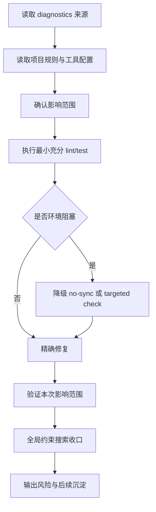

# Diagnostics 修复工作流

本工作流用于处理 IDE diagnostics、lint 报告、格式化检查、CI 问题列表和版本适配类静态问题。目标是精确修复当前问题，并把可复用经验沉淀回规则或复盘。

## 1. 适用场景

- 用户提供 `.temp/error.log`、CI 日志、IDE problems 或 diagnostics 列表。
- Ruff、format、pytest、mypy、pyright 或其他静态检查报告问题。
- Python 版本升级、弃用 API 清理或项目统一约束需要全局验证。
- 需要区分当前任务问题与历史遗留问题。

## 2. 核心原则

- 先读取诊断来源，再读取项目规则与工具配置。
- 先复现或确认问题，再修改文件。
- 只修改 diagnostics、用户明确反馈和直接验证所需文件。
- 全量检查优先；被环境或历史问题阻塞时，降级 targeted check 并说明原因。
- “全部移除”“不再存在”“全项目统一”类要求必须用全局搜索收口。
- 修复中发现的高频经验，应沉淀到 `.agents/rules/`、`.agents/workflows/` 或复盘报告。

## 3. 标准流程



## 4. 执行步骤

### 4.1 读取输入

必须先确认：

- diagnostics 来源文件或命令输出。
- 报错工具名称。
- 目标文件、行号、规则编号。
- 用户是否提出全局约束，例如“全部移除”“全项目统一”。

### 4.2 读取约束

按任务类型读取最小必要规则：

- Python diagnostics：`.agents/rules/python.md`
- 文档、归档、复盘：`.agents/rules/documentation.md`
- 项目路由：`AGENTS.md`
- 工具配置：`pyproject.toml`、`mise.toml` 或对应配置文件

### 4.3 确认影响范围

将问题分为三类：

| 类型 | 处理方式 |
|---|---|
| 当前任务直接问题 | 必须修复并验证 |
| 用户追加约束 | 按约束全局搜索或 targeted 验证 |
| 历史遗留问题 | 不混入当前 diff，必要时单独提出基线清理 |

### 4.4 精确修复

修复时遵循：

- 优先编辑已确认相关文件。
- 不主动格式化无关文件。
- 不做与 diagnostics 无关的重构。
- 类型注解、导入排序、格式化等风格问题按现有工具建议处理。

### 4.5 分层验证

优先运行全量验证：

```powershell
uv run --no-sync ruff check .
uv run --no-sync ruff format --check .
```

如果全量验证被文件锁、构建缓存或无关历史问题阻塞，降级到单目录或单文件：

```powershell
uv run --no-sync ruff check src/taolib/flowkit tests/flowkit
uv run --no-sync ruff format --check src/taolib/flowkit tests/flowkit
uv run --no-sync pytest tests/flowkit/test_flowkit.py
```

降级时必须在结果中说明：

- 全量验证为什么不可用。
- targeted check 覆盖了哪些本次变更范围。
- 是否仍有历史遗留问题未处理。

### 4.6 全局约束收口

当用户要求“全部移除”“不再存在”“全项目统一”时，必须执行搜索验证，并在结果中记录：

- 搜索模式。
- 搜索范围。
- 搜索结果。

示例：

```regex
^from __future__ import annotations$
```

### 4.7 复盘与沉淀

完成后检查是否需要沉淀：

- 新的高频命令：写入规则文件。
- 可复用判断流程：写入工作流文件。
- 风险与例外：写入规则、工作流或复盘报告。
- 临时复盘需要长期保留：从 `.temp/` 迁移到 `.agents/docs/superpowers/retrospectives/`。

## 5. 输出格式

最终回复应包含：

1. 修改了哪些文件。
2. 修复了哪些 diagnostics 或约束。
3. 运行了哪些验证命令，结果如何。
4. 是否存在验证降级，原因是什么。
5. 是否有历史遗留问题或后续风险。
6. 是否已沉淀为规则、工作流或复盘资产。
