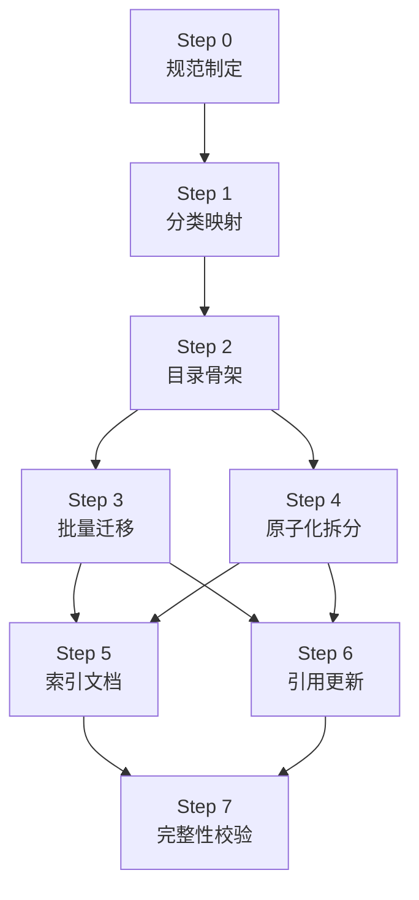
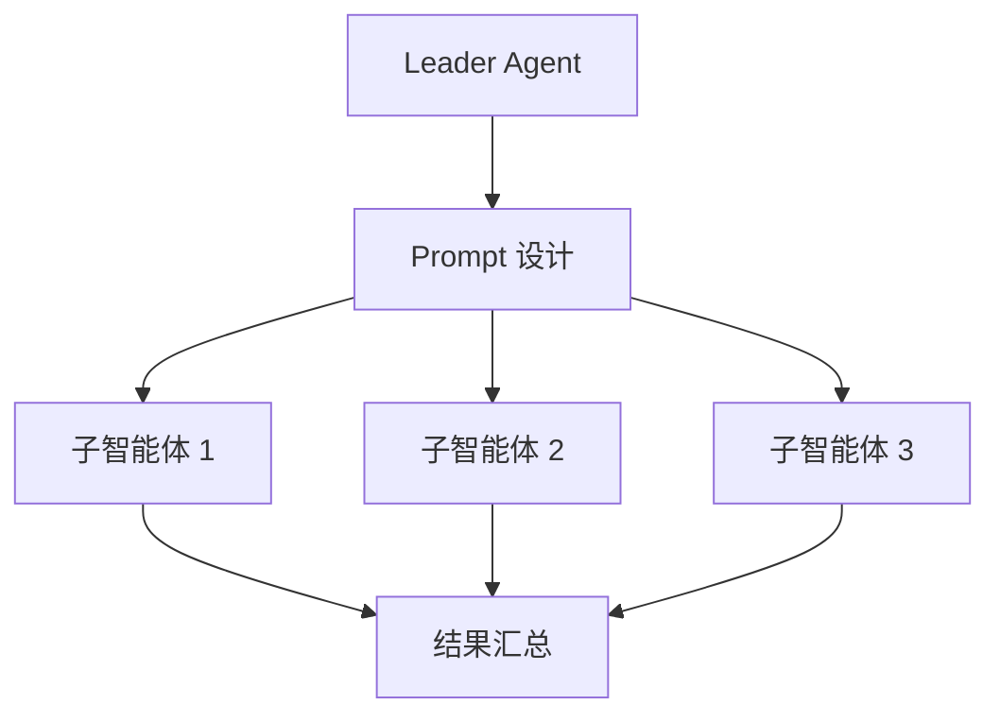

# 文档重构标准操作手册 (SOP)

本 SOP 用于对扁平结构的文档目录进行系统性重构，将其改造为原子化、模块化、结构化的组织形式。基于 `retrospectives-modularization` 重构实战经验提炼。

> **来源**：[`task-summary-retrospectives-modularization-20260623.md`](../docs/superpowers/retrospectives/task-summaries/documentation/task-summary-retrospectives-modularization-20260623.md)
> **适用范围**：任何需要从扁平结构升级为模块化结构的文档目录

---

## 1. 适用场景

- 文档目录存在类型混杂、命名漂移、缺乏索引等问题。
- 文件数量 >20 份且无模块化分类。
- 部分文档过大（>500 行）且覆盖多个独立主题。
- 需要建立引用关系图谱与完整性追溯。

## 2. 核心原则

- **零信息丢失**：所有原始内容完整迁移，不删除任何信息。
- **规范先行**：先制定 spec + tasks + checklist 三件套，再执行。
- **分类映射前置**：先研究全部文件再执行迁移，避免执行中分类争议。
- **批量操作优先**：使用 PowerShell/脚本批量处理文件操作。
- **并行执行无依赖任务**：使用子智能体并行处理独立任务。
- **自动化校验**：使用脚本验证完整性，避免人工遗漏。
- **引用扫描前置**：重构前先扫描项目内引用范围，避免引用遗漏。

## 3. 标准流程



## 4. 执行步骤

### Step 0: 规范制定

**目标**：明确重构范围、分类体系、原子化阈值与检查标准。

**产出**：
- `spec.md`：定义需求、模块分类、命名规范、检查标准
- `tasks.md`：分解为有序可验证的工作项
- `checklist.md`：列出所有检查点

**关键决策**：
1. 一级模块分类维度（按类型/时间/主题）
2. 二级子模块范围（仅大模块细分 or 全部细分）
3. 原子化拆分阈值（行数 + 主题独立性）
4. 命名规范（kebab-case + 日期格式）

### Step 1: 分类映射

**目标**：研究全部文件，建立分类映射表。

**操作**：
1. 使用 `search` 子智能体读取每份文件头部（前 30 行），提取：报告类型、日期、主题
2. 统计每份文件行数（`Get-ChildItem | ForEach-Object { (Get-Content $_.FullName).Count }`）
3. 按一级模块分类
4. 对大模块按二级主题分类
5. 识别需原子化拆分的文件（行数 + 主题独立性）

**产出**：完整分类映射表，格式：

| 原始文件名 | 行数 | 一级模块 | 二级主题 | 是否需拆分 | 拆分建议 |
|-----------|------|---------|---------|-----------|---------|

**关键原则**：
- 分类映射表必须覆盖全部文件，无遗漏
- 拆分建议需明确拆分方案（按哪些主题拆分）

### Step 2: 目录骨架

**目标**：创建模块化目录结构。

**操作**：
```powershell
$base = "<目标目录路径>"
$dirs = @("_meta", "module-a", "module-b", "module-b/sub-theme-1", "module-b/sub-theme-2")
foreach ($d in $dirs) {
    New-Item -ItemType Directory -Force -Path (Join-Path $base $d) | Out-Null
}
```

**产出**：完整的目录树结构。

**命名规范**：
- 目录名：纯 ASCII 英文 kebab-case
- 元数据目录：下划线前缀（`_meta/`）

### Step 3: 批量迁移

**目标**：将文件迁移至对应模块目录。

**操作**：
```powershell
$migrations = @{
    "file-a.md" = "module-a"
    "file-b.md" = "module-b/sub-theme-1"
    # ...
}
$moved = 0; $failed = 0
foreach ($file in $migrations.Keys) {
    $src = Join-Path $base $file
    $dst = Join-Path $base (Join-Path $migrations[$file] $file)
    if (Test-Path $src) {
        Move-Item -Path $src -Destination $dst -Force
        $moved++
    } else {
        $failed++
        Write-Host "NOT FOUND: $file"
    }
}
Write-Host "Moved: $moved, Failed: $failed"
```

**产出**：全部文件迁移至模块目录。

**关键原则**：
- 迁移映射表预定义，确保零失误
- 迁移后验证 `Moved` 与 `Failed` 计数

### Step 4: 原子化拆分

**目标**：将大型多主题文档拆分为独立原子单元。

**判断矩阵**：

| 行数 | 主题独立性 | 决策 |
|------|-----------|------|
| >500 行 | 多主题明确 | ✅ 必拆 |
| >500 行 | 单主题 | ⚠️ 按章节判断 |
| 200-400 行 | 多主题独立 | ✅ 拆分 |
| 200-400 行 | 标准模板章节 | ❌ 保留 |
| <200 行 | 任意 | ❌ 保留 |

**操作**（使用子智能体并行）：
1. 每份大型文档分配一个 `general_purpose_task` 子智能体
2. 子智能体读取完整内容，按 H2 章节拆分
3. 创建同名目录（去掉 `.md` 后缀）
4. 创建 `index.md`（含元数据、别名声明、概述、原子单元索引表）
5. 将每个章节写入独立原子单元文件（英文 kebab-case 命名）
6. 删除原始文件

**并行执行**：单消息内发起多个 Task 调用，最大化并行度。

**产出**：原子化目录 + `index.md` + 原子单元文件。

**别名声明格式**：
```markdown
> **别名**：曾用名 `old-filename.md`，已原子化拆分
```

### Step 5: 索引文档

**目标**：编写模块说明与元数据文档。

**产出**：
1. **模块 README**（每个一级/二级模块）：功能描述、使用方法、依赖关系、维护责任人、文件清单
2. **总入口 README**：总体说明、模块导航表、命名规范摘要、检索指南
3. **元数据文档**（`_meta/` 目录下）：
   - `naming-convention.md`：命名规范
   - `module-catalog.md`：模块目录清单
   - `dependency-graph.md`：依赖关系图谱
   - `migration-log.md`：迁移日志

**模块 README 模板**：
```markdown
# {模块名称}

> **维护责任人**：Leader Agent

## 模块功能
{1-2 句话描述}

## 使用方法
- **何时查阅**：{查阅场景}
- **如何引用**：使用相对路径引用

## 依赖关系
{列出依赖}

## 文件清单
| 文件/目录 | 说明 |
|----------|------|
| {filename} | {简要说明} |
```

**依赖图谱构建**：
1. 使用 Grep 搜索所有 `.md` 文件中的引用模式（如 `\]\(.*\.md\)`）
2. 整理为正向依赖（引用方 → 被引用方）与反向依赖
3. 使用 Mermaid 流程图可视化关键依赖链

**迁移日志格式**：
| # | 原始文件名 | 一级模块 | 二级主题 | 是否拆分 | 迁移去向 | 校验状态 |
|---|-----------|---------|---------|---------|---------|---------|

### Step 6: 引用更新

**目标**：更新项目内所有对重构目录的外部引用。

**操作**：
1. Grep 搜索项目内所有引用重构目录文件的文档
   ```
   Grep pattern: "retrospectives/[a-z]" glob: "*.md"
   ```
2. 使用子智能体批量更新引用路径
3. Markdown 链接需同时更新链接文本与链接路径
4. 纯文本引用仅更新路径部分

**关键原则**：
- 引用扫描应在 Step 3 之前完成（或与 Step 1 并行）
- 更新后验证所有引用可达

### Step 7: 完整性校验

**目标**：验证重构完整性，确保零信息丢失。

**校验脚本**（PowerShell）：
```powershell
$base = "<目标目录路径>"

# 1. 检查根目录无散落文件（除 README.md）
$rootMd = Get-ChildItem $base -File -Filter *.md | Where-Object { $_.Name -ne "README.md" }
if ($rootMd.Count -eq 0) { Write-Host "PASS: No stray .md files in root" }

# 2. 检查非 ASCII 文件名
$allMd = Get-ChildItem $base -Recurse -File -Filter *.md
$nonAscii = $allMd | Where-Object { $_.Name -match '[^\x00-\x7F]' }
if ($nonAscii.Count -eq 0) { Write-Host "PASS: All filenames are pure ASCII" }

# 3. 检查模块 README 完整性
foreach ($m in $modules) {
    $readme = Join-Path $base "$m\README.md"
    if (Test-Path $readme) { Write-Host "PASS: $m/README.md" }
}

# 4. 检查元数据文档
foreach ($f in @("_meta\naming-convention.md", "_meta\module-catalog.md", "_meta\dependency-graph.md", "_meta\migration-log.md")) {
    if (Test-Path (Join-Path $base $f)) { Write-Host "PASS: $f" }
}

# 5. 检查原子化目录 index.md
foreach ($d in $atomDirs) {
    if (Test-Path (Join-Path $base "$d\index.md")) { Write-Host "PASS: $d/index.md" }
}
```

**校验清单**：
- [ ] 迁移日志覆盖全部原始文件
- [ ] 每份原始文件标记为"完整迁移"
- [ ] 无原始内容丢失
- [ ] 所有模块 README 完整且文件清单准确
- [ ] 依赖图谱与实际引用一致
- [ ] 命名规范一致性（纯 ASCII、kebab-case、日期格式）
- [ ] 外部引用路径已更新

## 5. 子智能体并行执行模式

### 5.1 适用条件

- 多个任务无依赖关系
- 每个任务可独立完成（读取、处理、写入）

### 5.2 执行方式



**关键原则**：
1. 单消息内发起多个 Task 调用（并行）
2. Prompt 详细且自包含完整上下文
3. 每个子智能体返回结构化报告
4. 子智能体类型选择：
   - `search`：研究型任务（信息收集、分类映射）
   - `general_purpose_task`：执行型任务（读写删、文件操作）

### 5.3 Prompt 设计要点

- 明确任务目标与产出格式
- 提供完整的分类映射表或操作清单
- 说明命名规范与路径规范
- 指定使用的工具（Write、Edit、DeleteFile）

## 6. 常见问题与防范

### 6.1 PowerShell 语法陷阱

| 问题 | 根因 | 解决 |
|------|------|------|
| `$var:` 报错 | 变量作用域解析规则 | 使用 `${var}` 转义 |
| heredoc 不支持 | PowerShell 不支持 `<<'EOF'` | 使用多个 `-m` 参数 |

### 6.2 分类边界判断

| 场景 | 处理方式 |
|------|---------|
| 文档跨多个主题 | 按主要主题归类，在依赖图谱中记录交叉引用 |
| 文档类型不明确 | 归入 `misc/` 模块 |
| 任务总结涉及多个主题 | 按主要任务类型归类至二级子模块 |

### 6.3 原子化拆分判断

| 场景 | 处理方式 |
|------|---------|
| 标准模板文档（10 章复盘） | 保留单文件，章节是同一主题的组成部分 |
| 多主题独立文档 | 拆分为原子单元 |
| 行数刚过 200 行 | 按主题独立性判断，非机械按行数拆分 |

### 6.4 引用更新遗漏

| 防范措施 | 说明 |
|---------|------|
| 引用扫描前置 | 重构前先 Grep 搜索引用范围 |
| 多模式搜索 | 同时搜索 markdown 链接与纯文本引用 |
| 更新后验证 | Grep 确认无旧路径残留 |

## 7. 检查清单

重构完成后，逐项验证以下检查点：

### 目录骨架与命名规范
- [ ] 一级模块目录已创建
- [ ] 二级子模块目录已创建（如适用）
- [ ] `_meta/` 元数据目录已创建
- [ ] 命名规范文档已编写

### 原子化拆分
- [ ] 大型多主题文档已识别
- [ ] 每份大型文档已转为同名目录
- [ ] 每个原子单元专注单一主题
- [ ] 原子单元文件名使用英文 kebab-case

### 模块化分类
- [ ] 全部原始文件已按一级模块分类
- [ ] 大模块已按二级主题分类
- [ ] 模块内部高内聚
- [ ] 模块之间低耦合

### 结构化层级与命名
- [ ] 目录树结构符合规范
- [ ] 所有目录名为纯 ASCII 英文 kebab-case
- [ ] 日期格式统一为 YYYYMMDD
- [ ] 无中文、emoji、空格

### 引用关系图谱
- [ ] 依赖图谱已生成
- [ ] 图谱记录正向与反向依赖
- [ ] 关键依赖链使用 Mermaid 可视化

### 索引与模块说明
- [ ] 根目录 README 已编写
- [ ] 每个模块含 README
- [ ] 模块目录清单已生成

### 完整性检查
- [ ] 迁移日志覆盖全部原始文件
- [ ] 每份文件标记为"完整迁移"
- [ ] 无原始内容丢失
- [ ] 外部引用路径已更新
- [ ] 文件名变更的文档已添加别名声明

## 8. 工具与脚本

| 工具 | 用途 | 使用场景 |
|------|------|---------|
| PowerShell `Get-ChildItem` | 文件统计、批量操作 | 目录创建、文件迁移、完整性校验 |
| PowerShell `Move-Item` | 批量文件迁移 | Step 3 批量迁移 |
| Grep | 引用扫描 | Step 1 分类映射、Step 6 引用更新 |
| `search` 子智能体 | 研究型任务 | Step 1 分类映射研究 |
| `general_purpose_task` 子智能体 | 执行型任务 | Step 4 原子化拆分、Step 5 索引编写 |
| Mermaid | 流程图可视化 | 依赖图谱、执行流程图 |

## 9. 后续维护

1. **新增文档归档**：按文档类型归入对应一级模块，按主题归入二级子模块
2. **定期审计**：每季度检查命名规范一致性、引用完整性
3. **依赖图谱更新**：新增文档后更新 `_meta/dependency-graph.md`
4. **迁移日志追加**：新增迁移记录追加至 `_meta/migration-log.md`

---

> **版本**：v1.0
> **创建日期**：2026-06-23
> **维护责任人**：Leader Agent
> **来源**：retrospectives 模块化重构实战经验
