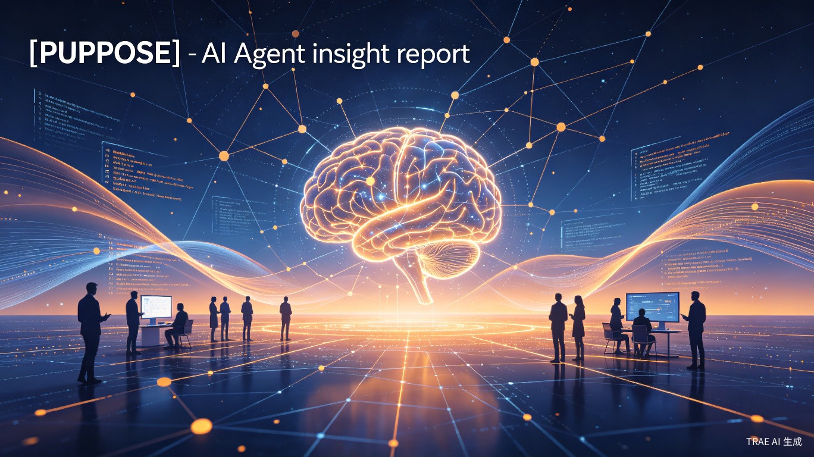
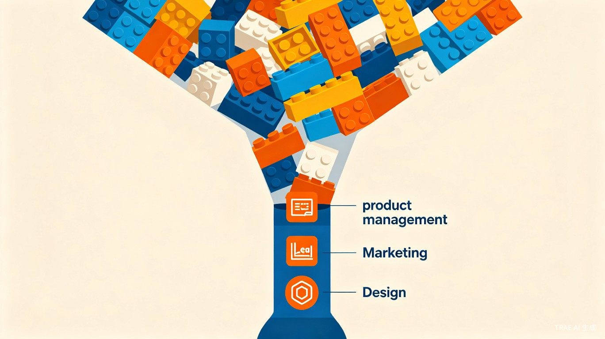
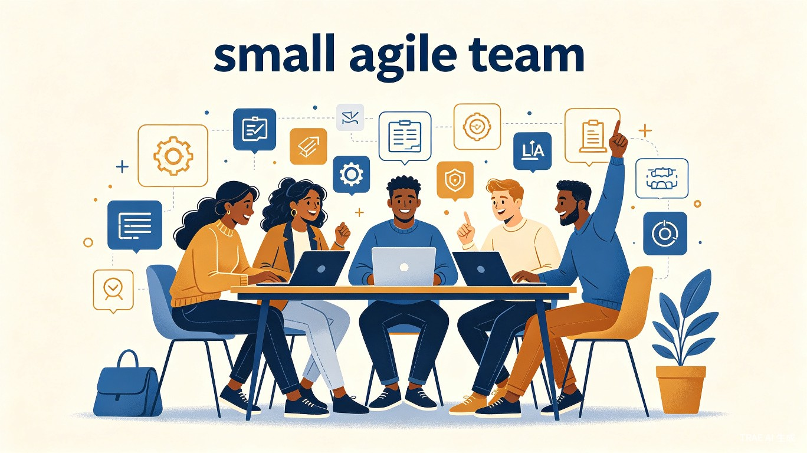
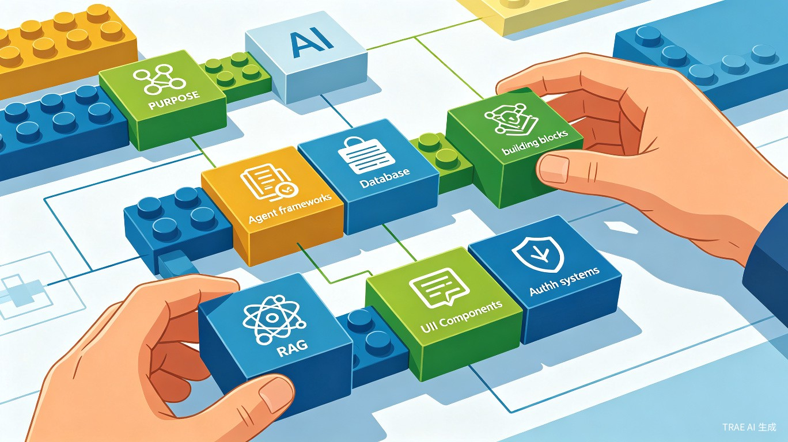
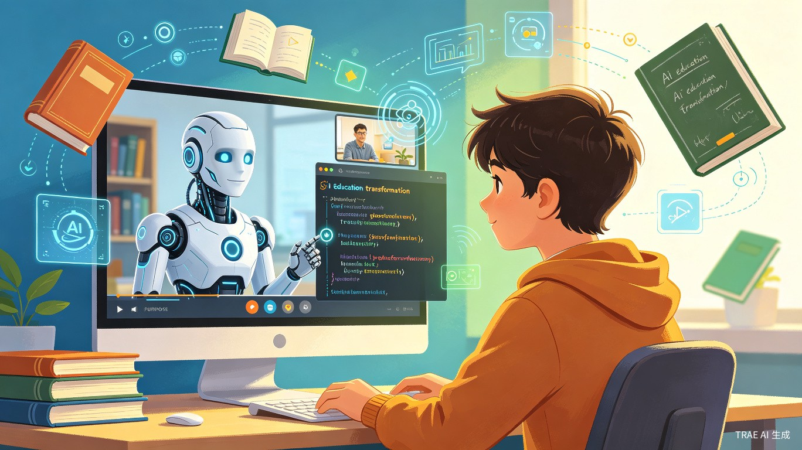

# AI Agent 时代：当代码写得比想法还快，真正的瓶颈在哪里？

> **AI 前线洞察** · 2026年6月22日

> 近期，在 LangChain 举办的智能体大会 Interrupt 上，吴恩达与 Harrison Chase 进行了一场关于 AI Agent 的深度对谈。整场交流的核心并不是简单讨论 Agent 有多强，而是围绕一个更现实的问题展开：**当 AI Agent 让软件开发变快之后，真正的瓶颈会转移到哪里？**

吴恩达认为，过去一年 AI 领域的热度和炒作超出了他的预期。但更值得关注的，是**编程智能体的快速进步**。六个月前他几乎只用 Claude Code，现在则混合使用 OpenAI Codex、Gemini CLI、OpenCode 等工具。甚至连在手机上写代码这样的工作流，也开始变得自然。

---

## 一、产品管理瓶颈：代码不再是瓶颈

编程智能体带来的最大变化，不只是写代码更快，而是**软件生产链条被重新分配**。吴恩达提出了"产品管理瓶颈"的概念：当代码实现速度提升 10 倍甚至 100 倍之后，限制团队效率的就不再只是工程实现，而是"到底该做什么"。

*当开发速度提升 100 倍后，产品管理、法务、营销、设计等环节成为新瓶颈*

需求定义、用户反馈、优先级判断、产品边界，都会变得更重要。与此同时，**营销、法务、设计、合规**也可能变成新瓶颈。过去一个产品开发三个月，等法务一周签字可以接受；但如果现在一天就能做出产品，再等一周，法务本身就成了阻碍。

> "过去，如果一个产品需要法律合规，你花三个月构建它，再等一周让法务签字，可能还可以接受。但现在，如果你一天就能构建出来，然后还要等一周法务签字，那就变成了法律合规瓶颈。"
>
> —— 吴恩达

---

## 二、未来团队：小、快、通才化

因此，未来的软件团队会**更小、更快，也更依赖通才型人才**。吴恩达越来越多地组建一到十人的小团队，成员往往是高上下文、高授权、技术能力强的工程师。他们不只写代码，还会借助 AI 完成产品定义、营销文案、服务条款初稿等工作。

*未来软件团队——小团队、通才型、高授权*

AI 不会让工程师瞬间变成优秀营销人员或律师，但可以让他们先产出一个可用初稿，再交给专业人员把关。这种"**鸽巢原理**"式的团队配置——五个人承担五种职能但只有两个人——迫使每个人都必须跨角色工作。

| 维度 | 要点 |
|------|------|
| **团队规模** | 1-10 人的小团队成为主流，成员是高上下文的通才型工程师 |
| **角色融合** | 工程师借助 AI 承担产品、营销、法务等角色，快速产出初稿 |

---

## 三、乐高积木式开发：组合即创新

在 Agent 开发方式上，吴恩达用了**"乐高积木"**的比喻。今天的开发者面对的不只是模型，还有 RAG、Agent 框架、评估工具、Guardrails、UI 组件、身份认证、数据库等大量构建模块。

*AI 开发如同乐高积木——模块越多，组合可能性呈指数增长*

但问题是，API、SDK 和工具变化太快，模型未必知道最新用法。因此，Agent 的能力不只取决于模型本身，也取决于它能否获得**及时、准确、可执行的上下文**。吴恩达提到了 Context Hub 项目——一个面向 AI 智能体的"Stack Overflow"。

---

## 四、企业落地：从降本到重构增长

谈到企业落地，吴恩达认为很多企业正在做自下而上的 AI 创新，但这种"百花齐放"往往只能带来**点状提效**，难以形成真正转型。

他以银行贷款审批为例：如果只是把一小时人工审核变成 AI 审核，价值有限；更大的机会是**重构整个流程**，推出"10 分钟获批"的贷款产品。这需要营销、数据、审批、尽调、执行等环节一起变化。

| 策略 | 效果 | 局限 |
|------|------|------|
| 自下而上创新 | 点状效率提升 | 难以形成系统性转型 |
| 自上而下重构 | 业务流程再造 | 需要高层推动和跨部门协作 |
| 混合模式 | 既有创新又有转型 | 需要清晰的战略和资源分配 |

他也提醒企业，**不要只把 AI 当作降本工具**。成本节省有上限，增长才更有想象空间。客服、呼叫中心等场景中，AI 的价值不只是减少人工，而是更快服务更多客户，改善体验，进而带动业务增长。

---

## 五、数据架构：Agent 时代的基础设施

最后，吴恩达把企业 Agent 的关键基础落到**数据架构**上。过去企业主要围绕结构化数据做治理，但 Agent 真正要发挥作用，必须能处理文本、PDF、图片、音频、视频等**非结构化数据**。

*企业数据架构重构——从结构化到 AI-ready 的非结构化数据处理*

很多企业数据分散、权限体系为人而非 Agent 设计、治理和可观测性不足。吴恩达判断，未来几年，企业会启动大规模数据架构重构，让数据真正变得 **AI-ready、agent-ready**。

| 维度 | 现状 |
|------|------|
| **数据碎片化** | 数据分散在各处，有些甚至还在个人笔记本电脑上 |
| **权限体系过时** | 现有权限系统为人类设计，Agent 的权限管理仍是空白 |
| **非结构化数据** | 过去 20 年堆积的 PDF、文档、音视频，可通过 AI 重新挖掘价值 |
| **可观测性不足** | 缺乏对 Agent 行为和数据使用的有效监控和审计机制 |

---

## 六、额外洞察：教育与供应商锁定

### AI 正在改变教育

吴恩达介绍了 CodeDream.ai 的愿景：**"不要只是上在线课程，而是来进行一场对话"**。学生可以与 AI 进行模拟视频通话，随时打断提问。视频区域不再是静态播放，而是可交互的 JavaScript 环境。

*AI 驱动的教育变革——从被动观看到主动对话与交互*

### 警惕供应商锁定

吴恩达特别强调要**警惕供应商锁定**。AI 模型和 Agent 工具变化太快，没人能确定一年后最强的模型是谁。因此，企业应尽量保留选择权，不要轻易因为折扣签下过长合约。他个人几乎从不签超过一年的合同。

> "无论对方提供多大折扣，我个人几乎从不签超过一年的合同。因为我非常重视这种选择权，希望一年后可以和当时最好的供应商合作。"
>
> —— 吴恩达

---

## 核心结论

- AI Agent 不只是让代码写得更快，它正在倒逼企业重新思考产品、组织、数据、流程和技术选型
- 当开发速度提升 100 倍后，产品管理、法务、营销、设计等环节成为新瓶颈
- 未来团队将更小、更快、更通才化，工程师借助 AI 跨角色工作
- 开发方式趋向"乐高积木"式组合，模块理解和上下文获取能力至关重要
- 企业不应只把 AI 当降本工具，而应追求重构流程、推动增长
- 数据架构重构是 Agent 落地的关键基础设施，非结构化数据处理能力亟待建设
- 在快速变化的技术环境中，保留供应商选择权比短期折扣更有价值

---

#AI Agent #吴恩达 #LangChain #企业转型 #编程智能体

**来源**：AI 前线编译，LangChain Interrupt 大会吴恩达与 Harrison Chase 对谈

**原文**：[点击查看原文](https://mp.weixin.qq.com/s/dpf8fQlJClt7HS6oU-LL5g)

**原视频**：[YouTube](https://www.youtube.com/watch?v=OaRhpwz_TGM)
