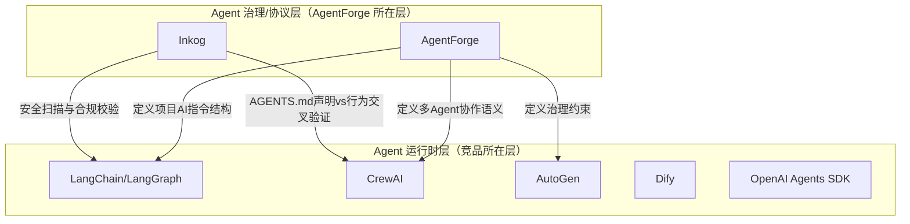
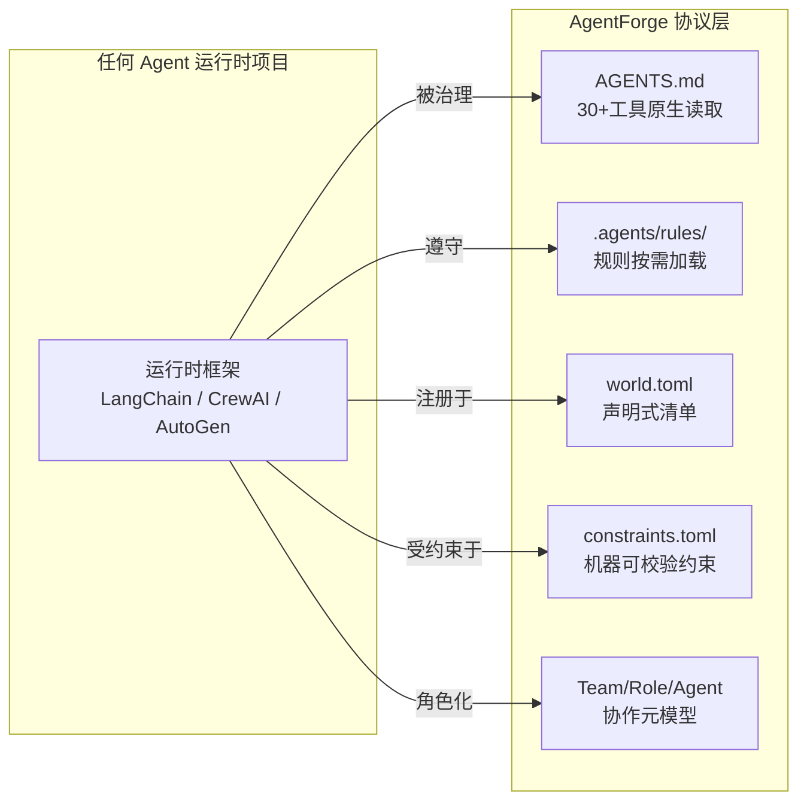

# AgentForge 竞品分析报告 2026

> **分析日期**：2026-06-21  
> **基于**：[session-meta-recap.md](session-meta-recap.md) 全会话知识资产 + 实时市场数据  
> **分析方法**：五维框架（参照 [research-methodology-template](research-methodology-template.md) §2）

---

## 一、分析前提：AgentForge 不是一个 Agent 运行时框架

在展开竞品分析前，必须首先澄清一个根本性的定位差异：



- **Agent 运行时框架**（LangChain/CrewAI/AutoGen/Dify）的核心问题是"如何让 Agent 跑起来"——它们提供 LLM 调度、工具集成、记忆管理、多 Agent 编排
- **AgentForge** 的核心问题是"如何让 Agent 守规矩"——它提供项目级 AI 治理协议、声明式清单、协作元模型、约束校验
- **AgentForge 与运行时框架不是竞争关系，而是补位关系**：一个 AgentForge 规范化的项目，可以同时在 LangChain/CrewAI/AutoGen 中运行

因此，本次竞品分析采用**双赛道分析框架**：主赛道（Agent 治理/协议层）和关联赛道（Agent 运行时框架）。

---

## 二、市场定位对比

### 2.1 赛道矩阵

```
                    高治理深度
                        │
              Inkog     │    AgentForge ★
         （安全扫描器）   │  （治理协议标准）
                        │
  ──────────────────────┼────────────────────── 高运行时完备度
                        │
            Dify        │    LangChain
         （可视化LLM平台）│  （通用Agent SDK）
                        │
            CrewAI      │    AutoGen
         （角色编排）     │  （事件驱动Agent）
                        │
                    低治理深度
```

### 2.2 定位对比表

| 维度 | AgentForge | LangChain/LangGraph | CrewAI | AutoGen | Dify | OpenAI Agents SDK | Inkog |
|------|-----------|---------------------|--------|---------|------|-------------------|-------|
| **核心定位** | AI Agent 治理协议标准 | 通用 Agent SDK 平台 | 角色扮演多Agent编排 | 事件驱动多Agent框架 | 可视化LLM应用平台 | 轻量Agent框架 | Agent安全扫描器 |
| **解决问题** | "Agent如何守规矩" | "Agent如何跑起来" | "Agent如何组队" | "Agent如何对话" | "AI应用如何搭建" | "GPT-4o Agent如何构建" | "Agent如何不出事" |
| **目标用户** | 架构师/技术负责人 | Python开发者 | Python开发者 | 研究者/.NET企业 | 全栈团队/非技术用户 | OpenAI生态开发者 | 安全/合规团队 |
| **首次可用时间** | ~2min（创建AGENTS.md） | ~10min（pip install） | ~3min（pip install） | ~10min | ~30min（Docker部署） | ~5min | ~2min（npm install） |
| **GitHub Stars** | 早期阶段 | 135k+ | 50k+ | 57k+ | 139k+ | 45k+ | 新锐 |
| **开源协议** | MIT | MIT | MIT | MIT | Apache 2.0 | Apache 2.0 | Apache 2.0 |

### 2.3 AgentForge 的定位独特性

AgentForge 是 **唯一** 在 Agent 治理/协议层提供完整三层架构的项目：

```
Layer 1: Project Protocol     → AGENTS.md 路由格式 + .agents/ 目录约定 + world.toml
Layer 2: Collaboration Protocol → Team/Role/Agent 元模型 + constraints.toml + Handoff
Layer 3: World Runtime        → 哲学内核 + 记忆做梦协议 + World Session
```

**关键差异化**：AgentForge 不绑定任何特定的 Agent 运行时。LangChain 项目、CrewAI 项目、AutoGen 项目都可以采用 AgentForge 的协议层——这使其天然具有"元标准"属性。

---

## 三、核心功能对比

### 3.1 功能矩阵

| 能力 | AgentForge | LangChain | CrewAI | AutoGen (v0.4+) | Dify | Inkog |
|------|-----------|-----------|--------|-----------------|------|-------|
| **项目级AI指令** | AGENTS.md（30+工具原生兼容） | 无标准化 | 无 | 配置文件 | 无 | AGENTS.md解析（消费端） |
| **规则按需加载** | `.agents/rules/` + glob paths: | 无 | 无 | 无 | 无 | 无 |
| **声明式清单** | `world.toml`（Fragment管理） | 无 | 无 | 无 | 无 | 无 |
| **技能跨平台导出** | SKILL.md（agentskills.io对齐） | 无 | 无 | 无 | 插件市场 | 无 |
| **多Agent协作语义** | Team/Role/Agent 15实体元模型 | LangGraph Agent | Crew/Role/Goal | GroupChat/Handoff | 工作流节点 | 无 |
| **操作性约束** | `constraints.toml`（strong/weak） | 无（需手动实现） | Guardrails | Approval hooks | 条件节点 | AGENTS.md交叉验证 |
| **治理合规** | 元模型约束 + 审计策略 | LangSmith观测 | Tracing | OpenTelemetry | 内置观测 | EU AI Act映射 |
| **LLM调度** | 无（非运行时） | ✅ 80+Provider | ✅ 20+Provider | ✅ 20+Provider | ✅ 100+Provider | 无 |
| **工具集成** | 无（非运行时） | ✅ 300+工具 | ✅ 30+企业集成 | ✅ MCP支持 | ✅ 50+内置工具 | MCP安全扫描 |
| **记忆管理** | Memory实体（语义层） | 向量存储 | Short/Long/Entity | Context管理 | RAG内置 | 无 |
| **可视化界面** | 无（纯配置） | LangSmith | CrewAI Studio | AutoGen Studio | ✅ 核心能力 | CLI/Web |
| **IDE集成数** | 30+（通过AGENTS.md） | 0 | 0 | 0 | 0 | Claude Code/Cursor |

### 3.2 AgentForge 的不可替代性



**核心结论**：AgentForge 的所有功能都位于"