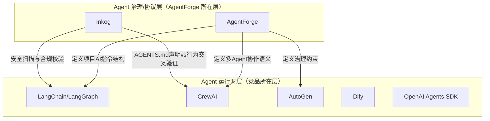
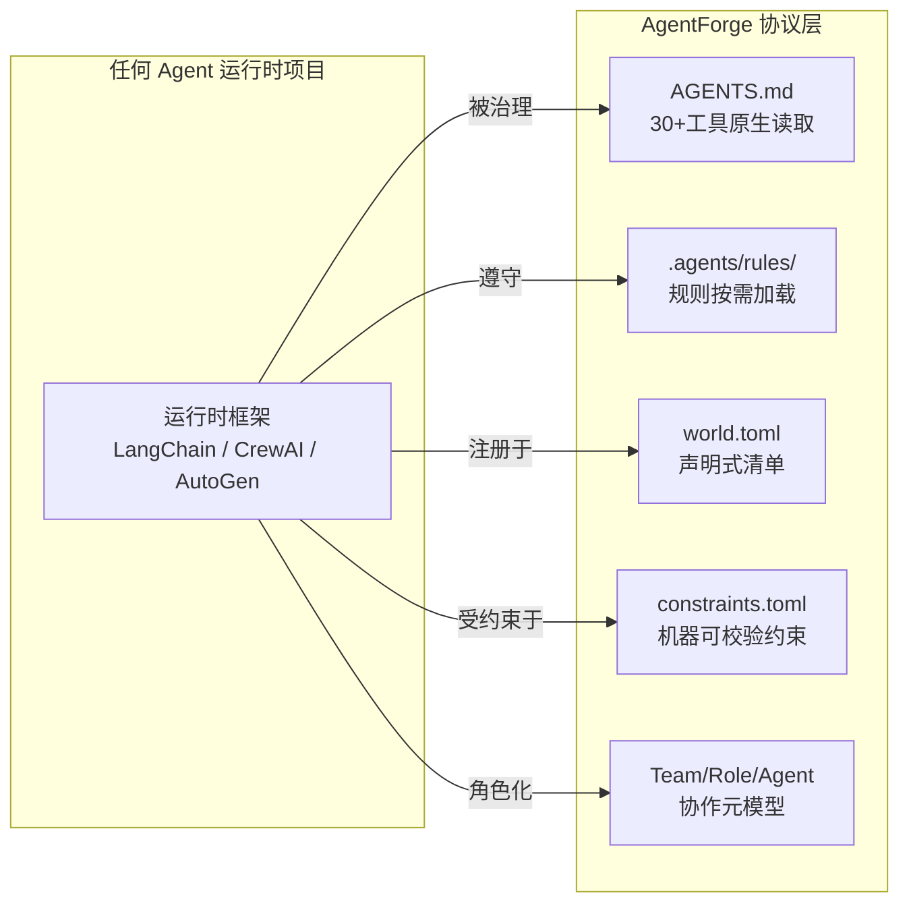
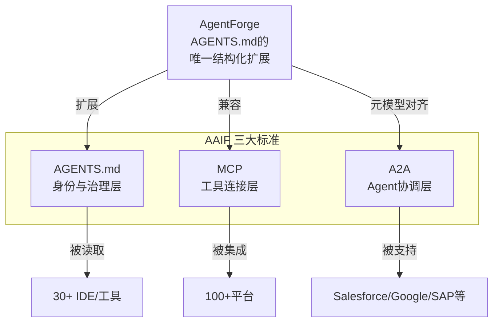

# AgentForge 竞品分析报告 2026

> **分析日期**：2026-06-21  
> **基于**：[session-meta-recap.md](session-meta-recap.md) 全会话知识资产 + 实时市场数据  
> **分析方法**：五维框架（参照 [research-methodology-template](research-methodology-template.md) §2）

---

## 一、分析前提：AgentForge 不是一个 Agent 运行时框架

在展开竞品分析前，必须首先澄清一个根本性的定位差异：



- **Agent 运行时框架**（LangChain/CrewAI/AutoGen/Dify）的核心问题是"如何让 Agent 跑起来"——它们提供 LLM 调度、工具集成、记忆管理、多 Agent 编排
- **AgentForge** 的核心问题是"如何让 Agent 守规矩"——它提供项目级 AI 治理协议、声明式清单、协作元模型、约束校验
- **AgentForge 与运行时框架不是竞争关系，而是补位关系**：一个 AgentForge 规范化的项目，可以同时在 LangChain/CrewAI/AutoGen 中运行

因此，本次竞品分析采用**双赛道分析框架**：主赛道（Agent 治理/协议层）和关联赛道（Agent 运行时框架）。

---

## 二、市场定位对比

### 2.1 赛道矩阵

```
                    高治理深度
                        │
              Inkog     │    AgentForge ★
         （安全扫描器）   │  （治理协议标准）
                        │
  ──────────────────────┼────────────────────── 高运行时完备度
                        │
            Dify        │    LangChain
         （可视化LLM平台）│  （通用Agent SDK）
                        │
            CrewAI      │    AutoGen
         （角色编排）     │  （事件驱动Agent）
                        │
                    低治理深度
```

### 2.2 定位对比表

| 维度 | AgentForge | LangChain/LangGraph | CrewAI | AutoGen | Dify | OpenAI Agents SDK | Inkog |
|------|-----------|---------------------|--------|---------|------|-------------------|-------|
| **核心定位** | AI Agent 治理协议标准 | 通用 Agent SDK 平台 | 角色扮演多Agent编排 | 事件驱动多Agent框架 | 可视化LLM应用平台 | 轻量Agent框架 | Agent安全扫描器 |
| **解决问题** | "Agent如何守规矩" | "Agent如何跑起来" | "Agent如何组队" | "Agent如何对话" | "AI应用如何搭建" | "GPT-4o Agent如何构建" | "Agent如何不出事" |
| **目标用户** | 架构师/技术负责人 | Python开发者 | Python开发者 | 研究者/.NET企业 | 全栈团队/非技术用户 | OpenAI生态开发者 | 安全/合规团队 |
| **首次可用时间** | ~2min（创建AGENTS.md） | ~10min（pip install） | ~3min（pip install） | ~10min | ~30min（Docker部署） | ~5min | ~2min（npm install） |
| **GitHub Stars** | 早期阶段 | 135k+ | 50k+ | 57k+ | 139k+ | 45k+ | 新锐 |
| **开源协议** | Apache 2.0 | MIT | MIT | MIT（代码） / CC BY 4.0（文档） | Apache 2.0（附加商业限制条款） | MIT | Apache 2.0 |

### 2.3 AgentForge 的定位独特性

AgentForge 是 **唯一** 在 Agent 治理/协议层提供完整三层架构的项目：

```
Layer 1: Project Protocol     → AGENTS.md 路由格式 + .agents/ 目录约定 + world.toml
Layer 2: Collaboration Protocol → Team/Role/Agent 元模型 + constraints.toml + Handoff
Layer 3: World Runtime        → 哲学内核 + 记忆做梦协议 + World Session
```

**关键差异化**：AgentForge 不绑定任何特定的 Agent 运行时。LangChain 项目、CrewAI 项目、AutoGen 项目都可以采用 AgentForge 的协议层——这使其天然具有"元标准"属性。

---

## 三、核心功能对比

### 3.1 功能矩阵

| 能力 | AgentForge | LangChain | CrewAI | AutoGen (v0.4+) | Dify | Inkog |
|------|-----------|-----------|--------|-----------------|------|-------|
| **项目级AI指令** | AGENTS.md（30+工具原生兼容） | 无标准化 | 无 | 配置文件 | 无 | AGENTS.md解析（消费端） |
| **规则按需加载** | `.agents/rules/` + glob paths: | 无 | 无 | 无 | 无 | 无 |
| **声明式清单** | `world.toml`（Fragment管理） | 无 | 无 | 无 | 无 | 无 |
| **技能跨平台导出** | SKILL.md（agentskills.io对齐） | 无 | 无 | 无 | 插件市场 | 无 |
| **多Agent协作语义** | Team/Role/Agent 15实体元模型 | LangGraph Agent | Crew/Role/Goal | GroupChat/Handoff | 工作流节点 | 无 |
| **操作性约束** | `constraints.toml`（strong/weak） | 无（需手动实现） | Guardrails | Approval hooks | 条件节点 | AGENTS.md交叉验证 |
| **治理合规** | 元模型约束 + 审计策略 | LangSmith观测 | Tracing | OpenTelemetry | 内置观测 | EU AI Act映射 |
| **LLM调度** | 无（非运行时） | ✅ 80+Provider | ✅ 20+Provider | ✅ 20+Provider | ✅ 100+Provider | 无 |
| **工具集成** | 无（非运行时） | ✅ 300+工具 | ✅ 30+企业集成 | ✅ MCP支持 | ✅ 50+内置工具 | MCP安全扫描 |
| **记忆管理** | Memory实体（语义层） | 向量存储 | Short/Long/Entity | Context管理 | RAG内置 | 无 |
| **可视化界面** | 无（纯配置） | LangSmith | CrewAI Studio | AutoGen Studio | ✅ 核心能力 | CLI/Web |
| **IDE集成数** | 30+（通过AGENTS.md） | 0 | 0 | 0 | 0 | Claude Code/Cursor |

### 3.2 AgentForge 的不可替代性



**核心结论**：AgentForge 的所有功能都位于"元层次"——它定义 Agent 项目应该如何被结构化、被治理、被约束，而非 Agent 应该如何执行任务。这使得它不与任何运行时框架竞争，反而成为它们的标准化治理层。

---

## 四、技术架构差异

### 4.1 架构范式对比

| 维度 | AgentForge | LangChain | CrewAI | AutoGen | Dify |
|------|-----------|-----------|--------|---------|------|
| **架构范式** | 声明式协议分层 | 组件化SDK | 角色抽象 | 事件驱动 | 可视化工作流 |
| **运行时模型** | 无运行时（静态协议） | Chain/Agent/Graph | Crew/Flow | Event/AgentChat/Core | 工作流DAG |
| **状态管理** | 静态声明（world.toml） | LangGraph State | Crew Memory | 事件日志 | 数据库持久化 |
| **扩展机制** | Fragment + SKILL.md | Partner包 | Tool + MCP | Extension | Plugin市场 |
| **部署模型** | Git文件（零依赖） | pip/poetry | pip | pip/NuGet | Docker Compose |
| **跨语言支持** | 语言无关（Markdown+TOML） | Python/JS | Python | Python/C#（v0.4起） | 平台无关 |
| **Token开销** | 零（静态文件读取） | 15-25% | 10-18% | 20-35% | 取决于工作流 |

### 4.2 AgentForge 架构的关键优势

**1. 零依赖与零Token开销**

AgentForge 的核心协议完全由 Markdown + TOML 文件构成。Agent 启动时读取 AGENTS.md 是一次性的极低成本操作，不像运行时框架每次 LLM 调用都附加 10-35% 的框架指令 overhead。

**2. 渐进式采用（不可分割的最小核心）**

```
Level 0: AGENTS.md only（5秒上手，30+工具兼容）
Level 1: + .agents/rules/（按领域隔离规则）
Level 2: + .agents/skills/（技能标准化）
Level 3: + world.toml + constraints.toml（声明式治理）
Level 4: + glob frontmatter + 操作性校验（完整治理）
```

这与 LangChain 的"全有或全无"、Dify 的"必须Docker部署"形成鲜明对比。

**3. 工具无关性**

AgentForge 的任何组件都不依赖特定工具。AGENTS.md 被 Cursor、Claude Code、Codex、Copilot、Windsurf、Aider、Devin 等 30+ 工具原生读取。而 LangChain/CrewAI/AutoGen 只能在各自的 Python 生态中运行。

### 4.3 Inkog：唯一直接竞争者

在 Agent 治理/协议层，**Inkog** 是 AgentForge 最直接的竞品：

| 维度 | AgentForge | Inkog |
|------|-----------|-------|
| **对AGENTS.md的立场** | 标准制定者（定义格式与路由） | 标准消费者（解析与校验） |
| **核心价值** | "让Agent项目被正确结构化" | "让Agent代码不违反声明" |
| **治理深度** | 协议层（定义是什么） | 校验层（检查对不对） |
| **合规映射** | 元模型约束 + 策略声明 | EU AI Act Art 12/14/15 |
| **运行时校验** | constraints.toml（静态声明） | 代码扫描（动态分析） |
| **IDE集成** | 30+工具原生读取AGENTS.md | Claude Code/Cursor MCP |

**关键差异**：AgentForge 是"上游标准制定者"，Inkog 是"下游合规校验者"。两者可以互补——一个定义协议，一个校验协议被遵守。

---

## 五、市场与社区

### 5.1 AGENTS.md 标准生态概览

AGENTS.md 于 2025 年 8 月由 OpenAI 随 Codex 发布，2025 年 12 月由 OpenAI 联合 Anthropic、Google 等捐献给 Linux Foundation 旗下的 Agentic AI Foundation (AAIF)。

| 里程碑 | 日期 |
|--------|------|
| OpenAI 发布 AGENTS.md | 2025年8月 |
| 达 60,000+ 公开仓库采用 | 2025年12月 |
| 捐献给 AAIF（Linux Foundation） | 2025年12月9日 |
| ETH Zurich 发布首份实证研究 | 2026年2月 |
| 与 MCP + A2A 并列为 AAIF 三大标准 | 2026年3月 |

**原生读取 AGENTS.md 的工具**：OpenAI Codex、Claude Code、Cursor、Aider、Devin、GitHub Copilot、Gemini CLI、Windsurf、Amazon Q、Trae、CodeFuse 等 30+ 工具。

### 5.2 社区规模对比

| 项目 | GitHub Stars | 贡献者 | 定位层级 |
|------|-------------|--------|---------|
| LangChain | 135,000+ | 2,000+ | 运行时 |
| Dify | 139,000+ | 800+ | 运行时 |
| AutoGen | 57,000+ | 400+ | 运行时 |
| CrewAI | 50,000+ | 500+ | 运行时 |
| OpenAI Agents SDK | 45,000+ | 200+ | 运行时 |
| AgentForge | 早期 | 初期 | 治理协议 |
| Inkog | 新锐 | 初期 | 安全校验 |

**注意**：AgentForge 的 Stars 数不应与运行时框架直接比较。它们处于完全不同的赛道——正如 Linux Kernel 的贡献者数不应与 Kubernetes 比较。AgentForge 的价值不在于开发者数量，而在于它的协议被多少项目采用。

### 5.3 AgentForge 的生态位机会



AgentForge 占据的是 AGENTS.md 标准的"结构化扩展"生态位——在 AGENTS.md 的基础之上，提供了 `.agents/` 目录约定、`world.toml`、`constraints.toml`、SKILL.md 等结构化扩展，而这些在 AAIF 三大标准中仍属空白。

---

## 六、定价策略比较

| 项目 | 开源版 | 最低付费版 | 企业版 | 定价模式 |
|------|--------|-----------|--------|---------|
| **AgentForge** | 免费（Apache 2.0） | — | — | 完全开源，零付费 |
| LangChain | 免费（MIT） | LangSmith $39/月 | 定制定价 | 核心免费+观测付费 |
| CrewAI | 免费（MIT） | AMP $25/月 | 定制定价 | 核心免费+Cloud付费 |
| AutoGen | 免费（MIT 代码 / CC BY 4.0 文档） | — | Azure AI Foundry | 核心免费+云服务付费 |
| Dify | 免费（Apache 2.0 + 附加商业限制条款） | Cloud $59/月 | Team $159/月 | 核心免费+Cloud付费 |
| OpenAI Agents SDK | 免费（MIT） | — | — | API用量计费 |
| Inkog | 开源（Apache 2.0） | 免费5次扫描/月 | 企业定制定价 | 扫描次数计费 |

> 注：此处“开源协议”按仓库实际授权口径校准。AutoGen 采用代码与文档分离授权；Dify 虽以 Apache 2.0 为基础，但存在针对商业化分发/白标化的附加限制；OpenAI Agents SDK 当前仓库授权为 MIT。

**AgentForge 的定价优势**：作为纯协议标准，AgentForge 没有任何运行时成本，也不需要云服务。它天然适合成为所有 AI 项目的"宪法层"——零成本、零依赖、零锁定。

---

## 七、SWOT 分析

### 7.1 AgentForge 的 SWOT

| | 优势 (Strengths) | 劣势 (Weaknesses) |
|---|---|---|
| **内部** | S1: 唯一的结构化 AGENTS.md 扩展协议<br/>S2: 渐进式采用（Level 0-4），零门槛<br/>S3: 30+ IDE 工具原生兼容<br/>S4: 三层架构正交分离，轻量且灵活<br/>S5: 不绑定任何运行时，天然跨平台<br/>S6: 协作元模型（15实体）是行业唯一 | W1: 社区规模极小，生态冷启动<br/>W2: 无运行时能力，独立使用价值有限<br/>W3: 无可视化工具，纯文本配置<br/>W4: 知名度远低于 AAIF 标准本身<br/>W5: 缺少"Hello World"级示范项目<br/>W6: 文档以中文为主，国际传播受限 |
| **外部** | **机会 (Opportunities)** | **威胁 (Threats)** |
| | O1: AAIF 推动 AGENTS.md 成为行业标准<br/>O2: EU AI Act（2026年8月生效）催生治理需求<br/>O3: 多Agent协作是企业2026年首要痛点<br/>O4: ETH Zurich 实证研究证明 AGENTS.md 价值<br/>O5: .agents/ 目录约定尚无竞品覆盖<br/>O6: SKILL.md 与 agentskills.io 对齐 | T1: AAIF 可能将类似功能纳入标准<br/>T2: LangChain/CrewAI 可能向上扩展治理层<br/>T3: Inkog 可能从安全校验扩展到协议定义<br/>T4: 大厂（Microsoft/Google/OpenAI）自建治理方案<br/>T5: AGENTS.md 的碎片化解读风险<br/>T6: 标准协议商业变现路径不清晰 |

### 7.2 竞品 SWOT 速览

**LangChain**：S=最大生态+最全集成 | W=Token开销高+学习曲线陡 | O=企业AI爆发 | T=轻量框架分流

**CrewAI**：S=角色抽象直观+60%财富500强采用 | W=较小生态+被锁定风险 | O=多Agent需求增长 | T=Microsoft Agent Framework合并威胁

**AutoGen**：S=微软背书+事件驱动架构+跨语言 | W=已合并进MS Agent Framework | O=.NET生态垄断 | T=独立身份丧失

**Dify**：S=可视化+139k Stars+RAG最强 | W=非Agent治理工具+重部署 | O=非技术用户市场 | T=低代码天花板

**Inkog**：S=唯一Agent安全扫描器+EU AI Act合规 | W=纯防御性+不定义协议 | O=合规强制需求 | T=SAST厂商入场

---

## 八、竞争策略建议

基于 [session-meta-recap.md](session-meta-recap.md) 中已萃取的 GTM 策略（[gtm-strategy-playbook.md](gtm-strategy-playbook.md)）和方法论（[research-methodology-template.md](research-methodology-template.md)），结合 AgentForge 的实际定位，提出以下竞争策略：

### 8.1 核心策略：不与运行时框架竞争，成为它们的"治理层标准"

```
AgentForge ≠ "又一个Agent框架"
AgentForge = "Agent框架的治理协议"
          = "Agent项目的.gitignore + package.json + CI配置"
```

**类比**：TypeScript 不与 JavaScript 运行时竞争——它为 JavaScript 添加类型系统。AgentForge 不与 LangChain/CrewAI 竞争——它为 Agent 项目添加治理结构。

### 8.2 四阶段推行策略

参照 [optimization-patterns.md](optimization-patterns.md) §1 的四阶段推行模式：

| 阶段 | 时间 | 动作 | 目标 |
|------|------|------|------|
| **Phase 1: 标准锚定** | 当前 | 完成 AGENTS.md 标准的 AgentForge 差异化文档；确保 Spec v0.2 与 AAIF 标准完全对齐 | 让社区理解"AgentForge 不是又一框架" |
| **Phase 2: 示范播种** | Q3 2026 | 创建 3 个示范项目：LangChain+AgentForge / CrewAI+AgentForge / AutoGen+AgentForge | 用"治理层+运行时"组合拳证明价值 |
| **Phase 3: 社区培育** | Q4 2026 | 发布 AGENTS.md 最佳实践指南；在 V2EX/HN/Reddit 持续输出 | 建立"非官方AGENTS.md权威"认知 |
| **Phase 4: 生态沉淀** | 2027 | 争取 2-3 个知名开源项目采用完整 AgentForge 协议 | 标杆案例 → 社区信任飞轮 |

### 8.3 差异化定位锚点

参照 GTM 策略中的"获客三路径"，AgentForge 处于**早期阶段（0-10w用户）**：

| 锚点 | 一句话 | 目标受众 |
|------|--------|---------|
| **AGENTS.md 的结构化补全** | "AGENTS.md 告诉你 Agent 是谁，AgentForge 告诉你 Agent 怎么管" | 已使用 AGENTS.md 的项目 |
| **多Agent协作的治理缺失** | "LangChain/CrewAI 让 Agent 跑起来，AgentForge 让它们不打架" | 多Agent项目团队 |
| **EU AI Act 合规的轻量方案** | "一个 Git 仓库就能满足 Article 14 人类监督要求" | 欧盟企业技术负责人 |
| **跨工具一致性** | "换 IDE 不换规矩——Cursor/Claude Code/Codex 都读同一份 AGENTS.md" | 多工具团队 |

### 8.4 对标 Inkog 的攻防策略

Inkog 是 AgentForge 在治理层的唯一直接竞品，但二者定位有本质区别：

| 维度 | AgentForge 策略 |
|------|----------------|
| **防御** | 强调"先有协议再有校验"——Inkog 校验的 AGENTS.md 本身需要结构化，AgentForge 提供这个结构 |
| **进攻** | AgentForge 的 constraints.toml 是声明式、语言无关的；Inkog 的扫描是程序式的、框架相关的 |
| **合作** | 与 Inkog 互补：AgentForge 定义协议，Inkog 校验合规。探索 Joint Solution 可能性 |

### 8.5 北极星指标

| 指标 | 当前（估） | 6个月目标 | 12个月目标 |
|------|-----------|----------|-----------|
| 采用 AgentForge 完整协议的项目数 | ~1（自身） | 5+ | 20+ |
| AGENTS.md 社区认知（"AgentForge=AGENTS.md扩展"） | 低 | 中 | 高 |
| 示范项目（AgentForge+运行时框架组合） | 0 | 3 | 10 |
| Spec 版本迭代 | v0.2 | v0.3（Layer 2完整发布） | v1.0（稳定API） |

---

## 九、风险与对策

参照 [optimization-patterns.md](optimization-patterns.md) §2 的风险对策矩阵：

| # | 风险 | 影响 | 概率 | 对策 |
|---|------|------|------|------|
| 1 | AAIF 将 `.agents/` 目录纳入 AGENTS.md 标准 | 高 | 中 | 主动参与 AAIF 标准讨论，将 AgentForge Spec 作为提案贡献 |
| 2 | LangChain 推出内置 Agent 治理模块 | 中 | 低 | 强调"治理层与运行时解耦"是架构优势，不是功能缺失 |
| 3 | AgentForge 生态冷启动失败 | 高 | 中高 | 4阶段推行（见§8.2），首阶段聚焦认知而非采用量 |
| 4 | Inkog 从安全校验扩展到治理协议定义 | 中 | 中 | 差异化定位：AgentForge=标准制定，Inkog=标准校验，合作优于竞争 |
| 5 | AGENTS.md 碎片化（不同工具不同解读） | 中 | 中 | 推动 Spec 成为"AGENTS.md 的权威结构化补充" |

---

## 十、总结

### 10.1 一句话结论

**AgentForge 不参与 Agent 运行时框架的竞争——它占据的是 AGENTS.md 标准的"结构化治理扩展"生态位，这是 LangChain/CrewAI/AutoGen/Dify 等 135k+ Stars 项目不曾覆盖也无意覆盖的空白地带。**

### 10.2 核心发现

1. **没有直接竞品**：在 Agent 治理/协议层，除 Inkog（安全校验方向）外，AgentForge 没有直接竞争者。`.agents/` 目录约定、`world.toml`、`constraints.toml`、Team/Role/Agent 15实体元模型均为行业唯一。

2. **互补大于竞争**：AgentForge 与所有主流 Agent 运行时框架（LangChain/CrewAI/AutoGen/Dify）是补位关系——它们解决"怎么跑"，AgentForge 解决"怎么管"。

3. **标准红利窗口期**：AGENTS.md 已被 AAIF 推为三大标准之一，60,000+ 仓库采用，30+ 工具原生读取——AgentForge 是这个标准的唯一结构化扩展，窗口期宝贵但有限。

4. **最大威胁不是竞品，是忽视**：AgentForge 最大的风险不是被竞品超越，而是潜在用户不理解"为什么要治理层"——这需要大量教育性内容输出。

5. **EU AI Act 是催化剂**：2026年8月生效的 EU AI Act Article 14（人类监督要求）将驱动企业对 Agent 治理的刚性需求，AgentForge 的 constraints.toml + 元模型天然适合作为轻量合规方案。

### 10.3 优先级行动项（P0-P2）

| 优先级 | 行动 | 依赖 | 预期效果 |
|--------|------|------|---------|
| **P0** | 发布 3 个示范项目（AgentForge + LangChain/CrewAI/AutoGen） | 无 | 证明"治理层+运行时"价值 |
| **P0** | 撰写"AGENTS.md 最佳实践"中英双语指南 | 无 | 建立社区权威认知 |
| **P1** | Spec v0.2 Layer 2 完整发布 | Spec完善 | 多Agent治理能力完备 |
| **P1** | 对接 2-3 个知名开源项目采用 | 社区关系 | 标杆案例 |
| **P2** | 参与 AAIF 标准讨论 | 社区关系 | 影响标准方向 |
| **P2** | 探索与 Inkog 的互补方案 | 商务对接 | 治理+校验闭环 |

---

## 十一、复盘 + 洞察 + 更新

### 11.1 复盘：这份竞品分析最有价值的产出是什么

回头看，这份报告最关键的贡献不是简单罗列 LangChain、CrewAI、AutoGen、Dify 等项目的市场数据，而是**先纠正了比较坐标系**：

- AgentForge 不属于 Agent 运行时框架赛道
- AgentForge 属于 Agent 治理 / 协议层赛道
- 因此不能直接用“功能多少、工具多少、Stars 多少”来判断竞争关系

这一前提一旦确立，整份报告的市场定位、定价策略、竞争策略和风险判断就获得了统一逻辑基础。后续围绕 EU AI Act、AGENTS.md 标准、constraints.toml、示范项目与治理闭环的所有推演，本质上都建立在这个前提修正之上。

### 11.2 洞察一：AgentForge 的真正对手不是运行时框架，而是“治理需求被忽视”

报告在第十章已指出“最大威胁不是竞品，是忽视”，这一判断在后续整改工作中被进一步验证。

从实际落地看，企业不会优先为“一个新的 Agent 框架”买单，但会为以下问题寻找解决方案：
- 多 Agent 行为不一致
- 不同 IDE / 工具读取项目规则的方式割裂
- 高风险动作缺少审批与审计
- 面对 EU AI Act 时无法快速回答“我们如何证明自己受控”

这说明 AgentForge 的市场教育重点，不应是“我们比 LangChain 更强”，而应是：

> **当 Agent 从单点试验走向团队协作和合规运营时，运行时框架之外还需要一个治理层。**

换句话说，AgentForge 的核心竞争对手很多时候不是某个具体产品，而是用户“暂时还没意识到需要治理层”。

### 11.3 洞察二：配置不是能力，声明层必须延伸到执行层与验证层

这份竞品分析报告中，AgentForge 的差异化主要落在：
- `AGENTS.md`
- `.agents/` 目录约定
- `world.toml`
- `constraints.toml`
- Team / Role / Agent 协作元模型

但在后续 EU AI Act 整改过程中，一个更深的认识浮现出来：

**如果这些内容只停留在声明层，它们仍然只是“规范资产”，还不是“治理能力”。**

例如：
- `audit_all_actions = true` 不等于系统真的完成审计
- `require_human_approval_for = [...]` 不等于高风险动作真的被阻断
- `sanitize_llm_input = true` 不等于所有模型输入真的经过净化

因此，对 AgentForge 的竞争力判断应进一步升级为三层：

```text
声明层：AGENTS.md / world.toml / constraints.toml
执行层：审计、审批、净化、协作路由等真实机制
验证层：本地校验脚本、CI 门禁、合规评分、行为审计
```

这意味着 AgentForge 若要从“结构化扩展标准”走向“可落地的治理方案”，后续叙事必须从“定义协议”进一步走向“协议如何被执行、被验证”。

### 11.4 洞察三：EU AI Act 不是附加卖点，而是治理层的现实催化剂

报告原本已将 EU AI Act 视为市场机会，但从后续整改实践看，这一判断应进一步强化。

真正推动企业采用治理层的，不会只是抽象的“最佳实践”，而往往是以下现实压力：
- 需要证明高风险动作有人类监督
- 需要证明关键操作可追溯、可留存
- 需要证明模型输入具备基础净化与鲁棒性控制
- 需要在审计、采购、法务问询时快速给出结构化证据

因此，AgentForge 的市场定位可以进一步清晰化：

> **AgentForge 不只是 AGENTS.md 的结构化扩展，更是把治理要求翻译成项目级工程结构的轻量承载层。**

这一定义比“治理协议标准”更接近企业购买动机，因为它直接回答了“为什么现在要做”。

### 11.5 需要更新的认知：北极星指标不应只看采用量，还应看“闭环度”

原报告中的北极星指标主要包括：
- 完整协议采用项目数
- 社区认知
- 示范项目数
- Spec 版本迭代

这些指标仍然成立，但经过后续实践，建议补充一类更关键的指标：**治理闭环度指标**。

建议新增以下观测项：

| 指标 | 含义 | 建议目标 |
|------|------|---------|
| 声明层采用率 | 仅使用 `AGENTS.md` / `constraints.toml` 的项目占比 | 用于观察入口渗透 |
| 执行层接入率 | 已把审计/审批/净化接入主链路的项目占比 | 用于观察真实落地 |
| 验证层覆盖率 | 具备本地校验或 CI 门禁的项目占比 | 用于观察治理自动化 |
| 示范闭环项目数 | 同时具备声明、执行、验证三层的案例数 | 用于形成标杆案例 |

这组指标比单纯“多少项目用了 AgentForge”更能反映其竞争质量，因为它直接衡量 AgentForge 是否从文档协议成长为工程治理体系。

### 11.6 对原报告的更新建议

基于后续工作，建议对这份竞品分析形成以下更新口径：

#### 更新 A：把“治理协议层”明确细化为“三层治理能力”
原表述偏重“协议定义”，建议升级为：
- **声明层**：定义规则与协作语义
- **执行层**：承接审计、审批、净化等治理动作
- **验证层**：校验声明与行为是否一致

这样能更自然地和 Inkog、CI 门禁、本地检查脚本形成关系分工。

#### 更新 B：把竞争策略从“教育市场”扩展为“交付闭环”
原来的竞争策略强调认知教育与示范播种，这仍然必要；但还应补充：
- 发布可运行的治理模块
- 提供最小可集成校验脚本
- 提供示范项目中的真实审计 / 审批 / 净化接入案例

只有这样，AgentForge 才不会停留在“概念正确”，而会进入“可复制采用”。

#### 更新 C：把 Inkog 的关系从“竞品”升级为“上下游互补生态”
原报告已提及双方可互补，但现在可以更明确：
- AgentForge 更偏上游：定义项目如何表达治理结构
- Inkog 更偏下游：检查项目是否真的遵守治理要求

这种关系更接近“协议层 + 校验层”的组合，而不是同层同质竞争。

### 11.7 更新后的结论

经过后续整改工作的验证，这份竞品分析的主结论依然成立，但建议升级为更完整的一句话：

**AgentForge 不与 LangChain、CrewAI、AutoGen、Dify 竞争“让 Agent 跑起来”的能力；它竞争的是“如何把 Agent 项目组织成可治理、可审计、可验证的工程系统”这一空白地带。其真正价值不止于 AGENTS.md 的结构化扩展，更在于为声明层、执行层、验证层提供一个渐进式闭环入口。**

---

## 附录：数据来源与引用

| 数据项 | 来源 |
|--------|------|
| LangChain 135k+ Stars | 多源交叉验证（CSDN/TokenMix/PerspectiveAI，2026年4月） |
| CrewAI 50k+ Stars, $25/月 | 多源交叉验证（CrewAI官网/CodaOne/Doolpa，2026年6月） |
| AutoGen 57k+ Stars, v0.4事件驱动架构 | DecisionCrafters + aitoolsatlas.ai（2026年4-6月） |
| Dify 139k+ Stars, $59/月 | 掘金/ToolJunction/aiwiki（2026年5-6月） |
| AGENTS.md 60,000+仓库, AAIF标准 | Prateek Sharma Blog + BuildBetter Blog（2026年2-5月） |
| Inkog EU AI Act合规 | Inkog官方文档（2026年） |
| Microsoft Agent Framework 1.0 GA | Dev.to + MS Blog（2026年4月） |
| AgentForge 内部数据 | [session-meta-recap.md](session-meta-recap.md) + [agentforge-spec-v0.2.md](../specs/agentforge-spec-v0.2.md) |

---

*本报告遵循 [research-methodology-template.md](research-methodology-template.md) 的四阶段流水线方法，数据采集→洞察分析→框架构建→优化评估。*
