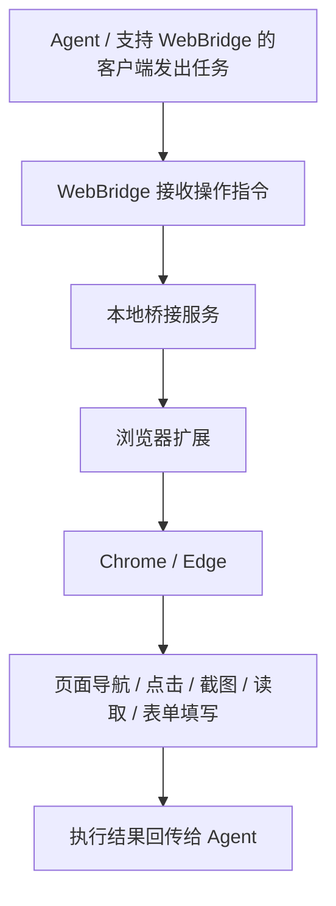

# Kimi WebBridge 技术学习笔记

> 来源页面：<https://www.kimi.com/zh-cn/features/webbridge>  
> 学习日期：2026-06-22  
> 文档定位：浏览器 Agent 能力研究、产品方案对比、技术选型参考

## 1. 概述

Kimi WebBridge 是 Moonshot AI 提供的一项浏览器桥接能力，目标是让 AI Agent 直接调用本机浏览器完成网页导航、点击、表单填写、截图与信息提取等操作。其核心价值不在于“读取网页”，而在于将浏览器变成 Agent 可调用的本地执行器。

从产品定位看，Kimi WebBridge 可通过独立安装脚本部署为本地浏览器桥接能力；Kimi Work 是官方展示和使用场景之一，但不应理解为唯一入口。安装完成后，Agent 可通过 WebBridge 操作用户本机浏览器完成任务。

一句话概括：

> Kimi WebBridge 是一个面向 AI Agent 的本地浏览器桥接执行系统。

## 2. 核心功能

根据页面说明，Kimi WebBridge 主要提供以下能力。

### 2.1 网页导航与交互

支持 Agent 在浏览器中执行常见操作，包括：

- 打开网页
- 点击按钮
- 浏览页面
- 截图
- 读取页面内容

这说明 Kimi WebBridge 并不是单纯的网页内容抓取工具，而是具备真实浏览器交互能力。

### 2.2 表单填写

Kimi WebBridge 支持自动填写网页表单，适用于信息录入、搜索、筛选、提交流程等任务。

这类能力可以覆盖：

- 搜索框输入
- 条件筛选
- 注册或报名表单填写
- 后台系统信息录入

### 2.3 信息提取

Kimi WebBridge 支持从网页中提取目标信息，用于调研、摘要、归档和内容整理。

与静态抓取相比，它更适合需要真实浏览器上下文的页面，例如：

- SPA 页面
- 动态渲染页面
- 登录态页面
- 交互式工具页面

### 2.4 面向任务的自动化执行

Kimi WebBridge 的交互入口是自然语言 Prompt，而不是预定义脚本。因此它更适合与 Agent 工作流结合，执行“目标导向”的网页任务。

页面给出的示例 Prompt 是：

> 帮我打开小红书，搜索关于 Kimi K2.6 发布的帖子

这说明它面向的是“任务式浏览器操作”，而不是仅打开某个固定页面或执行固定脚本。

## 3. 技术实现原理

Kimi WebBridge 的技术实现可以概括为三层：Agent 指令层、本地桥接层、浏览器执行层。



### 3.1 Agent 指令层

Agent 或支持 WebBridge 的客户端发出自然语言任务或操作指令，WebBridge 负责承接指令并驱动本地浏览器执行。

这一层解决的是：

- 用户目标理解
- 任务拆解
- 操作计划生成
- 执行结果解释

### 3.2 本地桥接层

Kimi WebBridge 通过本地桥接服务接收 Agent 指令，并将这些指令分发给浏览器扩展执行。

本地桥接服务可以理解为 Agent 与浏览器之间的中间层，承担指令调度与执行控制职责。

### 3.3 浏览器执行层

浏览器扩展基于 Chrome DevTools Protocol（CDP）在本机 Chrome 或 Edge 中执行操作，包括：

- 导航
- 点击
- 截图
- 页面读取
- 表单填写

执行结果再回传给 Agent，形成闭环。

### 3.4 本地执行与隐私保护

页面明确强调：

- 所有执行都在本地完成
- 登录态不会离开设备
- 网页内容不会离开设备

这意味着 Kimi WebBridge 的设计重点之一是：在保留真实浏览器上下文的同时，尽量降低账号与页面数据外流风险。

## 4. 支持环境

当前页面明确提到支持以下浏览器环境：

- Chrome
- Edge

从实现方式看，Kimi WebBridge 依赖 Chromium 生态及其调试协议能力。

## 5. 使用流程

Kimi WebBridge 的使用流程可分为安装、浏览器连接与任务执行三步。

### 5.1 安装 Kimi WebBridge

Windows 环境可通过 PowerShell 安装脚本部署 Kimi WebBridge：

```powershell
irm https://cdn.kimi.com/webbridge/install.ps1 | iex
```

安装完成后，WebBridge 即可作为本地浏览器桥接能力，配合 Agent 操作用户本机浏览器完成任务。

### 5.2 连接浏览器

Kimi WebBridge 通过本地浏览器环境完成实际操作，通常需要配合 Chrome / Edge 及浏览器扩展或等价连接机制。

这一层是 WebBridge 接入本机浏览器上下文的关键组件。

### 5.3 发起浏览器任务

安装和连接完成后，Agent 可通过 WebBridge 驱动浏览器执行网页任务。

典型流程：

```text
安装 Kimi WebBridge
  → 连接本机 Chrome / Edge
  → Agent 发出任务或操作指令
  → WebBridge 调用浏览器能力
  → 本机 Chrome / Edge 执行网页操作
  → 结果返回给 Agent
```

## 6. 安装验证与排查记录

### 6.1 Trae 沙箱内安装验证

在 Trae 终端中直接运行安装命令：

```powershell
irm https://cdn.kimi.com/webbridge/install.ps1 | iex
```

安装脚本可正常完成前置步骤：

```text
✓ Platform: windows-amd64
✓ Version: latest
==> Downloading binary from https://cdn.kimi.com/webbridge/latest/releases/kimi-webbridge-windows-amd64.exe
```

但在写入默认安装路径时失败：

```text
C:\Users\xinzo\.kimi-webbridge\bin\kimi-webbridge.exe
```

原因不是 WebBridge 脚本不可用，而是 Trae 执行环境的安全 allowlist 阻止远程安装脚本写入用户 Home 目录。

### 6.2 沙箱限制结论

Trae 阻止 `irm URL | iex` 类安装脚本写入非授权目录，是合理的安全边界。该限制用于避免 AI 或远程脚本直接修改用户系统环境、写入可执行文件、污染 Home 目录或修改 PATH 等用户级配置。

因此在 Trae 中验证这类工具时，应区分两条路径：

| 路径 | 适用目标 |
|---|---|
| Trae 内验证 | 验证脚本可访问、下载地址可用、局部命令行为 |
| 系统级安装 | 用户在本机 PowerShell 中手动执行，允许写入 Home 目录并配置环境 |

不建议尝试绕过 Trae 沙箱；如需长期使用，应由用户在本机 PowerShell 中手动安装。

### 6.3 手动安装后的 PATH 排查

用户在本机 PowerShell 手动安装后，如果运行：

```powershell
kimi-webbridge --help
```

出现：

```text
kimi-webbridge: The term 'kimi-webbridge' is not recognized as a name of a cmdlet, function, script file, or executable program.
```

这不一定代表安装失败，更可能是 `kimi-webbridge.exe` 所在目录没有进入当前 PowerShell 的 `PATH`，或当前终端尚未刷新环境变量。

推荐按三层顺序排查：

| 层级 | 验证内容 | 命令 |
|---|---|---|
| 文件层 | exe 是否存在 | `Test-Path "$env:USERPROFILE\.kimi-webbridge\bin\kimi-webbridge.exe"` |
| 可执行层 | exe 是否能直接运行 | `& "$env:USERPROFILE\.kimi-webbridge\bin\kimi-webbridge.exe" --help` |
| PATH 层 | 命令是否全局可用 | `kimi-webbridge --help` |

若完整路径可执行但命令不可识别，则说明是 PATH 问题。可在当前终端临时加入：

```powershell
$env:Path = "$env:USERPROFILE\.kimi-webbridge\bin;$env:Path"
kimi-webbridge --help
```

如需永久生效，可将目录加入用户 PATH 后重启 PowerShell / Trae Terminal。

## 7. 使用场景

页面列举了若干典型场景，说明其适用范围主要包括以下几类。

### 7.1 自动调研成文

用于自动访问网页、提取信息并辅助生成研究内容。

适合场景：

- 产品调研
- 竞品信息整理
- 公开资料收集
- 多页面信息汇总

### 7.2 智能填写信息

用于自动处理网页表单、录入字段、提交操作等流程。

适合场景：

- 报名表填写
- 搜索条件输入
- 后台信息录入
- 结构化字段提交

### 7.3 量化策略回测

用于驱动特定网页工具进行参数输入、结果获取与流程自动化。

这说明 Kimi WebBridge 不只适用于内容抓取，还可以用于网页工具调用类任务。

## 8. FAQ 要点

### 8.1 Kimi WebBridge 如何工作

其核心工作机制为：

- Agent 发出任务指令
- 本地桥接服务接收并转发
- 浏览器扩展通过 CDP 驱动 Chrome / Edge
- 浏览器执行结果回传 Agent

### 8.2 插件显示未连接怎么办

页面给出的处理建议包括：

1. 确认浏览器侧连接组件已正确安装
2. 重新运行 WebBridge 连接或安装指令
3. 必要时重启相关客户端或浏览器

这说明连接状态依赖三部分同时正常：本地 WebBridge 服务、浏览器侧连接组件、发起任务的 Agent 客户端。

### 8.3 使用中遇到问题怎么办

页面建议：

- 前往 Help Center 查找解决方案
- 或通过飞书群反馈问题和建议

## 9. 与 agent-browser / Playwright / 浏览器扩展方案对比

### 9.1 一句话区别

- Kimi WebBridge：面向 Kimi Agent 的本地浏览器桥接执行层
- agent-browser：面向 AI Agent / CLI 的通用浏览器自动化工具
- Playwright：面向工程开发与测试的通用浏览器自动化框架
- 纯浏览器扩展方案：面向浏览器内能力扩展，但通常缺少完整 Agent 调度闭环

### 9.2 对比总表

| 维度 | Kimi WebBridge | agent-browser | Playwright | 纯浏览器扩展方案 |
|---|---|---|---|---|
| 主要定位 | Kimi Agent 浏览器执行 | 通用 Agent 浏览器自动化 | 测试 / 自动化开发框架 | 浏览器内功能扩展 |
| 交互入口 | Agent / 支持 WebBridge 的客户端 | CLI / Agent 指令 | 代码脚本 | 扩展 UI / 注入逻辑 |
| 执行环境 | 本机 Chrome / Edge | Chrome / Chromium 等 | 多浏览器 | 浏览器自身 |
| 目标用户 | 普通用户 + Agent 使用者 | AI Agent 开发者 | 工程师 / QA / 自动化开发 | 插件开发者 |
| 是否强调本地隐私 | 强 | 取决于用法 | 取决于部署 | 取决于实现 |
| 是否适合复杂工程编排 | 一般 | 强 | 很强 | 弱 |
| 是否适合自然语言直接驱动 | 强 | 强 | 弱 | 弱 |
| 是否适合测试工程 | 弱 | 中 | 很强 | 弱 |

### 9.3 与 agent-browser 的差异

两者都具备浏览器操作、页面交互、页面内容读取和 Agent 自动化能力。

不同点在于：

- Kimi WebBridge 更偏本地桥接能力，安装后可被支持 WebBridge 的 Agent 客户端调用，面向终端用户，强调开箱即用。
- agent-browser 更偏通用基础设施，CLI 能力更强，指令粒度更细，更适合纳入自定义 Agent 工作流。

判断：

- 给最终用户直接使用，Kimi WebBridge 更自然。
- 给自定义 Agent 系统集成，agent-browser 更灵活。

### 9.4 与 Playwright 的差异

Playwright 更适合：

- E2E 测试
- 自动化测试脚本
- 大规模脚本维护
- CI 集成
- 断言与回归验证

Kimi WebBridge 更适合：

- 用户一句话发起任务
- Agent 理解后再执行
- 交互式临时任务
- 面向产品功能而非测试工程

判断：

- 工程测试、脚本稳定性、CI 自动化，Playwright 优势更大。
- 自然语言驱动的浏览器任务执行，Kimi WebBridge 更贴近产品体验。

### 9.5 与纯浏览器扩展方案的差异

纯浏览器扩展通常只解决：

- 注入页面
- 获取 DOM
- 修改页面行为

但不一定自带：

- Agent 指令理解
- 本地桥接调度
- 完整任务回传机制
- 与 Agent 客户端或桌面工作流的集成

Kimi WebBridge 明显多了一层完整闭环：

```text
Agent → 本地桥接 → 浏览器扩展 → 浏览器 → 执行结果回传
```

因此它不是单一扩展，而是一个带调度闭环的产品化体系。

## 10. 选型建议

| 场景 | 推荐方案 |
|---|---|
| 普通静态网页内容提取 | defuddle |
| SPA / 动态渲染页面抓取 | agent-browser / Playwright |
| AI Agent 在本机浏览器中完成网页任务 | Kimi WebBridge / agent-browser |
| 支持 WebBridge 的 Agent 客户端中执行自然语言浏览器任务 | Kimi WebBridge |
| 自定义 Agent 系统集成浏览器能力 | agent-browser |
| 工程化 E2E 测试 | Playwright |
| 浏览器内单点增强 | 浏览器扩展 |

## 11. 关键判断

### 11.1 它是 Agent 的浏览器执行层，而不是普通网页抓取工具

Kimi WebBridge 解决的核心问题不是“网页可读”，而是“网页可操作”。

### 11.2 它依赖真实浏览器上下文

由于运行在本地 Chrome / Edge 中，因此更适合处理：

- SPA
- 动态渲染页面
- 登录态页面
- 交互式页面

### 11.3 它强调本地可信执行

与纯云端浏览器代理不同，Kimi WebBridge 更强调：

- 本地闭环
- 隐私保护
- 账号态本地保留

### 11.4 它的边界在于工程可编排性

Kimi WebBridge 更像是为 Agent 产品体验优化过的浏览器能力封装层。它未必是最强的工程自动化框架，也未必是最灵活的开发者底层工具。

## 12. 可复用分析框架

后续分析类似产品时，可使用以下六层框架：

| 层级 | 关键问题 |
|---|---|
| 入口层 | 用户在哪里发起任务？桌面端、网页端、IDE、Agent 平台？ |
| 指令层 | 是自然语言驱动，还是脚本 / API 驱动？ |
| 桥接层 | 是否有本地服务、浏览器扩展、协议桥？ |
| 执行层 | 是静态抓取、CDP、Playwright，还是扩展注入？ |
| 安全层 | 登录态和网页内容是否离开本机？ |
| 生态层 | 是否能接入外部 Agent / 工作流 / 自动化系统？ |

## 13. 总结

Kimi WebBridge 的本质是一个面向 AI Agent 的本地浏览器桥接执行系统。它通过“本地桥接服务 + 浏览器扩展 + CDP”打通自然语言任务与真实浏览器操作之间的链路，使 Agent 可以在本机环境中完成网页导航、内容提取、表单填写和交互自动化任务。

对于需要真实浏览器上下文、登录态复用和本地隐私保护的场景，Kimi WebBridge 提供了一种比纯静态抓取更强、比传统脚本更贴近自然语言 Agent 工作流的方案。

从选型角度看：

- 相对 Playwright：Kimi WebBridge 更产品化，但工程化能力较弱。
- 相对 agent-browser：Kimi WebBridge 更偏本地安装后的即用型桥接能力；agent-browser 更偏通用 CLI 与工程编排。
- 相对纯浏览器扩展：Kimi WebBridge 具备更完整的 Agent 调度闭环。
