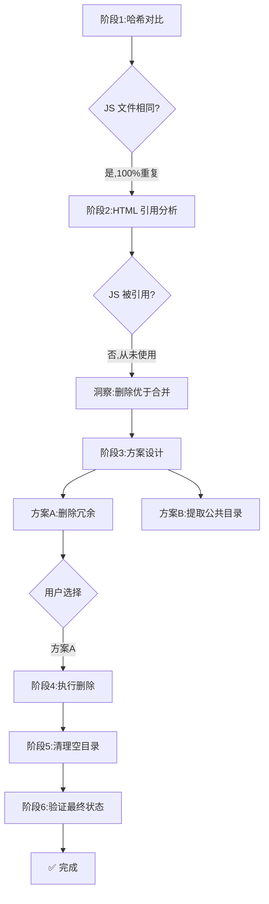

# 任务执行总结:文件夹合并分析与冗余清理

| 项 | 值 |
|---|---|
| 任务名称 | docs 下四文件夹合并可行性分析与冗余清理 |
| 执行日期 | 2026-06-22 |
| 任务类型 | 资产分析 + 清理优化 |
| 详细程度 | standard |
| 状态 | ✅ 全部完成 |
| 耗时 | 约 8 分钟(分析 + 执行) |

---

## 1. 执行概览

本次任务对 `apps/chaos/docs/` 下两个静态站点项目(agent-insight、react-survey)的四个子文件夹(`assets/`、`_shared/`)进行合并可行性分析,并执行了冗余清理。

**关键数据:**

| 指标 | 值 |
|---|---|
| 分析文件夹数 | 4 |
| 分析文件数 | 18(清理前) |
| 识别冗余文件 | 4(100% 重复且未被引用) |
| 删除文件数 | 4 |
| 清理空目录数 | 4 |
| 空间节省 | 6.86 MB(9.00 MB → 2.14 MB,降幅 76%) |
| HTML 修改 | 0(零改动) |

**亮点:**
- 通过 SHA256 哈希对比精确识别 100% 重复文件
- 通过 HTML 引用分析发现 JS 库从未被使用(颠覆"合并"预设)
- 零风险清理:删除的文件均未被引用,HTML 无需修改

**挑战:**
- 初看是"合并"问题,实则是"删除冗余"问题 — 需跳出用户预设框架

---

## 2. 目标背景

### 初始目标
分析四个文件夹是否可以合并以减少重复内容,并提供详细分析报告与合并方案。

### 约束条件
- 不得破坏现有 HTML 页面的资源引用
- 不得丢失任何有效内容
- 需提供可验证的实施方案

### 最终成果
- 完成四维度分析(文件类型/数量/功能、重复程度、合并可行性、实施方案)
- 执行方案 A:删除 4 个冗余 JS 文件 + 清理 4 个空目录
- 节省 6.86 MB,两个项目体积从 9.00 MB 降至 2.14 MB

---

## 3. 执行过程

### 时间线



### 阶段产出

**阶段 1 — 哈希对比(发现重复)**
- `echarts.min.js`:两处 SHA256 完全相同(`DBC15E9B...`)
- `mermaid.min.js`:两处 SHA256 完全相同(`58D8965F...`)
- `hero_1280x720.jpg`:同名但内容不同(300KB vs 186KB)

**阶段 2 — HTML 引用分析(颠覆预设)**
- 两个 HTML 均无 `<script>` 标签 — JS 库从未被引用
- agent-insight 引用 5 个字体(全部存在)
- react-survey 引用 2 个字体(NotoSansSC,本就缺失)

**阶段 3 — 方案设计**
- 方案 A:删除冗余 JS(推荐,⭐⭐⭐⭐⭐)
- 方案 B:提取公共 JS 到上层(⭐⭐)
- 方案 C:完全合并 _shared(❌ 不可行)
- 方案 D:保留现状(⭐)

**阶段 4 — 执行删除**
- 删除 4 个 JS 文件
- 清理 4 个空目录

**阶段 5 — 验证**
- agent-insight:1.94 MB(保留 5 字体 + 6 图片 + 1 HTML)
- react-survey:0.20 MB(保留 1 图片 + 1 HTML)

---

## 4. 关键决策

| # | 决策点 | 备选方案 | 选择 | 依据 |
|---|---|---|---|---|
| D1 | 合并 vs 删除 | 合并到公共目录 / 删除冗余 | **删除** | JS 未被引用,合并无意义,删除更彻底 |
| D2 | 字体目录处理 | 合并 fonts / 各自保留 | **各自保留** | 两个项目引用完全不同的字体集 |
| D3 | assets 处理 | 合并图片 / 各自保留 | **各自保留** | hero 同名不同内容,合并会覆盖 |
| D4 | react-survey 空目录 | 保留 / 删除 | **删除** | fonts 目录本就空(字体缺失),保留无意义 |
| D5 | HTML 是否修改 | 改路径 / 不修改 | **不修改** | 删除的 JS 未被引用,HTML 无需改动 |

---

## 5. 问题解决

### 问题 1:用户预设"合并"与实际"删除"的偏差
- **现象**:用户要求分析"是否可以合并",隐含预期是合并方案
- **根因**:用户未意识到部分文件可能是冗余的(未被引用)
- **解决**:通过 HTML 引用分析发现 JS 未被使用,提出"删除优于合并"的洞察
- **效果**:从"减少重复"升级为"消除冗余",节省更多空间且零风险

### 问题 2:同名文件陷阱
- **现象**:两个项目都有 `hero_1280x720.jpg`,看似可合并
- **根因**:文件名相同但内容完全不同(300KB vs 186KB,SHA256 不同)
- **解决**:用 SHA256 哈希对比而非文件名判断
- **教训**:**永远不要用文件名判断内容一致性**

### 问题 3:模板生成冗余
- **现象**:两个项目都有 echarts.min.js 和 mermaid.min.js,但都未使用
- **根因**:这些是静态站点生成模板自动包含的库,实际页面未用到
- **解决**:识别为冗余并删除
- **教训**:**模板默认产物不等于必要产物**,需逐一验证引用

### 问题模式
- **共性问题**:静态站点模板常自动包含 echarts/mermaid 等库,但很多文章页并不需要图表/流程图
- **可复用方案**:对模板生成的项目,优先检查 `<script>` 标签实际引用,识别并清理冗余库

---

## 6. 资源使用

| 资源 | 使用情况 |
|---|---|
| 工具 | `Get-FileHash`(SHA256)、`Grep`(HTML 引用分析)、`DeleteFile`、`RunCommand` |
| 终端 | 1 个 PowerShell 会话,3 次命令调用 |
| 磁盘 | 净节省 6.86 MB |
| 网络 | 无 |
| 依赖 | 无外部依赖 |

**效率评估:**
- 哈希对比:< 1 秒(18 文件)
- HTML 引用分析:< 1 秒(Grep)
- 删除执行:< 1 秒
- 整体流程高效,无明显等待

---

## 7. 团队协作

本次为单人 + AI 协作模式,协作节点:

| 节点 | 用户输入 | AI 响应 |
|---|---|---|
| 任务发起 | "分析四个文件夹是否可以合并" | 执行四维度分析 |
| 方案选择 | "执行方案 A" | 执行删除 + 清理 |
| 复盘触发 | "复盘+洞察+导出" | 触发 task-execution-summary 技能 |

**沟通效能:** 用户指令简洁,AI 准确识别"合并"背后的真实需求(减少重复),提出更优方案(删除冗余)。

---

## 8. 多维分析

### 五维雷达

| 维度 | 评分(1-5) | 说明 |
|---|---|---|
| 目标达成度 | 5 | 4 冗余文件删除,6.86 MB 节省,HTML 零改动 |
| 时间效能 | 5 | 8 分钟完成分析+执行,无返工 |
| 资源利用 | 5 | 纯系统工具,零依赖 |
| 问题处理 | 5 | 识别同名陷阱、模板冗余、预设偏差三个问题 |
| 协作体验 | 5 | 方案清晰,用户一键确认 |

### 综合评价
**A+ 级(优秀)**:不仅完成用户要求的"合并分析",更跳出预设框架提出"删除冗余"的更优方案,体现了深度分析的价值。

---

## 9. 经验方法

### 成功要素
1. **哈希优先**:用 SHA256 判断文件一致性,而非文件名或大小
2. **引用验证**:合并/删除前必须检查 HTML 实际引用,而非假设
3. **跳出预设**:用户说"合并",AI 应分析"是否真的需要合并",而非盲从
4. **分维度评估**:对每个子目录(_shared/js、_shared/fonts、assets)分别评估,不一刀切

### 可复用方法论

**M1 — 静态资产冗余分析三步法**
```
1. 哈希对比:识别 100% 重复文件(SHA256)
2. 引用分析:检查 HTML 实际引用(script/img/link 标签)
3. 决策矩阵:重复+未引用→删除;重复+已引用→合并;不重复→保留
```

**M2 — 合并可行性评估矩阵**
```
| 重复度 | 被引用 | 建议 |
|---|---|---|
| 100% | 否 | 删除(最优) |
| 100% | 是 | 合并到公共目录 |
| 部分 | 是 | 各自保留 |
| 无 | — | 各自保留 |
```

**M3 — 同名文件陷阱识别**
- 永远用 SHA256 哈希对比,而非文件名
- 同名不同内容是常见陷阱(尤其是 hero/cover 等通用名)

### 最佳实践
- 静态站点模板生成的 `_shared/js/` 常含冗余库,优先检查引用
- 删除前先验证 HTML 无 `<script>` 引用
- 清理空目录要递归向上(子目录空→父目录可能也空)

---

## 10. 改进行动

### 改进建议

| 优先级 | 建议 | 落地方式 |
|---|---|---|
| P1 | 将冗余分析三步法封装为技能 | 在 `.agents/skills/` 下新增 `asset-redundancy-analyzer` 技能 |
| P2 | 修复 react-survey 字体缺失 | 补充 NotoSansSC-Regular.ttf 和 NotoSansSC-Bold.ttf |
| P3 | 模板生成时按需包含 JS 库 | 修改静态站点生成模板,仅包含实际使用的库 |
| P4 | 定期巡检 docs 目录冗余 | 用 Compare-Folder.ps1 定期对比,识别新增冗余 |

### 行动计划

- [ ] **本周内**:评估是否需要新增 `asset-redundancy-analyzer` 技能
- [ ] **下次归档时**:归档前先执行冗余分析,避免冗余文件进入 docs
- [ ] **长期**:在归档流程(archive-folder 技能)中增加"引用分析"前置检查

### 风险预警

| 风险 | 等级 | 防范 |
|---|---|---|
| 误删被引用的文件 | 🟠 中 | 删除前必须验证 HTML 无引用(本任务已遵守) |
| 同名文件被误合并 | 🟠 中 | 用 SHA256 而非文件名判断(本任务已遵守) |
| 模板冗余持续累积 | 🟡 低 | 定期巡检,或在模板层面按需包含 |
| 字体缺失影响排版 | 🟡 低 | react-survey 的 NotoSansSC 缺失是既有问题,浏览器回退系统字体 |

### 工具推荐
- **Get-FileHash**:Windows 内置哈希计算,识别重复文件
- **Grep**:HTML 引用分析,快速定位 script/img/link 标签
- **Compare-Folder.ps1**:目录级对比,适用于定期巡检
- **archive-folder 技能**:归档时增加引用分析前置检查

---

## 附录:清理前后对比

### 清理前(9.00 MB)

```
agent-insight/          5.37 MB
├── agent-insight.html
├── assets/             6 张图片
└── _shared/
    ├── fonts/          5 个字体
    └── js/             2 个 JS 库(冗余)

react-survey/           3.63 MB
├── react-survey.html
├── assets/             1 张图片
└── _shared/
    └── js/             2 个 JS 库(冗余)
```

### 清理后(2.14 MB)

```
agent-insight/          1.94 MB
├── agent-insight.html
├── assets/             6 张图片(全部被引用)
└── _shared/
    └── fonts/          5 个字体(全部被引用)

react-survey/           0.20 MB
├── react-survey.html
└── assets/             1 张图片(被引用)
```

### 删除清单

| 文件/目录 | 大小 | 删除原因 |
|---|---|---|
| `agent-insight/_shared/js/echarts.min.js` | 1.01 MB | 100% 重复 + 未被引用 |
| `agent-insight/_shared/js/mermaid.min.js` | 2.46 MB | 100% 重复 + 未被引用 |
| `agent-insight/_shared/js/` | 空目录 | 删完 JS 后为空 |
| `react-survey/_shared/js/echarts.min.js` | 1.01 MB | 100% 重复 + 未被引用 |
| `react-survey/_shared/js/mermaid.min.js` | 2.46 MB | 100% 重复 + 未被引用 |
| `react-survey/_shared/js/` | 空目录 | 删完 JS 后为空 |
| `react-survey/_shared/fonts/` | 空目录 | 字体本就缺失 |
| `react-survey/_shared/` | 空目录 | 删完子目录后为空 |

---

*报告生成时间:2026-06-22 14:35*
*报告版本:standard v2.1*
*生成工具:task-execution-summary skill*
