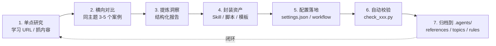

# 复盘 → 洞察 → 沉淀 工作流规律

> **类型**：经验层（topic）· 候选规则
>
> **触发来源**：[`task-summary-spa-content-extraction-20260621.md`](../superpowers/retrospectives/task-summaries/exploration/task-summary-spa-content-extraction-20260621.md)
>
> **关联规则**：[`../.agents/rules/rule-evolution.md`](../rules/rule-evolution.md) · [`../.agents/docs/superpowers/memories/2026-05-25-doc-architecture-three-layers-principle.md`](../docs/superpowers/memories/2026-05-25-doc-architecture-three-layers-principle.md)

---

## 0. 规律主张

> **一次"学习 URL"的单点任务，按"复盘 → 洞察 → 沉淀"七步走完，会自动变成项目可复用资产。**

---

## 1. 七步骨架

| # | 步骤 | 典型产物 | 本项目实例 |
|---|------|----------|------------|
| 1 | 单点研究 | `.temp/<slug>.md` | `trae-insight-report.md` |
| 2 | 横向对比 | 矩阵表 / 评分卡 | `ai-coding-tools-benchmark.md`（4 家） |
| 3 | 提炼洞察 | 结构化报告 | 同一份 benchmark |
| 4 | 封装资产 | `SKILL.md` / 脚本 | `.trae/skills/spa-content-extractor/SKILL.md` |
| 5 | 配置落地 | `settings.json` | `.trae/settings.json` 的 `default_skills` |
| 6 | 自动校验 | 校验脚本 | `.temp/check_skill.py` |
| 7 | 归档 | references / topics | `web-content-extraction-patterns.md` §10 + 本文件 |

---

## 2. 何时启动七步法

| 触发信号 | 是否进入七步法 |
|----------|----------------|
| 用户说"学习这个 URL / 抓这个页面" | ✅ 启动（单点） |
| 单点抓取时遇到反爬 / SPA / 编码问题 | ✅ 触发第 4-7 步 |
| 单点抓取顺利，无新经验 | ❌ 停在第 3 步，写报告即可 |
| 同一类任务已封装过 Skill | ❌ 复用现有 Skill，不重做第 4-7 步 |

> **判断关键**：本次任务**是否产生了可迁移的工具/流程经验**。是 → 走完七步；否 → 三步止。

---

## 3. 七步之间不要跳

### 3.1 常见反模式

| 反模式 | 后果 |
|--------|------|
| 跳过 2 横向对比 | Skill 只能处理单一 URL，无泛化能力 |
| 跳过 3 洞察 | 经验停留在"我抓到了"，没有抽象 |
| 跳过 4 封装 | 下次还要重做手工流程 |
| 跳过 5 配置 | Skill 写好了但没自动加载，靠人记 |
| 跳过 6 校验 | 后续修改累积格式错误，无人发现 |
| 跳过 7 归档 | 经验只留在 `.temp/`，下次进不去 |

### 3.2 必须串联的强约束

- 第 4 步封装前**必须**有 ≥ 3 个真实案例验证（对应 `rule-evolution.md` 的"频率"维度）
- 第 5 步配置后**必须**用一次真实任务跑通
- 第 6 步校验脚本**必须**纳入下次 PR 的 CI 或 pre-commit

---

## 4. 产出位置规则

| 步骤 | 产出应放 | 不应放 |
|------|----------|--------|
| 中间产物 | `.temp/` | 项目根 / `docs/` |
| 终稿报告 | `.temp/<slug>-report.md` | 主 README |
| Skill 定义 | `.trae/skills/<name>/SKILL.md` | `apps/chaos/.agents/`（与运行时解耦） |
| 校验脚本 | `.temp/check_xxx.py` | 长期不删，可移到 `scripts/` |
| 方法论 | `apps/chaos/.agents/docs/references/` | `docs/`（除非是面向人类） |
| 工作流规律 | `apps/chaos/docs/topics/`（**本文件**） | `apps/chaos/.agents/rules/`（需先经五维检验） |

> 路径独立性边界：详见 [`../.agents/rules/project-independence.md`](../rules/project-independence.md)。

---

## 5. 关联与对照

| 关系 | 文档 |
|------|------|
| 父流程 | [`task-summary-spa-content-extraction-20260621.md`](../superpowers/retrospectives/task-summaries/exploration/task-summary-spa-content-extraction-20260621.md) |
| 工具层 | [`../.agents/docs/references/web-content-extraction-patterns.md`](../docs/references/web-content-extraction-patterns.md) |
| 规则层（待定） | `../.agents/rules/experience-distillation.md`（**未创建**，需 ≥ 3 次独立触发） |
| 文档三层 | [`../.agents/docs/superpowers/memories/2026-05-25-doc-architecture-three-layers-principle.md`](../docs/superpowers/memories/2026-05-25-doc-architecture-three-layers-principle.md) |
| 知识摄取 | [`../.agents/docs/superpowers/memories/2026-06-02-external-knowledge-ingestion-principle.md`](../docs/superpowers/memories/2026-06-02-external-knowledge-ingestion-principle.md) |

---

## 6. 五维准入检验（候选规则状态）

> 按 [`../.agents/rules/rule-evolution.md`](../rules/rule-evolution.md) §1 自评。

| 维度 | 评分 | 依据 |
|------|------|------|
| 频率 | 1/3 | 本次为首次完整闭环（TRAE → Skill） |
| 普适性 | ✅ | 不依赖个人偏好，跨任务可复用 |
| 可执行性 | ✅ | 写成 MUST / SHOULD 句式无歧义 |
| 无害性 | ✅ | 只约束"复盘后必须沉淀"，不预设沉淀形式 |
| 可验证性 | ✅ | PR review 可查"是否跳步" |

**当前状态**：停留在 `docs/topics/` 经验层。**频率达 ≥ 3 次独立触发后**，方可提 PR 进入 `.agents/rules/`。

---

*版本：v0.1 · 2026-06-21 创建*
