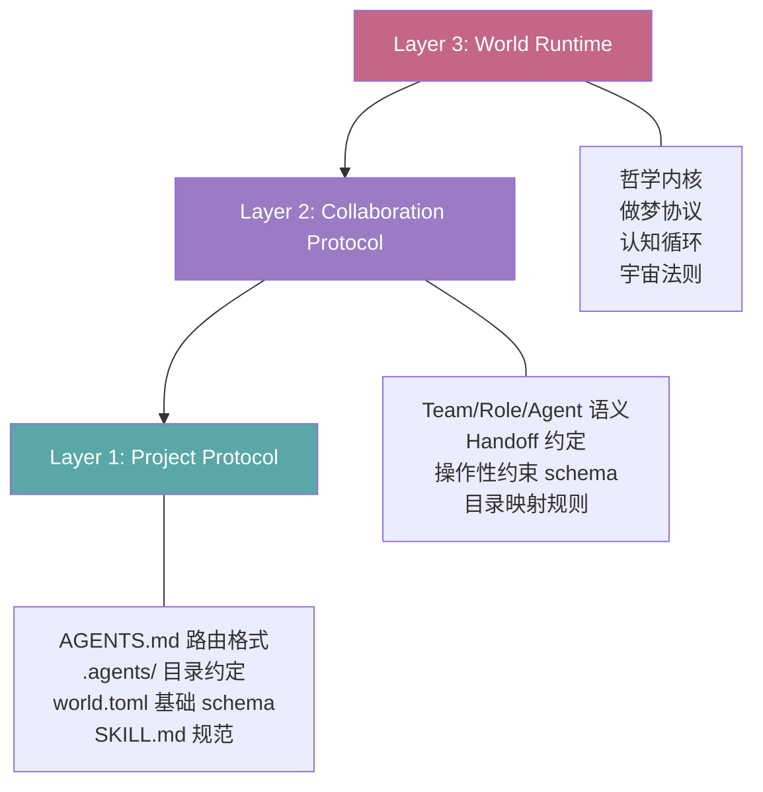

# AgentForge Specification v0.2

> **Draft v0.2** · AI-Native Project Protocol — 三层分离架构
>
> 从 v0.1 的渐进式复杂度模型（Level 0-4）演进为正交三层架构，解决"通用标准"与"世界完整性"的张力。

## 1. 设计哲学

### 1.0 AGENTS.md 开放标准与 AgentForge 的关系

**AGENTS.md 是一个独立的社区开放标准**。它只定义了一件事：在项目根目录放置一个 `AGENTS.md` 文件，AI 工具就能读取你的项目指令。OpenAI Codex、Google Jules、GitHub Copilot、Cursor、Amp 等 30+ 工具原生支持这个标准——**不需要安装 AgentForge，不需要了解任何扩展概念**。

**AgentForge 是 AGENTS.md 标准的超集消费者和扩展提供者**：

| | AGENTS.md 开放标准 | AgentForge 扩展 |
|---|---|---|
| **定义方** | 社区（30+ 工具共识） | AgentForge Spec |
| **核心约定** | 根目录放 `AGENTS.md` | `.agents/` 目录、`world.toml`、SKILL.md 规范 |
| **最低门槛** | 创建一个 Markdown 文件 | `world.toml` + `.agents/` 骨架 |
| **独立性** | 完全不依赖 AgentForge | 完全兼容 AGENTS.md 标准 |
| **适用范围** | 任何项目的 AI 指令入口 | 需要结构化 Agent 治理的项目 |

**两者互不绑定，但天然互操作**：
- 你可以只用 AGENTS.md（Level 0），AgentForge 不要求你安装任何东西
- 你可以逐步采纳 AgentForge 扩展（Level 1→4），AGENTS.md 仍然被 30+ 工具正常读取
- AgentForge 自身是 Spec v0.2 Layer 3 的示范实现，证明了标准与扩展可以共存

> **类比**：AGENTS.md 标准 ≈ Markdown；AgentForge ≈ CommonMark + GFM 扩展。你用 Markdown 写文档不需要知道 CommonMark，但如果你需要更丰富的语义，CommonMark 提供了标准化的扩展路径。

### 1.1 核心矛盾

AgentForge 的战略目标是成为 AI Agent 项目约定的通用标准。但当前设计从"世界"出发——一切在世界之内，哲学内核是不可分割的 kernel。这导致了一个张力：

- **世界**追求完整性——缺少任何部分则世界不成立
- **标准**追求可拆性——别人只采用他们需要的部分，其余可以不装

v0.2 的核心设计决策：**将完整性从"垂直堆叠"改为"正交分层"**。这一决策的直接后果是：哲学内核从 kernel 必需降格为 Layer 3 的可选 fragment——**AgentForge 不再要求标准采纳者接受它的世界观**。

### 1.2 正交分层 vs 渐进式复杂度

v0.1 的 Level 0-4 渐进式模型解决的是**功能增量**问题（从最简单到最复杂）：

```
Level 0: AGENTS.md only
Level 1: + .agents/rules/
Level 2: + .agents/skills/
Level 3: + world.toml + fragments
Level 4: + kernel + immutable rules
```

v0.2 增加一个**正交维度**——**关注点分离**（从通用到特定）：

```
Layer 1: Project Protocol     → 任何项目零前提采用
Layer 2: Collaboration Protocol → 多智能体协作语义
Layer 3: World Runtime        → 世界特有的哲学与运行时
```

两者不矛盾：Layer 定义"是什么"，Level 定义"用多少"。

## 2. 三层架构



### 2.1 依赖关系

- Layer 1 无前置依赖——任何项目可以直接采用
- Layer 2 依赖 Layer 1 的目录约定和 world.toml 基础 schema
- Layer 3 依赖 Layer 2 的协作元模型作为治理基础

### 2.2 采用约束

- 采用 Layer 1 不需要知道 Layer 2/3 的存在
- 采用 Layer 2 不需要接受 Layer 3 的哲学内核
- Layer 3 的哲学内核是**一个具体 World 的实现选择**，不是标准的一部分

---

## 3. Layer 1: Project Protocol（项目协议）

### 3.1 定位

Layer 1 回答的问题是：**一个项目只想要"AI 能读懂我的项目结构"，最小需要什么？**

这是与 AGENTS.md 开放标准对齐的最小公约数——兼容 OpenAI Codex、Google Jules、GitHub Copilot、Cursor、Amp 等 30+ 工具。

### 3.2 AGENTS.md 路由格式

#### 3.2.1 双分区设计（继承 v0.1）

AGENTS.md 分为两个逻辑分区：

| 分区 | 消费者 | 内容 |
|------|--------|------|
| **Agent Zone** | AI 智能体自动读取 | 构建命令、测试命令、代码约定、任务路由 |
| **Human Zone** | 人类开发者阅读 | 项目概述、贡献指南、架构说明 |

Agent Zone 内容也可以被 AGENTS.md 标准的 30+ 工具读取，因为格式就是标准 Markdown。

#### 3.2.2 路由表格式

```markdown
## Task Routing

| Task Type | Entry Point |
|-----------|-------------|
| Context optimization | `.agents/rules/context-economy.md` |
| Documentation governance | `.agents/rules/documentation.md` |
| Python development | `.agents/rules/python.md` |
```

路由表是 Layer 1 的核心机制——让 AI 按任务类型按需加载规范，而非一次性加载全部。

#### 3.2.3 与嵌套 AGENTS.md 的关系

AGENTS.md 标准支持嵌套（monorepo 中子项目各放一个），采用"就近优先"策略。Layer 1 的路由表与嵌套不冲突：

- 根 AGENTS.md 定义全局路由
- 子项目 AGENTS.md 定义子项目路由
- 冲突时子项目优先

### 3.3 `.agents/` 目录约定

#### 3.3.1 最小目录集

```
.agents/
├── rules/        # 领域规则（按需加载）
├── skills/       # 技能资产（SKILL.md + 配套文件）
└── docs/         # AI 知识库（参考、指南、沉淀）
```

三个目录是 Layer 1 唯一约定的。其余目录（workflows/、scripts/、templates/、roles/、teams/、kernel/）属于 Layer 2/3 扩展。

#### 3.3.2 目录职责

| 目录 | 职责 | 边界 |
|------|------|------|
| `rules/` | 高频执行规则，按领域拆分 | 不放脚本、不放模板 |
| `skills/` | 可调用能力单元 | 每个 skill 一个子目录 + SKILL.md |
| `docs/` | AI 专属知识资产 | 不放人类文档（人类文档在 `docs/`） |

#### 3.3.3 物理隔离原则（继承自现有设计）

- `README.md` + `docs/` → 面向人类开发者
- `.agents/docs/` → 面向 AI 智能体
- 两套文档物理隔离，避免职责混淆

### 3.4 `world.toml` 基础 Schema

Layer 1 的 `world.toml` 只包含 `[world]` 和 `[fragments]`：

```toml
# world.toml — Layer 1 最小格式

[world]
name = "my-project"           # 必填：项目标识
version = "1.0.0"             # 必填：语义化版本
description = "A brief description"  # 可选：一句话描述
spec_version = "0.2"          # 可选：遵循的 Spec 版本
spec_role = "consumer"        # 可选：standard-only | demo | consumer

[fragments.python-engineering]        # 可选 fragment
version = "1.0.0"
includes = [
    "rules/python.md",
    "scripts/check_python_compat.py",
]
optional = true
description = "Python engineering conventions"
```

**与 v0.1 的区别**：Layer 1 不包含 `[kernel]`、`[capabilities]`、`[memory]` 和 `immutable_rules`。这些是 Layer 2/3 的概念。

#### 3.4.1 Schema 字段定义

`[world]` section:

| 字段 | 类型 | 必填 | 默认值 | 语义 |
|------|------|------|--------|------|
| `name` | string | 是 | — | 项目标识，kebab-case |
| `version` | string | 是 | — | 语义化版本号，遵循 SemVer 2.0 |
| `description` | string | 否 | `""` | 一句话项目描述 |
| `spec_version` | string | 否 | — | 遵循的 AgentForge Spec 版本（如 `"0.2"`） |
| `spec_role` | enum | 否 | `"consumer"` | `"standard-only"`（纯标准）/ `"demo"`（示范实现）/ `"consumer"`（仅消费标准） |

`[fragments.*]` section:

| 字段 | 类型 | 必填 | 默认值 | 语义 |
|------|------|------|--------|------|
| `version` | string | 是 | — | Fragment 语义化版本 |
| `includes` | string[] | 是 | — | Fragment 包含的文件路径（相对 .agents/） |
| `optional` | bool | 否 | `true` | 是否可选择性安装 |
| `description` | string | 否 | `""` | Fragment 功能描述 |

### 3.5 SKILL.md 规范

#### 3.5.1 与 agentskills.io 对齐

Layer 1 的 SKILL.md 规范与 [agentskills.io](https://agentskills.io/home) 开放标准对齐，支持技能跨平台复用。

#### 3.5.2 双模式校验

| 模式 | 必填 | 适用场景 |
|------|------|----------|
| `relaxed` | Skill ID/Name + Description | 外部导入、生态获取、临时探索 |
| `strict` | + I/O Parameters, Dependencies, Deployment, Error Handling, Changelog | 项目自有 Skills |

#### 3.5.3 Frontmatter 扩展（与 Claude Code skills 对齐）

SKILL.md 支持 YAML frontmatter，提供动态参数和调用控制：

```yaml
---
description: "Reviews code for security vulnerabilities"
argument-hint: "<branch-or-path>"
disable-model-invocation: false   # true = 仅用户可触发
user-invocable: true              # false = 仅 AI 可触发
paths:                            # glob 条件加载（与 .claude/rules/ 对齐）
  - "src/api/**/*.py"
---

## Instructions

Review the code changes for:
1. Injection vulnerabilities
2. Authentication gaps
```

**新增字段说明**：

| 字段 | 类型 | 默认值 | 语义 |
|------|------|--------|------|
| `description` | string | — | 技能描述，决定 AI 何时自动调用 |
| `argument-hint` | string | `""` | 参数提示，如 `<branch-or-path>` |
| `disable-model-invocation` | bool | `false` | true 时 AI 不能自动调用，仅用户可触发 |
| `user-invocable` | bool | `true` | false 时不出现在用户调用菜单 |
| `paths` | string[] | `[]` | glob 匹配，仅当匹配文件进入上下文时加载 |

#### 3.5.4 参数注入

在 SKILL.md 正文中使用 `$ARGUMENTS` 占位符接收调用参数：

```markdown
## Diff to review

Run: `git diff $ARGUMENTS`

Audit the changes above for security issues.
```

### 3.6 条件加载机制

Layer 1 支持两种正交的条件加载机制：

| 机制 | 触发方式 | 适用场景 |
|------|----------|----------|
| **路由表** | AI 读取 AGENTS.md 后按任务类型选择入口 | 对话式/CLI 交互 |
| **Glob frontmatter** | 工具自动匹配文件路径后加载规则 | IDE 集成、自动上下文注入 |

两者可以并存：

- `rules/` 下的 `.md` 文件支持 `paths:` frontmatter（glob 自动触发）
- AGENTS.md 路由表覆盖 glob 无法表达的语义路由（如"协作元模型相关任务"）

Glob frontmatter 格式：

```yaml
---
paths:
  - "**/*.test.ts"
  - "src/api/**/*.py"
---

# Rules for test files

- Use descriptive test names
- Mock external dependencies only
```

---

## 4. Layer 2: Collaboration Protocol（协作协议）

### 4.1 定位

Layer 2 回答的问题是：**多个 AI Agent 如何在一个项目里协作？谁负责什么、交接怎么进行、约束怎么执行？**

Layer 2 基于现有 [agent-collaboration-metamodel.md](../.agents/docs/references/agent-collaboration-metamodel.md) 的语义建模，但增加**操作性**——从"描述性声明"升级为"机器可校验的协议"。

### 4.2 协作元模型（继承，不变）

15 个核心实体、5 大领域、双层结构（MetaModel + Governance）、强约束/弱约束分层——全部继承现有设计，不做修改。

核心实体：`Team`, `Role`, `Agent`, `Mission`, `Task`, `Workflow`, `Handoff`, `Memory`, `Context`, `Rule`, `Skill`, `Artifact`, `Policy`, `Permission`, `Session`。

### 4.3 操作性约束（新增）

**关键升级**：将元模型中的"强约束"从自然语言声明变为 TOML 声明式协议，使 AOI（Agent Orchestration Infrastructure）可以自动校验合规性。

```toml
# constraints.toml — 操作性约束声明

[constraints.strong]
# Agent 必须通过 Role 进入规范性协作体系
agent_requires_role = true
# Task 必须归属于某个 Mission
task_requires_mission = true
# Workflow 不拥有知识，只编排执行
workflow_owns_no_knowledge = true
# Permission 赋给 Role 或 Agent，不赋给 Task
permission_scoped_to_role_or_agent = true
# Handoff 必须是显式对象
handoff_explicit = true

[constraints.weak]
# Team 是否必须拥有多个 Role
team_requires_multiple_roles = "project-decision"
# Agent 是否允许跨 Team 协作
agent_cross_team = "governance-decision"
# Memory 是否持久化
memory_persistence = "implementation-layer"
```

**校验模式**：

| 约束类型 | 违反时行为 | 校验时机 |
|----------|-----------|----------|
| `strong` | ERROR，阻断执行 | 任务分派前、Handoff 发生时 |
| `weak` | WARN，不阻断 | 建议性检查 |

### 4.4 扩展目录约定

在 Layer 1 最小目录集之上，Layer 2 增加以下目录：

```
.agents/
├── rules/        ← Layer 1
├── skills/       ← Layer 1
├── docs/         ← Layer 1
├── workflows/    ← Layer 2: 协作协议实例
├── scripts/      ← Layer 2: 自动化脚本
├── templates/    ← Layer 2: 标准化模板
├── roles/        ← Layer 2: Role 实例
└── teams/        ← Layer 2: Team 实例
```

#### 4.4.1 角色声明格式

Layer 2 的角色声明采用 TOML 格式（机器可校验），而非纯 Markdown：

```toml
# roles/collaboration-architect.toml

[role]
name = "collaboration-architect"
domain = "governance+knowledge"
description = "维护协作元模型的语义边界与治理约束"

[role.bindings]
rules = ["rules/documentation.md", "rules/context-economy.md"]
references = ["docs/references/agent-collaboration-metamodel.md"]
skills = ["brainstorming", "writing-plans"]

[role.constraints]
rules_must_exist = true          # 校验：绑定的规则文件是否存在
non_goals_enforced = true        # 校验：不越界到 non-goals 声明的范围

[role.non_goals]
- "不直接承担运行时任务调度实现"
- "不替代具体业务角色的职责定义"
```

同时保留 Markdown 版本（`.md`）作为人类可读的伴生文件。TOML 是真相源，Markdown 是派生。

#### 4.4.2 团队声明格式

```toml
# teams/core-team.toml

[team]
name = "core-team"
description = "核心开发团队"

[team.members]
# role-name = ["agent-name", ...]
collaboration-architect = ["claude-code", "qoder"]
execution-orchestrator = ["codex"]
governance-auditor = ["claude-code"]

[team.policies]
# 跨 Team 协作需显式 Handoff
cross_team_handoff_required = true
```

### 4.5 `world.toml` Layer 2 Schema

在 Layer 1 基础上增加 `[kernel]` 和 `[capabilities]`：

```toml
[world]
name = "my-project"
version = "1.0.0"

[kernel]
# 不可分割的最小集合——缺少任何部分则项目协作不成立
rules = [
    "rules/context-economy.md",
    "rules/documentation.md",
]
references = [
    "docs/references/agent-collaboration-metamodel.md",
]

[kernel.immutable_rules]
context-economy = true  # 子世界不可覆盖

[fragments.python-engineering]
version = "1.0.0"
includes = ["rules/python.md", "scripts/check_python_compat.py"]
optional = true
description = "Python engineering conventions"

[capabilities]
skills = "skills/"
scripts = "scripts/"
templates = "templates/"
workflows = "workflows/"

[memory]
paths = [
    "docs/superpowers/memories/",
    "docs/superpowers/specs/",
    "docs/superpowers/retrospectives/",
]
portable = false
```

**与 Layer 1 的区别**：增加了 `[kernel]`（定义不可分割的最小集合）、`[capabilities]`（独立安装的技能和脚本）和 `[memory]`（不可移植的个体经验）。

### 4.6 并行 Agent 隔离协议

多 Agent 并行执行时的文件隔离约束，从自然语言规范升级为操作性协议：

```toml
# constraints.toml 中的并行隔离段

[constraints.parallel]
# 文件级隔离：每个并行 Agent 独占文件集合
file_isolation = true
# 模块级边界：以文件夹为最小隔离单元
module_boundary = true
# 集成串行化：跨模块操作在并行完成后串行执行
integration_serial = true
# 冲突策略优先级：merge > reboundary > serialize
conflict_strategy = "merge"
```

---

## 5. Layer 3: World Runtime（世界运行时）

### 5.1 定位

Layer 3 是**一个具体 World 的实现**，不是标准本身。它示范了如何将 Layer 1 + Layer 2 的协议组合成一个有哲学内核和运行时能力的完整世界。

类比：POSIX 是标准（Layer 1/2），Linux 是一个具体实现（Layer 3）。

### 5.2 哲学内核作为 Fragment

在 Layer 3 中，Ψ=Ψ(Ψ) 和道德经驱动不再是 `optional = false` 的 kernel 成员，而是作为一个 **psi-philosophy Fragment** 示范：

```toml
# AgentForge 世界的 world.toml（Layer 3 完整版）

[world]
name = "agentforge"
version = "3.1.0"
description = "哲学驱动的人-AI 协作世界"
spec_version = "0.2"
spec_role = "demo"

[kernel]
manifest = "world.toml"
readme = "README.md"
rules = [
    "rules/context-economy.md",
    "rules/documentation.md",
    "rules/skills.md",
]
references = [
    "docs/references/agent-collaboration-metamodel.md",
    "docs/references/agent-memory-dream-protocol.md",
]
workflows = ["workflows/role-review.md"]

[kernel.immutable_rules]
world-hierarchy = true
context-economy = true

[fragments.psi-philosophy]
version = "1.0.0"
includes = ["docs/references/dao-tech-foundation.md"]
optional = false   # ← 对 AgentForge 世界不可选，但对标准可选
description = "Ψ=Ψ(Ψ) 哲学-工程映射基础"

[fragments.python-engineering]
version = "1.2.0"
includes = [
    "rules/python.md",
    "scripts/check_python_compat.py",
    "scripts/check_python_deprecations.py",
]
optional = true
description = "Python 工程规范与兼容性检查"

[capabilities]
skills = "skills/"
scripts = "scripts/"
templates = "templates/"

[memory]
paths = [
    "docs/superpowers/memories/",
    "docs/superpowers/retrospectives/",
    "docs/superpowers/plans/",
    "docs/superpowers/specs/",
]
organization = ["roles/", "teams/"]
portable = false
versionable = false
```

**关键变化**：`psi-philosophy` 对 AgentForge 世界 `optional = false`（本世界特有），但标准本身不要求这个 Fragment。任何采用 Layer 2 的项目可以自由选择是否安装哲学内核。

### 5.3 记忆与做梦协议

记忆与做梦协议作为 Layer 3 的示范性能力：

- **记忆 Memory**：未来能降低理解成本或决策成本的稳定知识
- **做梦 Dream**：对多条记忆进行非线性重组，发现隐藏关系
- **洞见 Insight**：做梦之后产生的可判断、可验证、可回流结论
- **遗忘 Forgetting**：主动删除、合并、降级或标记过期信息

这不是 Layer 1/2 的必要组件，但示范了如何在 Layer 2 的 `Memory` 实体之上构建更丰富的认知协议。

### 5.4 World Session 运行时

World Session 是 Layer 3 的运行时扩展——将静态的 `world.toml` 升级为支持多端协同（CLI/Web/Skill）的动态运行时容器：

- `world.state/` — 动态运行时结构
- `events.jsonl` — WAL 日志作为真相源
- Session 生命周期管理
- 端无关 Skill 协议

这是 Layer 3 特有的运行时能力，不影响 Layer 1/2 的静态协议定义。

### 5.5 扩展目录约定

```
.agents/
├── rules/        ← Layer 1
├── skills/       ← Layer 1
├── docs/         ← Layer 1
├── workflows/    ← Layer 2
├── scripts/      ← Layer 2
├── templates/    ← Layer 2
├── roles/        ← Layer 2
├── teams/        ← Layer 2
├── kernel/       ← Layer 3: Kernel 边界管理元数据
├── docs/superpowers/  ← Layer 3: 长期沉淀（memories/specs/retrospectives/plans）
└── registry.toml      ← Layer 3: Registry 源配置
```

---

## 6. 三层 vs v0.1 Level 的正交关系

v0.1 的 Level 0-4 渐进式复杂度仍然有效——它描述的是**功能深度**。v0.2 的 Layer 1-3 描述的是**关注点范围**。

一个项目可以在每个 Layer 内部按 Level 渐进采用：

| | Layer 1: Project Protocol | Layer 2: Collaboration Protocol | Layer 3: World Runtime |
|---|---|---|---|
| **Level 0** | AGENTS.md only | — | — |
| **Level 1** | + rules/ | + roles/ | — |
| **Level 2** | + skills/ | + workflows/ + teams/ | — |
| **Level 3** | + world.toml | + constraints.toml | + kernel/ |
| **Level 4** | + glob frontmatter | + 操作性校验 | + 做梦协议 + Session |

**大多数项目只需要 Layer 1 的 Level 0-2**。AgentForge 自己是 Layer 3 Level 4 的示范实现。

---

## 7. 与 AGENTS.md 开放标准的兼容性

### 7.1 入口兼容

AGENTS.md 文件本身就是标准的 Markdown 格式，与 AGENTS.md 开放标准 30+ 工具完全兼容。

### 7.2 目录桥接

不同工具使用不同的目录名，但语义等价：

| AgentForge `.agents/` | Claude Code `.claude/` | GitHub Copilot `.github/` |
|---|---|---|
| `rules/` | `rules/` | `agents/` |
| `skills/` | `skills/` | — |
| `docs/` | — | — |
| `workflows/` | `commands/` | `workflows/` |
| `roles/` | `agents/` | — |

建议在 AGENTS.md 中声明目录映射，方便不同工具桥接：

```markdown
## Directory Mapping

| This Project | .claude/ Equivalent |
|---|---|
| `.agents/rules/` | `.claude/rules/` |
| `.agents/skills/` | `.claude/skills/` |
```

### 7.3 层级兼容

| 层级 | AGENTS.md 标准 | Claude Code | GitHub Copilot |
|------|---------------|-------------|----------------|
| Layer 1 | 完全兼容（AGENTS.md + .agents/） | 需桥接（.agents/ → .claude/） | 部分兼容（读取 AGENTS.md） |
| Layer 2 | 超出标准范围 | 部分对应（agents/ ≈ roles/） | 不涉及 |
| Layer 3 | 超出标准范围 | 不涉及 | 不涉及 |

---

## 8. 标准化路径

### Phase 1: Layer 1 独立发布

**目标**：任何项目可以零前提采用 AgentForge 的项目协议层。

交付物：
- [x] AGENTS.md 路由格式规范（含双分区设计）
- [x] `.agents/` 最小目录约定（rules/ + skills/ + docs/）
- [x] `world.toml` Layer 1 schema（仅 `[world]` + `[fragments]`）
- [x] SKILL.md 规范（含 glob frontmatter + `$ARGUMENTS`）
- [x] 与 AGENTS.md 标准 30+ 工具的兼容性声明
- [x] AGENTS.md 开放标准分离声明（§1.0）
- [x] 治理章程 [GOVERNANCE.md](../GOVERNANCE.md)
- [x] 参考实现：`world init` 项目脚手架（starter template）
- [ ] 参考实现：一个独立 Python 项目采用 Layer 1 的示范

### Phase 2: Layer 2 发布

**目标**：多智能体协作语义成为可校验的协议。

交付物：
- [ ] 协作元模型规范（15 实体 + 双层结构 + 操作性约束）
- [ ] `constraints.toml` schema
- [ ] `roles/` + `teams/` TOML 声明格式
- [ ] `world.toml` Layer 2 schema（+ `[kernel]` + `[capabilities]` + `[memory]`）
- [ ] 合规 AOI 参考实现接口
- [ ] 目录映射规范（.agents/ ↔ .claude/ ↔ .github/）

### Phase 3: Layer 3 作为示范

**目标**：AgentForge 世界成为 Layer 1 + Layer 2 的示范性完整实现。

交付物：
- [ ] AgentForge 世界的完整 `world.toml`（含 psi-philosophy fragment）
- [ ] 哲学-工程映射作为 fragment 示范
- [ ] 记忆做梦协议作为 memory fragment 示范
- [ ] kernel/ 管理规范
- [ ] World Session 运行时规范
- [ ] registry.toml 分发规范

---

## 9. 变更日志

| 版本 | 日期 | 变更 |
|------|------|------|
| v0.2 Draft | 2026-05-28 | 三层分离架构：Layer 1 Project Protocol / Layer 2 Collaboration Protocol / Layer 3 World Runtime；SKILL.md frontmatter 扩展；操作性约束 schema；标准化路径；新增 §1.0 AGENTS.md 标准分离声明；[world] schema 增加 spec_version/spec_role 字段；治理章程 GOVERNANCE.md；规范文档迁移至 specs/ 目录；Phase 1 交付物更新（world init + Governance 已完成） |
| v0.1 | 2026-05-24 | 渐进式复杂度模型 Level 0-4；AGENTS.md 双分区设计；world.toml 三层语义模型 |
