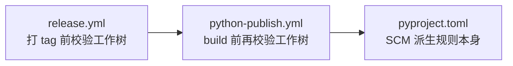

# 🔧 构建约定

本文档说明 AgentForge 项目的构建系统配置与日常开发命令约定。

## 构建后端

本项目采用 **PDM** 作为构建后端，配置位于 `pyproject.toml`：

```toml
[build-system]
build-backend = "pdm.backend"
requires = ["pdm-backend"]
```

- **包目录映射**：源代码位于 `src/taolib/`，通过 `tool.pdm.build` 显式声明：

```toml
[tool.pdm.build]
includes = ["src/taolib"]
package-dir = "src"
```

这种 `src/` 布局可避免开发时误导入未安装的源码，确保测试与 CI 均基于真实安装态运行。

## 依赖分组策略

本项目遵循 **PEP 735** 的 `dependency-groups` 规范，将依赖按使用场景拆分为独立的可选依赖与依赖组。

### 可选依赖（`project.optional-dependencies`）

用于运行时按需安装的功能扩展：

| 分组名 | 用途 | 包含包 |
|--------|------|--------|
| `github-app` | GitHub App Token 管理功能 | `httpx`, `PyJWT[crypto]`, `PyGithub` |
| `task` | 工作流任务执行 | `metaflow` |

安装示例：

```bash
uv sync --extra github-app
```

### 依赖组（`dependency-groups`）

用于开发、测试、文档等场景的纯工具依赖，不进入运行时包：

| 分组名 | 用途 | 包含包 |
|--------|------|--------|
| `dev` | 开发工具链 | `ruff`, `invoke`, `uv`, `typer`, `pre-commit` |
| `docs` | 文档构建 | `sphinx`, `myst-parser`, `sphinx-book-theme` 等 |
| `test` | 测试框架 | `pytest`, `pytest-asyncio`, `pytest-cov` 等 |

安装示例：

```bash
# 安装全部开发依赖
uv sync --group dev --group test --group docs

# 仅安装测试依赖（CI 场景）
uv sync --group test

# 仅安装文档依赖
uv sync --group dev --group docs
```

> **设计原则**：`optional-dependencies` 面向包的使用者（运行时功能开关），`dependency-groups` 面向包的开发者（本地/CI 工具链）。两者职责分离，避免将纯开发工具污染到最终用户环境。

## mise 工具链管理

`mise.toml` 锁定项目所需的全部外部工具及其精确版本：

```toml
[tools]
python = "3.14.5"
uv = "0.11.16"
node = { version = "22.22.3", postinstall = "corepack enable" }
"npm:defuddle" = { version = "0.18.1", depends = ["node"] }
```

### 版本冻结策略

- **Python 运行时**：精确到补丁版本（`3.14.5`），确保所有开发者与 CI 环境完全一致
- **工具链**：`uv`、`node`、`defuddle` 均声明精确版本，并通过 `mise install` 统一安装
- **升级流程**：修改 `mise.toml` → `mise install --force` → `mise run check-env` → `mise run test`

### 环境变量

```toml
[env]
PYTHONUTF8 = "1"
```

确保跨平台（尤其是 Windows）下 Python 默认使用 UTF-8 编码，避免中文路径或日志输出时的编码问题。

## uv 包管理器使用约定

本项目统一使用 `uv` 管理 Python 依赖，**禁止直接使用 `pip` 或 `conda`**。

### 常用命令

| 命令 | 作用 |
|------|------|
| `uv sync` | 根据 `pyproject.toml` + `uv.lock` 同步虚拟环境 |
| `uv sync --group <name>` | 同步时包含指定依赖组 |
| `uv sync --extra <name>` | 同步时包含指定可选依赖 |
| `uv run <command>` | 在虚拟环境中执行命令 |
| `uv build` | 构建 wheel + sdist |
| `uv lock` | 刷新 `uv.lock` 文件（依赖变更后执行） |

### 锁文件

- `uv.lock` 必须纳入版本控制，确保所有环境安装完全一致
- 修改 `pyproject.toml` 中的依赖后，执行 `uv lock` 或 `uv sync` 自动更新

## 版本管理

项目采用 **动态版本** 策略：

```toml
[project]
dynamic = ["version"]

[tool.pdm.version]
source = "scm"
write_to = "taolib/_version.py"
write_template = "__version__ = '{}'\n"
```

版本号不硬编码于 `pyproject.toml`，而是由构建后端在打包时从 VCS 标签或版本文件中解析。这种方式确保：

- 源码中无需手动维护版本字符串
- 发布流程与 Git 标签天然对齐
- 预发布版本（alpha/beta/rc）可通过标签直接生成

文档构建时通过 `importlib.metadata.version("taolib")` 动态解析当前版本号。

### 配置要点

> ⚠️ **`dynamic` 与 `[tool.pdm.version]` 必须并存**：
>
> - 仅声明 `dynamic = ["version"]` 而缺失 `[tool.pdm.version]` 段时，pdm-backend 会兜底为 `0.0.0`，导致 wheel 文件名与 git tag 完全脱节。
> - 仅有 `[tool.pdm.version]` 而 `[project]` 没声明 `dynamic`，则版本源配置不会生效。

运行时入口 `src/taolib/__init__.py` 通过 `from ._version import __version__` 暴露版本号，并在源码树直接运行（未构建安装）时回退到 `importlib.metadata.version("taolib")`，再降级到 `0.0.0+unknown`。

### PDM SCM 版本派生规则（PEP 440）

`pdm-backend` 的 SCM 源遵循 PEP 440 + setuptools-scm 风格规则，**版本号会诚实反映工作树状态**：

| git 状态 | 派生版本号示例 | 适用场景 |
|---|---|---|
| 在 tag commit 上 + 工作树干净 | `0.6.0` | ✅ 正式发布到 PyPI |
| tag + N 个新 commit + 工作树干净 | `0.6.1.dev1+ga6a981f` | 仅 TestPyPI 或本地预览 |
| 在 tag commit 上 + **dirty** 工作树 | `0.6.0+d20260524` | ❌ PyPI 拒收（包含 local segment） |
| tag + N 个新 commit + **dirty** 工作树 | `0.6.1.dev1+ga6a981f.d20260524` | ❌ PyPI 拒收 |

关键概念：

- `.devN`：PEP 440 预发布段（pre-release segment），`N` 为距最近 tag 的 commit 数
- `+g<sha>`：local version identifier，`g` 是 git 前缀，`<sha>` 是当前 commit 短哈希
- `+d<date>`：dirty 标记，本地日期，**该形态会被 PyPI 直接拒收**

### 发布流程的工作树洁净度防线

为防止 dirty 标记污染发布产物，CI 流程设有 **三道防线**：



- **第 1 道**：`.github/workflows/release.yml` 在打 tag 前执行 `git status --porcelain` 校验
- **第 2 道**：`.github/workflows/python-publish.yml` 在 `mise run package-build` 之前再次校验
- **第 3 道**：`pyproject.toml` 中 `[tool.pdm.version]` 派生规则本身

### 本地构建发布产物的正确姿势

如需在本地复现 CI 的纯净构建，遵循以下流程：

```bash
git checkout v0.6.0          # 切到目标 tag
git status                   # 确认输出为空（工作树干净）
uv build                     # 产物为 taolib-0.6.0-py3-none-any.whl
twine check dist/*.whl       # 上传前预校验 PyPI 兼容性
```

如有未提交改动，先 `git stash push -u` 暂存，构建完毕后再 `git stash pop` 恢复。

## 常用构建命令

以下命令均通过 `mise run` 执行，确保跨平台一致性：

### 环境初始化

```bash
# 一键完成信任、安装、依赖同步与环境校验
mise run init

# 仅检查工具链是否就绪
mise run init-check

# 校验本地工具链版本
mise run check-env
```

### 依赖同步

```bash
# 同步全部开发、测试与文档依赖
mise run sync

# 仅安装测试依赖（CI 场景）
mise run install-test-deps

# 仅安装文档依赖
mise run install-docs-deps
```

### 测试

```bash
# 运行完整测试集
mise run test

# 运行 GitHub App 专项测试
mise run test-github-app

# 运行带覆盖率的完整测试
mise run test-coverage

# 运行发布前回归测试
mise run test-release
```

### 代码质量

```bash
# 运行 pre-commit 全量检查（包含 ruff lint + format + 其他 hooks）
mise run lint

# 仅运行 Ruff 格式化
mise run fmt

# 审计 Python 依赖安全问题
mise run audit
```

### 文档构建

```bash
# 构建 HTML 文档
mise run docs-html

# 执行文档外链校验
mise run docs-linkcheck

# CI 文档构建入口
mise run docs-build
```

### 包构建

```bash
# 构建 Python 包（wheel + sdist）
mise run package-build
```

## 配置速查

| 配置文件 | 用途 |
|----------|------|
| `pyproject.toml` | Python 包元数据、构建系统、依赖分组、ruff/pytest/coverage 配置 |
| `mise.toml` | 工具链版本锁定、mise 任务定义、环境变量 |
| `uv.lock` | 依赖解析锁定文件，确保可复现安装 |
| `.pre-commit-config.yaml` | pre-commit hooks 配置（ruff、代码格式化等） |
| `docs/conf.py` | Sphinx 文档构建配置 |
| `docs/_config.toml` | Sphinx 主题选项配置 |
