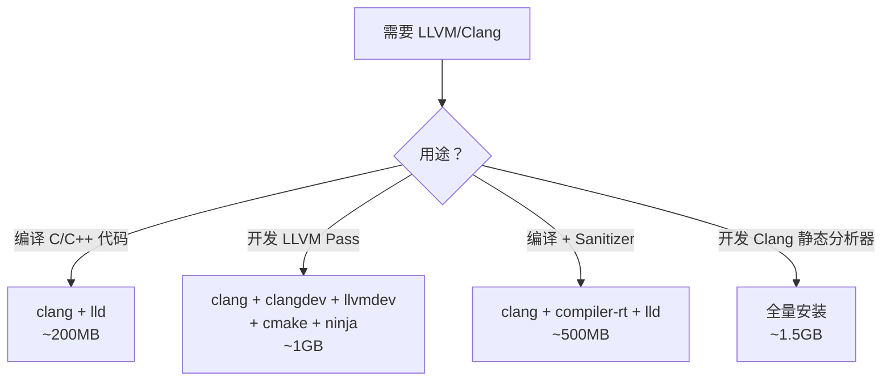

# LLVM/Clang 容器镜像构建复盘与洞察报告

## 任务概述

**目标**：基于已有 `miniconda3:ubuntu26.04` 基础镜像，添加 LLVM/Clang 工具链标签，用于 LLVM Pass / Clang Plugin 开发。

**最终交付**：
- `miniconda3:llvm` 镜像（1.59 GB），含 LLVM/Clang 22.1.7 全套开发环境
- `Containerfile.llvm` + README 标签索引更新
- 导出 tar 文件（3.3 GB）+ `.gitignore`

## 执行时间线

| 阶段 | 行动 | 结果 |
|------|------|------|
| V1 构建 | 天真安装 5 个 conda 包 | 构建成功但存在隐患 |
| 镜像导出 | `podman save` → tar | 3.3 GB 文件 |
| 诊断 | `du -sh` 逐层分析 | 发现版本不一致 + 冗余空间 |
| V2 重构 | 版本锁定 + 裁剪无用组件 | 1.59 GB，版本统一 22.1.7 |

## 关键发现

### 1. conda 多频道版本冲突（严重）

**现象**：不指定 `--override-channels` 时，conda solver 从 `defaults` 和 `conda-forge` 混合拉取：
- `clang` = 22.1.0（conda-forge）
- `llvmdev` = 8.0.0（defaults/pkgs/main）
- `clangdev` = 8.0.0（conda-forge 旧版）

**根因**：conda-forge 的 `llvmdev` 最新版为 22.1.7，但 `defaults` 频道的 `llvmdev` 停留在 8.0.0。solver 在混合频道中倾向于选择「不需要更多依赖变化」的旧版本。

**影响**：LLVM 8 的头文件与 LLVM 22 运行时 ABI 完全不兼容，编写的 Pass 会在加载时段错误（segfault）。

**修复**：
```
conda install -c conda-forge --override-channels llvmdev=22.1 clangdev=22.1 ...
```

### 2. 容器镜像瘦身的三大杠杆

对 LLVM 开发环境而言，三个最有效的裁剪点：

| 组件 | 占用 | 是否 Pass 开发必需 | 处置 |
|------|------|-------------------|------|
| sysroot (glibc headers) | 483 MB | 否（仅交叉编译需要） | 删除 |
| 静态库 (.a) | 463 MB | 否（动态链接 libLLVM.so） | 删除 |
| compiler-rt sanitizer | ~200 MB | 否（仅目标代码插桩需要） | 部分删除 |

**合计节省 ~1.1 GB**，加上版本一致后避免了旧版冗余包，总镜像从 3.3 GB 降至 1.59 GB。

### 3. 场景驱动的包选择策略

同一个「LLVM/Clang」需求在不同场景下需要截然不同的包组合：



**洞察**：通用 Dockerfile 是反模式——容器镜像应当是「场景的物化」而非「工具的堆叠」。

## 技术洞察

### 洞察 1：频道隔离是 conda 多包一致性的唯一保障

conda 的依赖解析器（SAT solver）在多频道共存时，优化目标是「最小变更集」而非「版本一致性」。这意味着：

- 同名包在不同频道可能有截然不同的版本线
- solver 可能从一个频道取运行时，从另一个频道取开发包
- **结论**：涉及 ABI 耦合的包组（如 LLVM 生态），必须用 `--override-channels -c <单一频道>` 强制隔离

### 洞察 2：「开发包」≠「工具包」的语义陷阱

conda-forge 的命名约定中：
- `clang`：编译器可执行文件（用 clang 编译你的代码）
- `clangdev`：Clang 库的头文件（用 libclang API 开发工具）
- `llvmdev`：LLVM 库的头文件 + 静态库（用 LLVM API 开发 Pass）

但 `llvmdev` 的版本可能与 `clang` 的 `libLLVM.so` 版本完全脱耦——这在 apt/dnf 生态中几乎不会发生（它们通过严格的版本依赖约束绑定），conda 的「频道间无约束」设计在此暴露了系统级风险。

### 洞察 3：容器瘦身的认知模型

```
镜像体积 = Σ(组件) × (1 - 场景剪枝率)
```

有效瘦身的前提是清晰的「场景边界定义」。没有场景定义就优化体积，等于在黑暗中射箭。本次任务的核心转折点恰恰是确认了「LLVM Pass 开发」这一场景边界后，才能精确识别哪些组件可安全移除。

### 洞察 4：构建验证的版本断言模式

Containerfile 中的 `RUN clang --version && llvm-config --version && opt --version` 不仅是验证安装，更是一种**运行时断言**：如果未来 conda-forge 的依赖解析行为变化导致版本漂移，构建会在此处显式失败，而非产出一个「看似正常但 ABI 不兼容」的镜像。

**模式化**：每个涉及 ABI 耦合的容器层，应在构建时包含版本一致性断言。

### 洞察 5：导出 vs 注册的容器分发二象性

`podman save` 导出的 tar 文件（3.3GB）适合离线传递但无增量更新能力；推送到 registry 则支持层复用但需要网络。对于开发环境镜像（频繁迭代但不需分发），本地 image 是最优形态，tar 导出仅作灾备/迁移用途。

## 改进建议

1. **版本锁定自动化**：可考虑用 `conda env export --from-history` 生成 `environment.yml`，作为锁文件放入仓库
2. **多阶段构建**：如果后续需要更小的运行时镜像（仅跑编译好的 Pass），可用 multi-stage build 只保留 `libLLVM.so` + `opt`
3. **CI 集成**：在 `.github/workflows/` 中加入镜像构建验证，防止 conda-forge 上游变化破坏构建

## 元反思

本次任务的核心教训是：**工具链容器化不是"打包安装命令"，而是"将场景约束物化为构建逻辑"。** 天真地 `conda install` 一组包名，在单频道 + 单版本线的简单场景下能工作，但一旦涉及：

- 多频道混合（defaults + conda-forge）
- ABI 耦合组件（headers 必须匹配 .so）
- 空间约束（容器体积预算）

就必须从「列出需要的工具」升级为「定义使用场景 → 推导最小充分包集 → 约束版本一致性 → 裁剪场景外冗余」的系统性方法。
