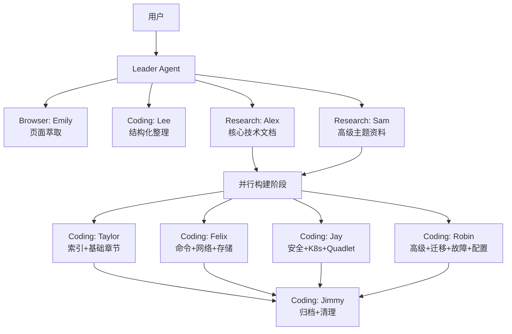

# Podman 参考资料库构建任务复盘

## 一、任务概述

- **起始需求**：学习并萃取 https://acntxq6xf8pe.aiforce.cloud/app/app_4jwk79sp6p8gg（妙搭平台上的 Podman 开源项目知识库应用）
- **演进路径**：萃取网页内容 → 构建完整参考资料库 → 归档到项目文档 → 修复 toctree → 提交
- **最终产出**：`docs/general/podman/` 下 15 个结构化文档（含索引），共 3705 行
- **附带产出**：Windows 下 Podman 挂载网络驱动器的技术问答（drvfs / CIFS / NFS 方案）

## 二、执行时间线

| 阶段 | 动作 | 产出 |
|------|------|------|
| 1. 页面萃取 | Browser Agent (Emily) 访问妙搭应用，提取全部文本内容 | 原始内容提取 |
| 2. 结构化整理 | Coding Agent (Lee) 将提取内容萃取为两部分文档 | `.temp/topics/podman-knowledge-base-extraction.md`（应用模式分析 + 知识萃取） |
| 3. 深度研究 | Research Agent (Alex) 收集官方文档深度技术资料（命令参考、网络、存储、安全、Quadlet、配置文件） | 12000+ 行官方文档收集 |
| 4. 深度研究 | Research Agent (Sam) 收集高级主题资料（CI/CD、多架构、Machine、供应链安全、性能、迁移） | 高级场景与实战资料 |
| 5. 资料库构建 | 4 个 Coding Agent 并行构建（Taylor: 索引+基础 / Felix: 命令+网络+存储 / Jay: 安全+K8s+Quadlet / Robin: 高级+迁移+故障+配置） | 13 章节 + README 索引 |
| 6. 归档 | Coding Agent (Jimmy) 移动文件到 `docs/general/podman/`、更新索引、清理临时文件 | 正式归档 |
| 7. 修复 | Leader 直接修复 README.md 添加 `{toctree}` 指令 | Sphinx 文档树完整 |
| 8. 提交 | git commit（16 files, 3705 insertions） | `55d6cdf` |

## 三、架构与协作模式

### 3.1 智能体协作拓扑

### 3.2 并行策略

- **研究阶段**：2 个 Research Agent 并行，按领域划分（核心 vs 高级）
- **构建阶段**：4 个 Coding Agent 并行，按文件划分避免冲突
- **归档阶段**：串行执行（依赖所有构建完成）

### 3.3 依赖管理

- Task 3（构建）blockedBy Task 1 + Task 2（研究）
- 实际执行中严格遵循了 phase-gating 原则

## 四、产出质量评估

### 4.1 内容覆盖度

| 维度 | 覆盖情况 |
|------|---------|
| 项目概述与架构 | ✅ 版本时间线、分层架构图、技术栈 |
| 安装指南 | ✅ Linux/macOS/Windows 三平台 |
| 核心概念 | ✅ 9大主题（Daemonless、Rootless、Pod、OCI等） |
| 命令参考 | ✅ 693行，覆盖全部命令类别 |
| 网络 | ✅ 376行，6种网络模式 + Rootless网络 |
| 存储 | ✅ 361行，4类驱动 + 卷管理 |
| 安全 | ✅ Rootless/SELinux/Capabilities/Seccomp/签名 |
| Pod与K8s | ✅ Pod管理 + kube play + Kind集成 |
| Quadlet/systemd | ✅ 7种单元文件完整语法 |
| 高级主题 | ✅ CI/CD/多架构/Machine/供应链安全/性能 |
| Docker迁移 | ✅ 命令映射 + Compose迁移 + 常见差异 |
| 故障排除 | ✅ 按类别组织的常见问题与解决方案 |
| 配置文件 | ✅ containers.conf/storage.conf/registries.conf/policy.json |

### 4.2 格式规范

- ✅ 所有文件包含 YAML frontmatter
- ✅ 使用 Sphinx-compatible Markdown（MyST）
- ✅ README.md 使用 `{toctree}` 指令
- ✅ `docs/general/index.md` 已更新索引条目
- ✅ 相对路径引用

## 五、经验与改进点

### 5.1 做得好的

1. **并行策略有效**：研究阶段和构建阶段的并行化显著缩短了总耗时
2. **领域隔离清晰**：每个 Agent 负责明确的文件范围，无冲突
3. **渐进式演进**：从萃取到研究到构建，信息逐层丰富
4. **格式一致性**：所有文件遵循统一的 frontmatter + Markdown 规范

### 5.2 可改进的

1. **toctree 遗漏**：初始构建时未包含 `{toctree}` 指令，需要额外修复步骤。改进：构建前应明确查阅项目文档规范（Sphinx 索引格式要求）
2. **截图清理延迟**：根目录截图文件在提交后才清理，应在归档阶段一并处理
3. **研究输出编码**：研究报告输出存在编码问题（中文乱码），影响结果复用。改进：确认输出编码一致性
4. **内容验证缺失**：未对生成的文档做 Sphinx build 验证。改进：归档后应跑一次文档构建检查

### 5.3 可复用的模式

- **"萃取→研究→并行构建→归档"** 是构建知识参考库的标准流程
- **按文件/章节划分并行任务** 是避免 Coding Agent 冲突的有效模式
- **Research Agent 按领域分工** 比单一 Agent 覆盖所有内容更高效

## 六、指标摘要

| 指标 | 值 |
|------|-----|
| 总投入 Agent 数 | 10（1 Browser + 2 Research + 6 Coding + 1 Leader） |
| 最终文件数 | 15 个 .md 文件 |
| 总代码行数 | 3705 行 |
| Git commit | `55d6cdf` |
| 任务演进步数 | 8（萃取→整理→研究×2→构建×4→归档→修复→提交） |

## 七、后续建议

1. 运行 `sphinx-build` 验证文档无警告
2. 考虑添加 Podman 实战案例章节（基于项目自身的 Containerfile 使用经验）
3. 定期更新版本信息（当前基于 v5.8.x）
4. 可将 Windows 网络驱动器挂载内容补充到 `05-networking.md` 或 `10-advanced-topics.md`
