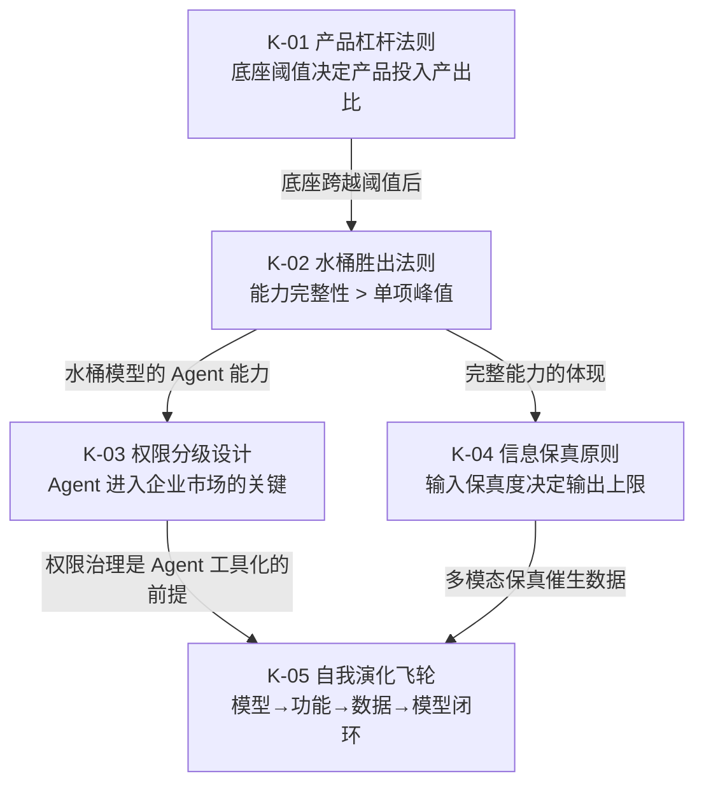

# AI 产品行业洞察：从基模竞争到自我演化

> **来源**：萃取自 [`task-summary-force-conf-insight-extraction-20260624.md`](../../apps/chaos/.agents/docs/superpowers/retrospectives/task-summaries/exploration/task-summary-force-conf-insight-extraction-20260624.md)（火山引擎 FORCE 大会报道学习）  
> **方法**：按 [`extraction-methodology.md`](extraction-methodology.md) 的"筛选与净化"原则，剥离具体场景与个人色彩，保留可迁移内核  
> **定位**：AI 产品/模型行业的可迁移模式，非项目设计哲学

本文是 [`extraction-methodology.md`](extraction-methodology.md) "萃取 = 筛选与净化"原则的实践样本——从一篇行业报道中萃取 5 条跨场景可迁移的模式，剥离了具体产品名、个人项目细节与时效性数据，保留因果链与决策指导价值。

---

## 一、洞察概览

5 条洞察来自对 2026 年国产大模型行业事件的深度学习，萃取为跨场景可迁移的模式。它们并非孤立存在，而是围绕"AI 产品如何构建竞争壁垒"形成一组关联判断。

---

## 二、洞察清单

### K-01：AI 产品杠杆法则

> **当底座能力低于"可用阈值"时，产品优化边际收益递减；底座跨越阈值后，产品优化才重新产生杠杆。**

**因果链**：AI 产品的投入产出比存在临界点。底座不足时，产品层堆功能等于加债务——每个功能都建立在"模型能力不够"的沙地上，体验拉胯；底座跨越"可用"门槛后，同样的产品优化才能被放大为体验提升。

**适用场景**：AI 产品投入决策、功能优先级排序、技术栈选型

**反模式**：底座不足时堆功能（加债务不加价值），或底座已够用时仍只优化底座不投入产品（错失杠杆）

**决策依据**：先评估底座是否跨越可用阈值，再决定产品投入比例

---

### K-02：水桶胜出法则

> **在真实业务场景（非 benchmark），能力完整的水桶模型胜过单项长板的模型。**

**因果链**：benchmark 测单项能力，但真实业务场景需要能力组合——一个能写代码但不能看图的模型，在"文档摘要+图表理解+代码生成"的复合任务中必然受限。短板不是"少一个能力"，而是"业务场景覆盖不完整"。

**适用场景**：模型选型、技术栈评估、AI 产品能力规划

**关键维度**：能力完整性 > 单项峰值

**反模式**：追逐单项 benchmark 第一，忽视能力组合的业务覆盖度

---

### K-03：Agent 权限分级设计模式

> **Agent 执行任务时，应按需分级申请权限（文件/脚本/外部服务），把授权决策交还用户。**

**因果链**：Agent 从"玩具"到"工具"的关键不是能力，而是权限治理。权限/安全/准确性三者互相制约——权限越少越安全但能力越弱，权限越多越强但风险越高。分级申请 + 人工授权是平衡解法，把风险决策交还用户。

**适用场景**：Agent 产品设计、企业市场准入、自动化流程设计

**设计原则**：最小权限 + 分级申请 + 人工授权

**三角约束**：权限 / 安全 / 准确性互相制约，需显式权衡，不能三者兼得

---

### K-04：多模态信息保真原则

> **内容理解/评分/摘要系统若输入含多模态信息而模型只处理文本，输出必然失真——多模态丰富的内容被系统性低估。**

**因果链**：这不是"评分不准"的随机误差，而是"信息输入不完整"的系统性偏差。当原文含图片/视频/音频，而模型只处理文本时，丢失的信息会扭曲输出——且失真方向可预测：多模态丰富的内容被系统性低估。

**适用场景**：内容评分系统、摘要系统、信息流过滤、推荐系统

**设计原则**：输入信息保真度决定输出质量上限

**失真预测**：多图/视频/音频内容会被系统性低估，纯文本内容不受影响

---

### K-05：Agent 自我演化飞轮

> **模型用于开发依赖该模型的功能，功能产生的数据反哺模型——形成产品层自我演化闭环。**

**因果链**：当模型能力达到"可用"后，它可以用于开发自身依赖的功能（如多模态摘要、评分系统）。这些功能产生的数据反过来喂养模型，形成飞轮。当前仍是人主导的半自动演化，但闭环模式已现。

**适用场景**：AI 产品飞轮设计、数据闭环构建、产品演化规划

**关键要素**：模型 → 功能 → 数据 → 模型

**当前阶段**：人主导的半自动演化，未来趋向自动化

---

## 三、洞察间的深层关联

5 条洞察并非孤立，而是围绕"AI 产品竞争壁垒"形成递进关系：

| 递进关系 | 含义 |
|----------|------|
| K-01 → K-02 | 底座跨越阈值后，竞争转向能力完整性（水桶） |
| K-02 → K-04 | 水桶模型的核心价值是信息保真（多模态不缺失） |
| K-02 → K-03 | 水桶模型的 Agent 能力需要权限治理才能工具化 |
| K-03 + K-04 → K-05 | 权限治理 + 信息保真共同支撑自我演化飞轮 |

**一句话总结**：底座跨越阈值（K-01）后，能力完整性（K-02）成为竞争核心，其价值通过信息保真（K-04）和权限治理（K-03）释放，最终形成自我演化飞轮（K-05）。

---

## 四、对项目的启示

### 4.1 作为 R-03 印证产物

本文是 [`content-extraction-rule-candidates.md`](content-extraction-rule-candidates.md) R-03 候选"洞察浓度指标"的第二次印证产物——主动追求洞察密度而非执行速度，从事实层挖掘到模式层。浓度评分 7.3 分/千字（优秀洞察级别），详见 [`insight-density-metric.md`](insight-density-metric.md) §4.2。

### 4.2 萃取方法论的实践样本

本文是 [`extraction-methodology.md`](extraction-methodology.md) "萃取 = 筛选与净化"的实践样本。原始文件含具体场景（产品名、个人项目、价格数据），本文萃取时过滤了：

| 被过滤内容 | 过滤原因 |
|-----------|---------|
| 具体产品名与版本号 | 时效性强，易过时 |
| 个人项目实现细节 | 个人色彩，非可迁移 |
| 具体价格数字 | 时效性强，易过时 |
| 工具操作步骤 | 工具特定，非模式 |
| 视觉效果主观评价 | 主观判断，非可迁移 |

**保留内核**：5 条剥离了场景与个人色彩的模式，可跨项目迁移。

### 4.3 适用边界

本文的 5 条洞察适用于 **AI 产品/模型行业**的决策参考，不适用于：
- 非 AI 产品的权限设计（K-03 的三角约束是 Agent 特有）
- 无多模态输入的系统（K-04 不适用）
- 底座能力固定的传统软件（K-01 的阈值问题不存在）

---

## 参见

- **原始溯源**：[`task-summary-force-conf-insight-extraction-20260624.md`](../../apps/chaos/.agents/docs/superpowers/retrospectives/task-summaries/exploration/task-summary-force-conf-insight-extraction-20260624.md)（含完整场景分析、6 条深度洞察、因果链图）
- **萃取方法论**：[`extraction-methodology.md`](extraction-methodology.md)（本文的萃取原则依据）
- **洞察浓度指标**：[`insight-density-metric.md`](insight-density-metric.md)（本文作为 R-03 验证样本 B）
- **规则候选**：[`content-extraction-rule-candidates.md`](content-extraction-rule-candidates.md) §3.6（本文作为 R-03 第二次印证产物）
