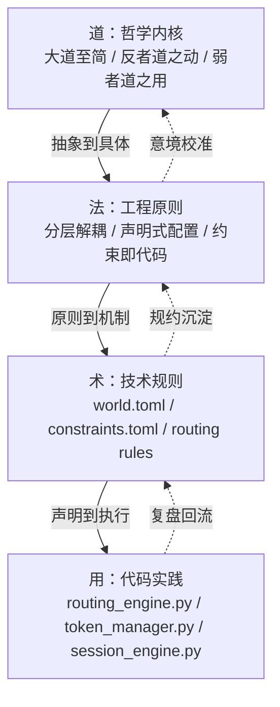
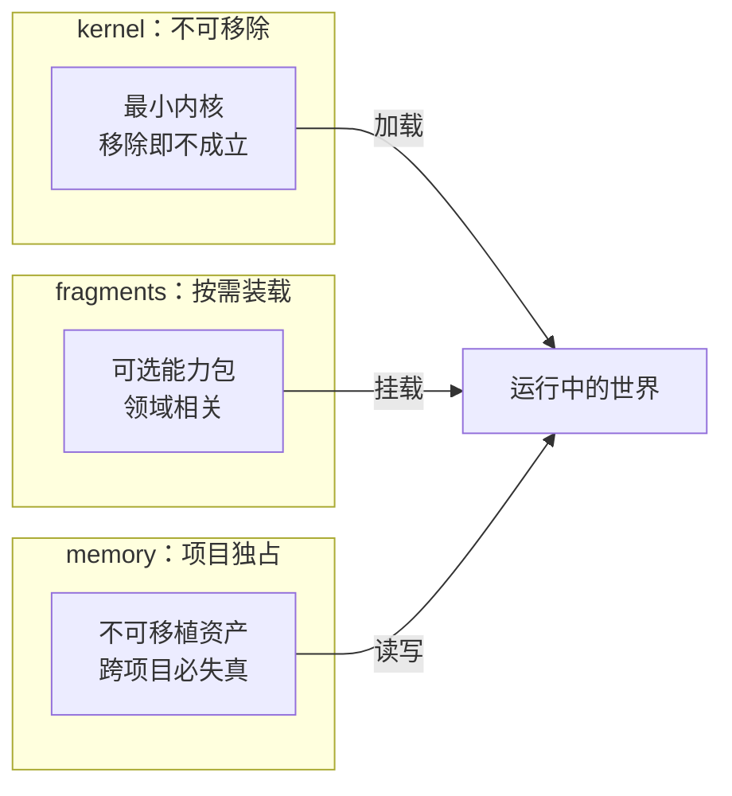
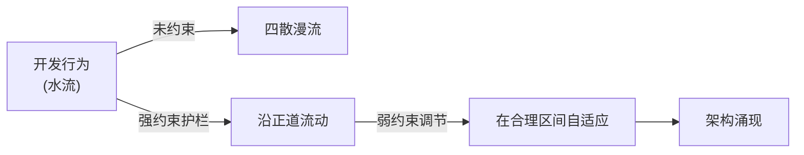
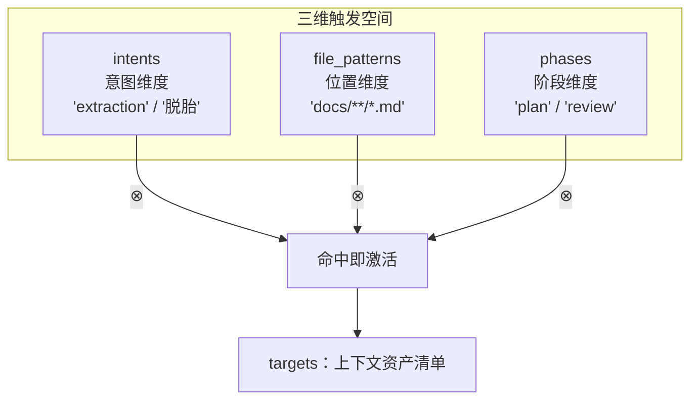
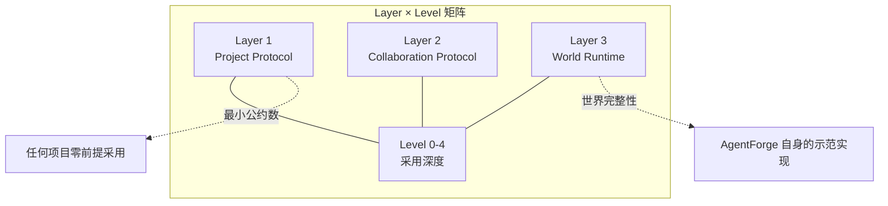
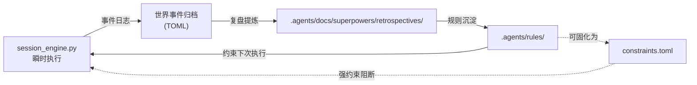
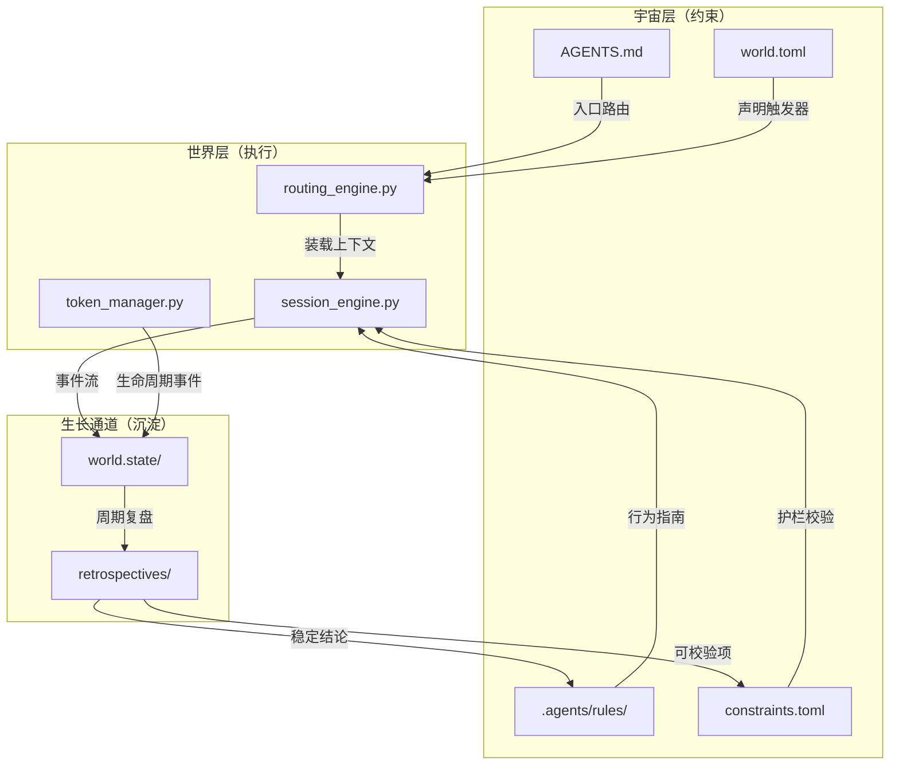

# 代码架构洞察：从道法术用到分层解耦

从《道德经》出发，看到了项目结构里"宇宙—世界—生长通道"的分层智慧。本文把镜头继续推近，深入到 `apps/chaos/src/taolib/` 的具体代码与 `.agents/` 下的具体配置，回答一个更尖锐的问题：

**好的代码架构不是"设计"出来的，是"约束"出来的。**

设计师写的是接口与类，但真正决定系统是否长寿的，是它在每一个接缝处选择"放还是收"——选择让什么必须发生、让什么自然发生、让什么永远不发生。AgentForge 的 `world.toml` / `constraints.toml` / `routing` 三件套，恰好把这件事做到了"声明级"。

---

## 一、道法术用：从哲学内核到代码落地的四层映射

> "道生之，德畜之，物形之，势成之。" ——《道德经》第五十一章

哲学不会自己变成代码，它必须经过工程原则的"翻译"，才能在文件系统里留下足迹。AgentForge 在这条翻译链上分了四层：



完整对照表：

| 层级 | 关键命题 | 哲学锚点 | 项目落地（路径） |
|------|----------|----------|------------------|
| **道** | "少即是多，约束即自由" | "大道至简" | [`AGENTS.md`](../../AGENTS.md) 全局契约 |
| **道** | "回转修正强于线性扩张" | "反者道之动" | `.agents/docs/superpowers/retrospectives/` |
| **道** | "可被覆盖才是真柔" | "弱者道之用" | `apps/chaos/.agents/rules/` 可被子世界覆盖 |
| **法** | 分层解耦 | 道生一，一生二 | `apps/chaos/specs/agentforge-spec-v0.2.md` 的 Layer 1/2/3 |
| **法** | 声明式配置 | 无为而治 | `apps/.agents/world.toml` 的 `[routing]` |
| **法** | 约束即代码 | 道法自然 | `apps/.agents/constraints.toml` |
| **术** | 三维路由触发器 | 三生万物 | `RouteTriggers(intents, file_patterns, phases)` |
| **术** | 强/弱约束分级 | 知雄守雌 | `[constraints.strong]` vs `[constraints.weak]` |
| **用** | 路由引擎 | 抱一为天下式 | `apps/chaos/src/taolib/cli/_world_engines/routing_engine.py` |
| **用** | 令牌生命周期 | 万物负阴而抱阳 | `apps/chaos/src/taolib/github_app/token_manager.py` |
| **用** | 会话引擎 | 周行而不殆 | `apps/chaos/src/taolib/cli/_world_engines/session_engine.py` |

**关键洞察**：从"道"到"用"，每一层都只做一件事——"把上层的抽象，向下凝固成可校验的不变量"。这正是 Spec v0.2 三层架构（参见 `apps/chaos/specs/agentforge-spec-v0.2.md` §2）的工程意义。

---

## 二、kernel 准入：不可或缺 × 普适性 × 稳定性

> "少则得，多则惑。" ——《道德经》第二十二章

打开 `world.toml`，最容易让人困惑的是：为什么有些东西放进 `[kernel]`、有些放进 `[fragments]`、有些干脆放进 `[memory]`？这不是组织代码的随意切分，而是一道关于"什么是项目的本体"的哲学考题。



### kernel 三条准入标准（来自 Spec v0.2 §4.5）

| 准入标准 | 工程含义 | 反例（不应入 kernel） |
|----------|----------|------------------------|
| **不可或缺** | 缺了它项目协作就不成立 | 某种特定 lint 规则 |
| **普适性** | 跨项目、跨子世界都成立 | "Python 3.14 兼容性"约束 |
| **稳定性** | 一年内不应重大改写 | 某次实验性技能规范 |

### fragments 是"包管理"思维的迁移

`[fragments.python-engineering]` 在结构上完全对应 npm/pip 的 package：声明 `version`、`includes`、可被其他世界 `extends` 继承。这种设计直接搬运了"少耦合、可拆装"的工业经验——**任何一段能被独立卸载的能力，都不该绑死在 kernel 里**。

### memory 的不可移植性是哲学选择

memory 不是"丢失的功能"，而是"故意不通用"——`docs/superpowers/memories/` 里的复盘、决策、经验，离开本项目语境就立刻失真。AgentForge 用一道目录边界，承认了"知识有产地"。

> 类比："少则得"在代码层面就是：让世界的"必需"窄到极限，让"可选"宽到极限，让"私有"明确到极限。

---

## 三、约束即代码：从 constraints.toml 到架构护栏

> "天下万物生于有，有生于无。" ——《道德经》第四十章

`apps/.agents/constraints.toml` 是整个项目最被低估的文件。它没有一行可执行代码，却是工程上最锋利的护栏。

### 强/弱约束的哲学选择

```toml
[constraints.strong]
agent_requires_role = true        # ERROR：违反则拒绝
task_requires_mission = true
workflow_owns_no_knowledge = true

[constraints.weak]
team_requires_multiple_roles = "project-decision"   # WARN：项目自决
agent_cross_team           = "governance-decision"
memory_persistence         = "implementation-layer"
```

这套分级映射到道家最古老的智慧：

| 维度 | 强约束（ERROR） | 弱约束（WARN） |
|------|-----------------|----------------|
| 哲学锚点 | "知其白，守其黑" —— 边界 | "曲则全，枉则直" —— 弹性 |
| 触发动作 | 拒绝执行 / CI 失败 | 记录提示 / 留作复盘 |
| 决策位置 | 协作元模型层（不可让渡） | 项目 / 治理 / 实现层（可让渡） |
| 设计意图 | 让"不该发生"永远不发生 | 让"如何发生"由场景决定 |

### 约束的"自我描述性"

注意 `team_requires_multiple_roles = "project-decision"` 这种写法——它没把决策结果写死，而是把"决策权归属"写成了枚举值。这一笔之差，让约束文件从"规则清单"升级为"治理元数据"：**它不仅描述规则，还描述谁有权改这条规则**。

### 类比：约束之于代码 ≈ 堤坝之于水流



**真正的工程美学不是写出多少功能，而是堵住多少不该发生的事。** 一个好的 `constraints.toml`，让团队不需要靠 PR review 反复重复同一个意见。

---

## 四、三维路由：正交组合的优雅

> "三生万物。" ——《道德经》第四十二章

`routing_engine.py` 中的 `RouteTriggers` 只有三个字段：

```python
@dataclass(frozen=True)
class RouteTriggers:
    intents:       list[str] = field(default_factory=list)
    file_patterns: list[str] = field(default_factory=list)
    phases:        list[str] = field(default_factory=list)
```

短短三行，撑起了整个上下文路由协议。它的精妙在于"正交"——这三个维度互不重叠、互不替代、互相补强：



### 数学美感：以少御多

三个维度，每维 N 个枚举值，理论上可表达 N³ 种触发情境。但项目只需声明实际用到的几十条规则，剩余 N³ 全都"懒计算"——这就是"以少御多"。

### 冲突解决的哲学选择

`RoutingConfig.conflict_resolution` 给出三种策略：

| 策略 | 哲学解读 | 适用场景 |
|------|----------|----------|
| `merge` | 兼听则明 | 资产可叠加，多上下文有益 |
| `priority-first` | 取舍有度 | 资产互斥，必须择一 |
| `ask` | 知不知，上 | 关键决策，让人介入 |

`apps/.agents/world.toml` 默认选择 `conflict_resolution = "merge"`，对应"扩张式融合"的路由人格。

### "无为而治"的具体实现

路由引擎不主动"告诉"Agent 该读什么，它只是把规则编译成索引，等 Agent 触达 intent / file / phase 三维任意一点时**自然弹出**该读的资产。这就是"无为而治"——不是没有治理，而是治理隐藏到了"事情本来就该这样"的层级。

> 路由的尽头不是控制信息流，而是让信息自然抵达。

---

## 五、设计模式的道家解读

软件设计模式诞生于 GOF，但它们在哲学上早被《道德经》预演过一遍。看 AgentForge 中实际使用的模式：

| 模式 | 道家原则 | 代码位置 | 哲学含义 |
|------|----------|----------|----------|
| 策略模式 | 弱者道之用 | `taolib/github_app/token_manager.py` 的 `RequestedTokenStrategy` / `EffectiveTokenStrategy` | 可替换即是柔——同一接口下，多种执行路径任意切换 |
| 观察者模式 | 反者道之动 | `taolib/github_app/events.py` 的 `TokenEventHook` 协议 | 回转即是反馈——刷新成功/失败都把信号回送给调用方 |
| Singleflight | 大道至简 | `token_manager.py` 中的 `_refresh_locks: dict[str, asyncio.Lock]` | 一次请求即是少——并发风暴坍缩成一次实际调用 |
| 空对象（Null Object） | 无为而无不为 | `events.py` 的 `NullTokenEventHook` | 默认空实现即是为——不写任何回调也能正常运行 |
| 声明式配置 | 道法自然 | `apps/.agents/world.toml` `[routing]` 区块 | 不写代码即是为——结构化数据即等价行为 |
| 分层继承 | 道生一，一生二 | `apps/.agents/world.toml` ←→ `apps/chaos/.agents/world.toml` | 从一到多的生成——子世界继承根世界并就近覆盖 |

特别值得展开的是 **`NullTokenEventHook`**：

```python
class NullTokenEventHook:
    """空操作实现，默认注入，不产生任何副作用。"""
    async def on_token_refreshed(self, cache_key, result) -> None: ...
    async def on_token_refresh_failed(self, cache_key, error) -> None: ...
```

它是整套架构里最小的一段代码，却体现了最深的设计取向——**让"不接入监听"成为可执行路径，而不是 if/else 判空**。这就是"以无为本"在类型系统层面的具体形态。

---

## 六、Layer × Level：正交矩阵的渐进智慧

> "为学日益，为道日损。" ——《道德经》第四十八章

Spec v0.1 用 Level 0-4 表达"功能从少到多"；Spec v0.2 引入 Layer 1/2/3 表达"关注点从通用到特定"。两者一旦正交起来，就形成了一张二维渐进矩阵：



参见 `apps/chaos/specs/agentforge-spec-v0.2.md` §1.2 §2，其结构性收益：

| 维度 | v0.1 垂直堆叠 | v0.2 正交分离 |
|------|----------------|----------------|
| 接受门槛 | 必须从 Level 0 一路升级 | Layer 1 即可独立运转 |
| 标准 vs 实现 | 哲学内核绑死在 kernel | 哲学内核降为 Layer 3 fragment |
| 可裁剪性 | 全有或全无 | 每层独立采纳 |
| 演进路径 | 升级即重构 | 加层不破坏旧层 |

### "不被 All or Nothing 绑架"

v0.2 最深的工程哲学是：**最大价值不是 Layer 3 有多强大，而是 Layer 1 有多简单**。一个标准如果只有"完整接受"和"完全拒绝"两种姿态，它就还没成为标准；只有当它允许"局部接受"，它才有了真正的扩散能力。

### 渐进采纳的工程意义

类比 Markdown 与 CommonMark + GFM：你写 README 时不需要知道 CommonMark 存在；当你需要表格、任务列表时，再叠加 GFM。AgentForge 想做的就是"AI 协作领域的 Markdown"——**门槛低到忽略，潜力大到无限**。

---

## 七、飞轮效应：代码如何自我进化

> "周行而不殆，可以为天地母。" ——《道德经》第二十五章

观察 `session_engine.py` 的核心责任：会话生命周期管理。把它和 retrospectives、rules 串起来看，会发现一个完整的飞轮：



### 关键迁移：从瞬时态到长期资产

| 阶段 | 形态 | 存活时间 | 示例 |
|------|------|----------|------|
| Session | 进程内对象 | 几分钟到几小时 | 一次 `world session run` |
| Archive | 结构化日志（TOML） | 永久 | `.agents/world.state/` |
| Retrospective | Markdown 复盘 | 永久 | `superpowers/retrospectives/*.md` |
| Rule | 跨世界规范 | 长期 | `.agents/rules/*.md` |
| Constraint | 机器校验项 | 长期 | `constraints.toml` 强约束 |

**核心洞见**：每一次 session 不只是执行一次任务，它同时在喂养系统的长期记忆。当某条经验被反复印证，它就会从复盘走向规则、从规则走向约束——也就完成了"瞬时知识 → 永久护栏"的资本化。

> 真正可持续的系统，不是不犯错，而是每犯一次错都会沉淀出一条防御性规则。

---

## 八、总结：代码架构的终极洞察

回到最开始的命题：**好的代码架构不是设计出来的，是约束出来的。**

如果要把这篇洞察压成三句话：

1. **好的架构不追求"功能覆盖"，而追求"约束闭环"**——`constraints.toml` 比任何业务模块都更能决定项目的生命周期。
2. **最优雅的代码不是写出来的，而是由规则"约束涌现"出来的**——`world.toml` 的 `[routing]` 用三个字段就管住了整个上下文流动。
3. **真正可持续的系统，是让每一次执行都在强化系统本身**——session → archive → retrospective → rule 的飞轮，让代码成为"会自学习的有机体"。

最后，用一张图总结 AgentForge 架构的活力循环：



这张图也是对 `洞察.md` 的一个回响：上一篇说"做系统不要追求控制一切，而要追求让正确的事自然发生"——本文则进一步指出，**让正确的事自然发生的唯一办法，是把'什么是正确'写成可被代码读取的约束**。

> 道生约束，约束生架构，架构生世界，世界周行不殆。
