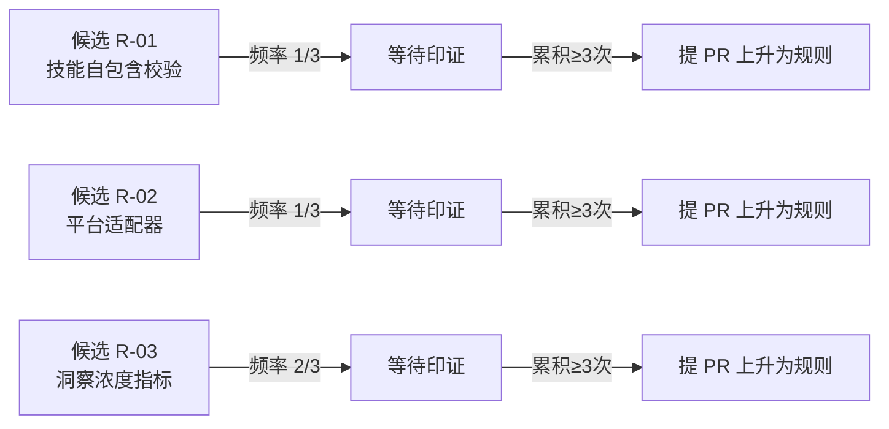

# 内容提取工作流：三条规则候选

> **状态**：Candidate（候选）  
> **来源**：单次任务复盘 — 微信文章内容提取（2026-06-24）  
> **溯源**：[`task-summary-force-conf-recap-20260624.md`](../../apps/chaos/.agents/docs/superpowers/retrospectives/task-summaries/exploration/task-summary-force-conf-recap-20260624.md)  
> **准入进度**：未达 [`rule-evolution.md`](../../apps/chaos/.agents/rules/rule-evolution.md) §1.1 的"≥3 次独立触发"频率门槛，当前停留在 `docs/topics/` 经验层，等待后续印证累积。

本文记录一次内容提取任务后提炼出的三条规则候选。它们尚未取得正式规则身份——按 [`rule-evolution.md`](../../apps/chaos/.agents/rules/rule-evolution.md) 的五维准入检验，频率维度 R-01/R-02 为 1/3，R-03 已累积至 2/3。在此公开候选，是为了让后续同类任务能对照印证，待触发次数累积到位后上升为 `.agents/rules/` 正式规则。

---

## 一、候选 01：技能自包含校验

### 1.1 现象

加载 `content-parser` 技能后，发现其依赖的 `shared/authentication.md`、`shared/config-pattern.md`、`shared/common-patterns.md` 等共享文件均不存在，技能无法按标准流程执行，被迫降级到 `defuddle`。

### 1.2 根因假设

技能包未做到**自包含**——`SKILL.md` 声明了对外部 `shared/` 目录的依赖，但分发机制未保证依赖随技能一起安装。这与 [`skills.md`](../../apps/chaos/.agents/rules/skills.md) §4 的目录结构约束存在执行缺口：目录结构定义了 `scripts/`、`tests/`、`references/` 等子目录，但未强制要求"被引用的依赖必须存在"。

### 1.3 候选规则草案

> **候选 R-01：技能自包含校验**  
> 任何 `SKILL.md` 引用的 `shared/`、`references/`、`schemas/` 等内部依赖，**MUST** 在技能目录内实际存在。技能加载前**SHOULD**执行依赖完整性校验，缺失依赖时**MUST**降级到备选技能并记录降级原因，而非直接报错中断。

### 1.4 五维准入初判

| 维度 | 初判 | 说明 |
|------|------|------|
| 频率 | ❌ 1/3 | 仅本次复盘触发，需累积 2 次以上独立印证 |
| 普适性 | ✅ | 跨技能、跨场景均成立 |
| 可执行性 | ✅ | 可写成 MUST/SHOULD 句式 |
| 无害性 | ✅ | 只约束"依赖缺失"反模式，不预设解法 |
| 可验证性 | ✅ | 可由 `validate_skill_md.py` 扩展依赖检查 |

### 1.5 待印证触发条件

- 再次遇到任意技能因 `shared/` 或类似内部依赖缺失而无法加载
- 或 PR review 中发现新增技能引用了不存在的内部文件

---

## 二、候选 02：平台适配器（内容提取平台特化）

### 2.1 现象

`defuddle` 提取微信公众号文章时，正文末尾混入平台 UI 文本（"赞，轻点两下取消赞 在看..."），通用网页提取器对**平台特化噪声**无感知。

### 2.2 根因假设

通用提取器（defuddle/WebFetch）按 DOM 通用规则清理噪声，但各内容平台（微信/知乎/掘金/小红书）有各自独有的尾部组件、广告注入、分享栏等。当前 [`browser-agent.md`](../../apps/chaos/.agents/rules/browser-agent.md) 只规定"静态优先 defuddle"，未区分内容源的平台差异。

### 2.3 候选规则草案

> **候选 R-02：内容提取平台适配器**  
> 针对高频内容源（微信公众号、知乎、掘金、小红书等），**SHOULD**建立平台适配器清单，记录各平台的特化噪声模式与清理策略。提取后**MAY**按平台执行尾部/头部噪声清理，而非依赖通用提取器的默认行为。

### 2.4 五维准入初判

| 维度 | 初判 | 说明 |
|------|------|------|
| 频率 | ❌ 1/3 | 仅微信平台触发一次，需跨平台累积印证 |
| 普适性 | ⚠️ | 仅适用于"内容提取"场景，非全项目普适 |
| 可执行性 | ✅ | 可写成 SHOULD/MAY 句式 |
| 无害性 | ✅ | 只约束噪声清理，不强制特定实现 |
| 可验证性 | ⚠️ | 噪声模式需人工维护，难以全自动校验 |

### 2.5 待印证触发条件

- 在知乎/掘金/小红书等平台提取时再次遇到平台特化噪声
- 或多次微信提取均出现相同尾部噪声（确认非偶发）

---

## 三、候选 03：洞察浓度指标（复盘评估）

### 3.1 现象

本次复盘报告以"5 分钟完成""95% 目标达成度"为核心评估指标，但学习类任务的核心价值是**可迁移洞察的密度**，而非执行速度。快但浅的复盘，不如慢但深的复盘。

### 3.2 根因假设

现有复盘模板默认采用"耗时 + 达成度"二维评估，缺少对产出物**洞察质量**的量化维度。这导致复盘倾向于记录"做了什么"而非"想到了什么"，[`retrospective-rethinking.md`](retrospective-rethinking.md) 指出的"复盘的元价值是再思考而非总结"在指标层未被落地。

### 3.3 候选规则草案

> **候选 R-03：洞察浓度指标**  
> 学习类/研读类任务的复盘**SHOULD**增加"洞察浓度"指标，定义为"每千字可迁移洞察数"（insights per 1000 words）。耗时与达成度作为辅助指标，不作为唯一评估维度。洞察浓度低于阈值时**SHOULD**追问"为什么"的因果链，而非停留在事实陈述。

### 3.4 五维准入初判

| 维度 | 初判 | 说明 |
|------|------|------|
| 频率 | ⚠️ 2/3 | 2 次独立印证（复盘自评 + 洞察萃取任务），待 1 次 |
| 普适性 | ⚠️ | 仅适用于学习/研读类任务，非全任务类型普适 |
| 可执行性 | ✅ | 已给出 L1-L4 分层 + 公式 + 阈值，详见 [`insight-density-metric.md`](insight-density-metric.md) |
| 无害性 | ✅ | 不抑制创新，只补充评估维度 |
| 可验证性 | ⚠️ | 人工可一致评判 + 自动化接口预留，详见 [`insight-density-metric.md`](insight-density-metric.md) §五 |

### 3.5 待印证触发条件

- 连续 2-3 次学习类任务复盘均出现"快但浅"的倾向
- 或复盘报告被读者反馈"信息密度不足"

### 3.6 印证记录

| 次数 | 时间 | 任务 | 印证产物 |
|------|------|------|----------|
| 1/3 | 2026-06-24 | 微信文章提取复盘 | [`task-summary-force-conf-recap-20260624.md`](../../apps/chaos/.agents/docs/superpowers/retrospectives/task-summaries/exploration/task-summary-force-conf-recap-20260624.md) — 自评发现"快但浅"倾向 |
| 2/3 | 2026-06-24 | 洞察+萃取任务 | [`task-summary-force-conf-insight-extraction-20260624.md`](../../apps/chaos/.agents/docs/superpowers/retrospectives/task-summaries/exploration/task-summary-force-conf-insight-extraction-20260624.md) — 主动追求洞察密度，产出 5 条可迁移知识 |

**第二次印证产物**（5 条萃取知识，作为"洞察浓度"的实践结果）：

- **K-01** AI 产品杠杆法则：底座能力 < 可用阈值时，产品优化边际收益递减
- **K-02** 水桶胜出法则：真实业务场景中，能力完整性 > 单项峰值
- **K-03** Agent 权限分级设计模式：最小权限 + 分级申请 + 人工授权
- **K-04** 多模态信息保真原则：输入信息保真度决定输出质量上限
- **K-05** Agent 自我演化飞轮：模型 → 功能 → 数据 → 模型

> 这 5 条知识是 R-03 理念的实践验证——当主动追求"洞察浓度"而非"执行速度"时，产出从"事实复述"上升为"可迁移模式"。详见 [`task-summary-force-conf-insight-extraction-20260624.md`](../../apps/chaos/.agents/docs/superpowers/retrospectives/task-summaries/exploration/task-summary-force-conf-insight-extraction-20260624.md)。

---

## 四、准入进度总览

| 候选 | 频率 | 普适 | 可执行 | 无害 | 可验证 | 综合状态 |
|------|------|------|--------|------|--------|----------|
| R-01 技能自包含 | 1/3 | ✅ | ✅ | ✅ | ✅ | 待频率印证 |
| R-02 平台适配器 | 1/3 | ⚠️ | ✅ | ✅ | ⚠️ | 待频率+场景印证 |
| R-03 洞察浓度 | 2/3 | ⚠️ | ✅ | ✅ | ⚠️ | 可执行性已解决，待 1 次频率印证 |

---

## 五、对项目的启示

这三条候选共享一个元模式：**单次复盘足以发现问题，但不足以固化规则**。[`rule-lifecycle.md`](rule-lifecycle.md) 的"经验自然选择"模型在此得到实证——

> 规则不是写出来的，是被"世界事件"反复冲刷之后，凝结到通道壁上的结晶。

本次复盘是一次"世界事件"，三条候选是"结晶的雏形"。它们是否最终凝结为规则，取决于后续是否被独立印证。在此期间，它们以候选身份停留在 `docs/topics/`，既不污染 `.agents/rules/` 的严肃性，也不丢失经验本身。

这本身就是 [`rule-evolution.md`](../../apps/chaos/.agents/rules/rule-evolution.md) §1.3 反模式清单中"一次性救火经验"的正确处置——不直接上升为规则，但记录在案，等待复现。

---

## 参见

- [`apps/chaos/.agents/rules/rule-evolution.md`](../../apps/chaos/.agents/rules/rule-evolution.md)：规则生长通道与五维准入检验
- [`apps/chaos/.agents/rules/skills.md`](../../apps/chaos/.agents/rules/skills.md)：技能开发规范（R-01 的目标规则文件）
- [`apps/chaos/.agents/rules/browser-agent.md`](../../apps/chaos/.agents/rules/browser-agent.md)：浏览器与内容提取规则（R-02 的目标规则文件）
- [`rule-lifecycle.md`](rule-lifecycle.md)：规则生命周期模型
- [`retrospective-rethinking.md`](retrospective-rethinking.md)：复盘的元价值（R-03 的哲学依据）
- 溯源复盘：[`task-summary-force-conf-recap-20260624.md`](../../apps/chaos/.agents/docs/superpowers/retrospectives/task-summaries/exploration/task-summary-force-conf-recap-20260624.md)
