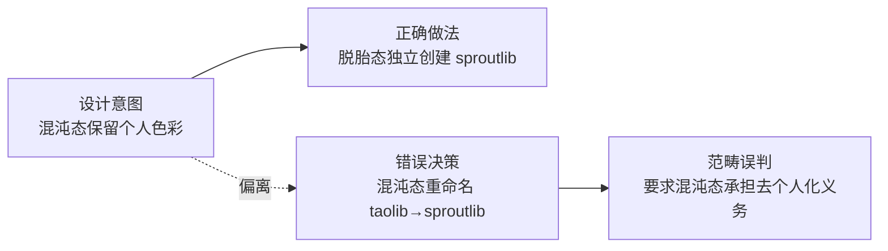

# 设计者偏离：当哲学的提出者不再是它的守护者

设计哲学的提出者并不自动成为其执行时的守护者。当哲学从"设计意图"滑向"执行决策"时，提出者本人也可能成为最大的偏离者——这不是因为哲学错了，而是因为执行场景的范畴发生了迁移，而决策者没有同步迁移自己的判断框架。

本文从 AgentForge 项目中 `taolib → sproutlib` "全项目重命名"决策的复盘切入，揭示一个反直觉现象：**最危险的设计偏离，往往出自设计者本人之手**。

---

## 一、案例分析：taolib→sproutlib 决策如何偏离双态架构设计意图

### 1.1 决策背景

AgentForge 的双态架构明确定义了两个世界的职责边界：

| 状态 | 目录 | 设计意图 | 个人色彩 |
|------|------|----------|----------|
| **混沌态** | `apps/chaos/` | 保留个人色彩、实验代码、哲学内核 | ✅ 应保留 |
| **脱胎态** | `rebirth/` | 社区标准、去个人化、独立创建 | ❌ 应去除 |

`taolib` 是混沌态的核心包名，承载了项目设计者（xinetzone）的个人色彩与哲学表达。在 WorldSprout 脱胎过程中，出现了一个决策："将 `taolib` 全项目重命名为 `sproutlib`"。

### 1.2 偏离的发生

这一决策的范畴误判体现在：

> 决策要求**混沌态**承担**脱胎态**的"去个人化"义务——而双态架构的设计意图恰恰相反：混沌态保留个人色彩是设计意图，不是缺陷。

值得强调的是，这个决策并非来自外部协作者对架构的误解，而是**出自项目设计者本人之手**——这构成了"设计者偏离"的典型样本。

---

## 二、根因分析：设计意图与执行决策之间的认知断层

### 2.1 三层认知断层

设计者偏离不是单一失误，而是三层认知断层的叠加：

| 断层层级 | 表现 | 根因 |
|----------|------|------|
| **范畴断层** | 混淆"混沌态资产"与"脱胎态资产"的边界 | 决策时未回到双态架构的原始定义 |
| **角色断层** | 设计者切换到执行者时未切换判断框架 | "我是设计者所以我的决策一定符合设计意图"的隐性假设 |
| **语境断层** | 脱胎语境（去个人化）污染了混沌语境（保留个人色彩） | 上下文切换不彻底，决策框架被任务语境反向塑造 |

### 2.2 为什么设计者更容易偏离

直觉上，设计者应该是最不可能偏离设计哲学的人。但实际恰恰相反——

- **设计者拥有最高的决策权限**：偏离不会被流程拦截；
- **设计者最熟悉哲学表达**：容易把"哲学表达"与"哲学约束"混淆；
- **设计者最易陷入"我说的就是对的"**：缺少外部审计的自觉。

> 设计者最大的风险，不是不懂自己的哲学，而是太懂自己的哲学——以至于在执行时跳过了"回到定义"这一步。

---

## 三、机制化约束的必要性：从"自觉"到"规则"

### 3.1 自觉的失效边界

如果设计偏离只能靠设计者本人的自觉来纠正，那么这种纠正具有以下失效特征：

- **不可重复**：本次复盘发现了，下次未必能发现；
- **不可审计**：没有外部视角可以挑战；
- **不可继承**：新协作者无法学习"如何避免设计者偏离"。

### 3.2 机制化约束的三层防护

设计哲学需要机制化约束，不能仅靠设计者的自觉。这正是 [`rebirth-extraction.md`](../../../apps/chaos/.agents/rules/rebirth-extraction.md) 规则存在的根本理由：

| 防护层 | 机制 | 作用 |
|--------|------|------|
| **规则层** | `rebirth-extraction.md` 显式声明"萃取 ≠ 重命名" | 决策前必须对照规则自检 |
| **审计层** | 复盘环节增加"决策审计"（参见 [复盘的元价值](retrospective-rethinking.md)） | 已决策但未执行的项目可被重新审视 |
| **文档层** | 未实现资产标注 `[planned]`（参见 [文档领先于实现](doc-ahead-of-implementation.md)） | 避免文档制造虚假完成感 |

### 3.3 核心论点

> **设计哲学的提出者并不自动成为它的守护者。** 哲学的守护必须依靠机制，而不是提出者的自觉——因为提出者本人在执行场景中，恰恰是最容易跳过哲学约束的人。

---

## 四、对项目的启示

1. **规则先于自觉**：任何设计哲学一旦写下来，就应立即配套可执行的规则文件，不能依赖"我记得设计意图"。
2. **决策审计应成为复盘的标准环节**：对未执行的已决策项，重新评估前提是否仍然成立（参见 [复盘的元价值](retrospective-rethinking.md)）。
3. **设计者应主动让渡部分决策权**：在涉及"是否符合设计哲学"的判断时，引入外部视角（如 AI 协作者、社区贡献者）作为制衡。
4. **范畴误判是最高频的偏离模式**：决策前先回到架构定义，确认当前任务属于哪个世界、适用哪套规则。
5. **萃取方法论应上升为通用原则**：从"个人 → 社区"的转化，应走萃取而非重命名路径（参见 [萃取方法论](extraction-methodology.md)）。

---

## 参见

- [文档领先于实现](doc-ahead-of-implementation.md)：文档如何制造虚假完成感
- [萃取方法论](extraction-methodology.md)：从个人到社区的转化范式
- [复盘的元价值](retrospective-rethinking.md)：决策审计作为复盘的标准环节
- [规则生命周期](rule-lifecycle.md)：规则如何诞生、成长、衰老、重生

> 来源：[综合复盘报告](../../../apps/chaos/.agents/docs/superpowers/retrospectives/retrospective-agentforge-comprehensive-20260623.md)（2026-06-23）
