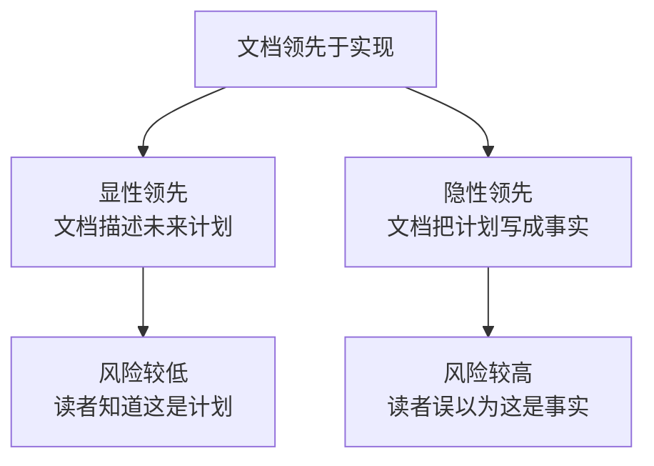

# 文档领先于实现：隐性债务的伪装者

文档不应描述未实现的产物为既定事实。当文档把"计划中的资产"写成"已存在的资产"时，它就从知识载体变成了认知陷阱——读者（包括 AI 协作者与人类贡献者）会基于这个虚假前提推导出错误的决策，而文档本身则成为错误决策的"权威源头"。

本文承接 [设计者偏离](designer-deviation.md) 提出的"范畴误判"问题，进一步追问：**当文档领先于实现时，它如何伪装成隐性债务，并最终诱导出"只需重命名"的错误结论？**

---

## 一、现象描述：sproutlib 在文档中已是既定事实，但无实现

### 1.1 文档与实现的错位

在 AgentForge 项目的复盘过程中，发现了一个典型的"文档领先"现象：

| 资产 | 文档中的状态 | 实际实现 | 错位 |
|------|--------------|----------|------|
| `sproutlib`（包名） | 在 `rebirth/worldsprout/` 文档中被作为既定事实引用 | 无 `src/` 实现 | ⚠️ 文档领先 |
| `taolib`（包名） | 在 `apps/chaos/` 中有完整实现 | 86 个 `.py` 文件 | ✅ 文档与实现对齐 |

### 1.2 文档领先的两种姿态

文档领先于实现，可以表现为两种形式：

`sproutlib` 的案例属于**隐性领先**——文档没有显式标注"这是计划中的资产"，而是直接以既定事实的姿态引用，导致后续决策者（包括设计者本人）基于"sproutlib 已存在"的虚假前提，推导出"只需把 taolib 重命名为 sproutlib"的错误结论。

---

## 二、风险分析：虚假完成感如何导致错误决策

### 2.1 虚假完成感的传导链

文档领先制造的虚假完成感，会沿着一条清晰的传导链演化为错误决策：

| 阶段 | 表现 | 后果 |
|------|------|------|
| **文档阶段** | sproutlib 被描述为既定事实 | 读者形成"它已存在"的认知 |
| **认知阶段** | 决策者基于"已存在"前提思考 | 推导出"重命名即可"的方案 |
| **决策阶段** | 形成"taolib → sproutlib 重命名"行动项 | 范畴误判（参见 [设计者偏离](designer-deviation.md)） |
| **执行阶段** | 若未在复盘环节被推翻 | 将造成混沌态资产被错误改造 |

### 2.2 文档作为"权威源头"的双刃剑

文档在项目中享有特殊的权威地位——

- **AI 协作者优先读取文档**：文档是 AI 形成项目认知的主要来源；
- **新贡献者依赖文档**：文档是新人理解项目的入口；
- **决策者引用文档作为依据**：文档被视为"事实来源"。

正是这种权威性，使得文档领先于实现时，其危害远大于口头讨论中的"计划"——

> 当一个未实现的资产被文档描述为既定事实时，它就获得了"事实"的权威性，却不需要承担"事实"的验证义务。这是最危险的隐性债务。

### 2.3 与"骨架领先"的区分

需要区分两种不同的"领先"：

| 类型 | 表现 | 风险等级 | 应对策略 |
|------|------|----------|----------|
| **文档领先于实现** | 文档把未实现的资产写成事实 | 🔴 高 | 标注 `[planned]` 或 `[TODO]` |
| **骨架领先于运行时** | 架构已定义但未验证 | 🟡 中 | 转向运行时验证（参见 [骨架与运行时](skeleton-vs-runtime.md)） |

前者的风险更高，因为它直接污染了决策前提；后者的风险是"假设未经验证"，但至少没有伪造事实。

---

## 三、解决方案：文档标注规范

### 3.1 状态标注约定

为避免文档领先于实现，所有文档应遵循以下标注规范：

| 标注 | 含义 | 适用场景 |
|------|------|----------|
| `[planned]` | 计划中，尚未实现 | 设计文档描述未来资产 |
| `[TODO]` | 待办，短期内将实现 | 任务清单中的待完成项 |
| `[draft]` | 草案，可能调整 | 规范文档的早期版本 |
| `[experimental]` | 实验性，可能废弃 | chaos 中的探索性资产 |
| （无标注） | 既定事实，已实现 | 已落地的稳定资产 |

### 3.2 标注的执行原则

- **MUST**：任何描述"尚未实现资产"的文档段落，必须显式标注状态；
- **MUST NOT**：禁止以既定事实的语气描述未实现的资产；
- **SHOULD**：文档审查环节应包含"实现状态一致性"检查。

### 3.3 核心论点

> **文档不应描述未实现的产物为既定事实。** 当文档把"计划"伪装成"事实"时，它本身就成了错误决策的源头——因为所有基于该文档的推导，都建立在一个虚假的前提之上。

---

## 四、对项目的启示

1. **文档审查应包含"实现状态一致性"检查**：在 PR 审查与复盘环节，专门检查文档是否描述了未实现的资产为既定事实。
2. **未实现资产必须显式标注**：使用 `[planned]` / `[TODO]` / `[draft]` 等标注，让读者明确知道这是计划而非事实。
3. **决策前提应回溯到实现层**：任何基于"资产已存在"的决策，都应先验证该资产是否真的存在（参见 [设计者偏离](designer-deviation.md)）。
4. **文档领先是隐性债务的最高危形式**：它不像代码债务那样可被 lint 工具发现，需要专门的文档治理流程。
5. **AI 协作者应被训练识别文档领先**：在 `.agents/rules/documentation.md` 中增加"未实现资产标注"规则，让 AI 在生成文档时主动标注。

---

## 参见

- [设计者偏离](designer-deviation.md)：范畴误判如何出自设计者本人之手
- [骨架与运行时](skeleton-vs-runtime.md)：架构骨架与运行时验证的区分
- [萃取方法论](extraction-methodology.md)：从个人到社区的转化范式
- [规则生命周期](rule-lifecycle.md)：规则如何避免空转

> 来源：综合复盘报告（`retrospective-agentforge-comprehensive-20260623.md`）（2026-06-23）
