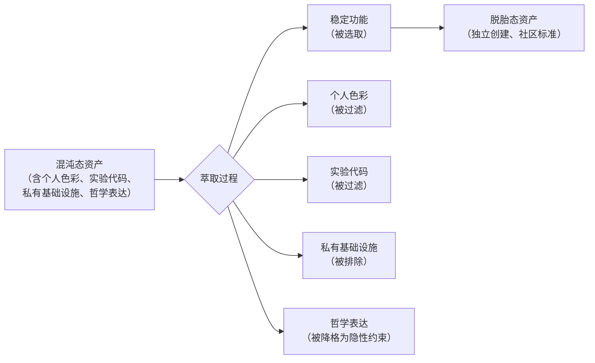
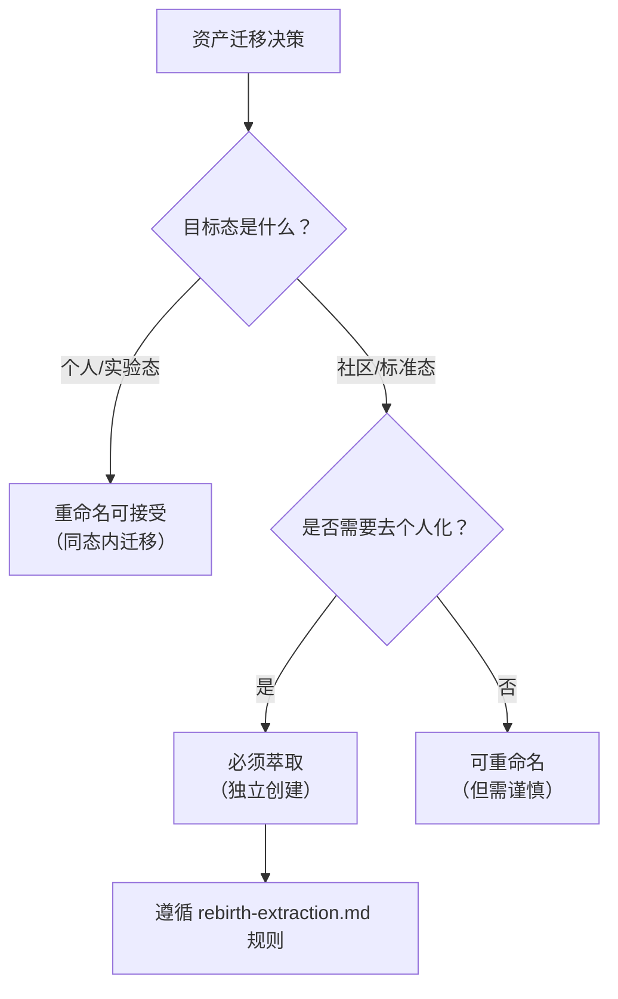
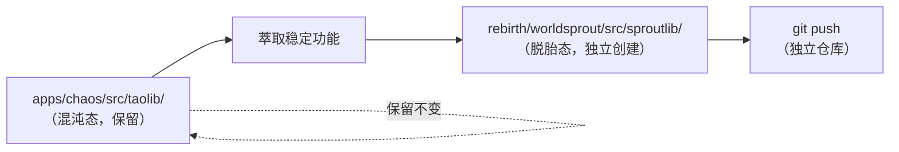

# 萃取方法论：从个人到社区的转化范式

"萃取 ≠ 重命名"不仅适用于包名迁移，它是一个可推广的转化范式。任何从"个人/实验"向"社区/标准"的转化，都应是选取稳定部分重新实现（萃取），而非整体搬迁（重命名）。重命名保留了原始上下文的所有债务，萃取则天然完成筛选与净化。

本文承接 [设计者偏离](designer-deviation.md) 揭示的 `taolib → sproutlib` 决策失误，将这一具体案例上升为脱胎态的通用方法论——**"脱胎 = 萃取 + 独立创建"，而非"脱胎 = 搬迁 + 改名"**。

---

## 一、方法论定义：萃取 vs 重命名的本质区别

### 1.1 两种转化路径的根本差异

从"个人资产"向"社区资产"的转化，存在两条根本不同的路径：

| 维度 | 重命名（搬迁 + 改名） | 萃取（选取 + 重新实现） |
|------|----------------------|------------------------|
| **本质** | 整体搬迁，保留原始上下文 | 选取稳定部分，重新实现 |
| **债务处理** | 保留所有原始债务 | 天然完成筛选与净化 |
| **个人色彩** | 强行去除（违反混沌态设计意图） | 在脱胎态中从未引入 |
| **哲学内核** | 强行剥离（造成哲学断层） | 在脱胎态中从未承载 |
| **独立性** | 依赖原始资产的存在 | 完全独立创建 |
| **可追溯性** | 历史污染（保留所有 commit） | 清晰溯源（脱胎点明确） |

### 1.2 萃取的本质：筛选与净化

萃取之所以优于重命名，根本原因在于它**天然完成了筛选与净化**：

重命名则跳过了这一筛选过程——它把所有内容（包括债务）原封不动地搬过去，再试图"事后清理"，这违背了"先筛选后引入"的原则。

---

## 二、适用场景：从包名迁移到通用转化范式

### 2.1 萃取方法论的适用范围

"萃取 ≠ 重命名"不仅适用于包名迁移，它是一个可推广的转化范式：

| 转化场景 | 重命名（错误做法） | 萃取（正确做法） |
|----------|-------------------|-----------------|
| **包名迁移** | `taolib` → `sproutlib`（全项目重命名） | 在 `rebirth/` 中独立创建 `sproutlib` |
| **模块迁移** | 复制粘贴整个模块 | 选取稳定接口，重新实现 |
| **文档迁移** | 整体改名搬迁 | 选取通用部分，去个人化重写 |
| **规则迁移** | 把混沌态规则原样搬到脱胎态 | 选取普适规则，独立规范化 |
| **技能迁移** | 把个人技能原样发布 | 选取稳定能力，去上下文化发布 |

### 2.2 判断"应萃取还是应重命名"的决策框架

遇到资产迁移决策时，应通过以下框架判断：

核心判断标准：**只要目标态是"社区/标准"，就必须走萃取路径**——因为社区资产不应承载个人色彩，而重命名无法去除个人色彩，只能"掩盖"。

---

## 三、实践案例：taolib → sproutlib 的正确做法

### 3.1 错误做法复盘

`taolib → sproutlib` 的"全项目重命名"决策，违反了萃取方法论的核心原则：

| 错误做法 | 违反的原则 | 后果 |
|----------|-----------|------|
| 全项目重命名 `taolib` → `sproutlib` | 萃取 ≠ 重命名 | 混淆双态架构职责边界 |
| 要求混沌态承担去个人化义务 | 混沌态应保留个人色彩 | 违反混沌态设计意图 |
| 在混沌态中执行脱胎态的净化 | 净化应在脱胎态中发生 | 范畴误判（参见 [设计者偏离](designer-deviation.md)） |

### 3.2 正确做法：萃取路径

按照萃取方法论，`taolib → sproutlib` 的正确做法应是：

具体步骤：

1. **混沌态保持不变**：`apps/chaos/src/taolib/` 保留原貌，包括个人色彩与哲学表达；
2. **脱胎态独立创建**：在 `rebirth/worldsprout/src/sproutlib/` 中**重新实现**稳定功能；
3. **筛选与净化**：萃取过程中过滤掉个人色彩、实验代码、私有基础设施；
4. **独立发布**：脱胎态资产有独立的包名、独立的 PyPI 发布、独立的文档站点。

### 3.3 萃取的工程价值

萃取方法论的工程价值体现在三个层面：

| 层面 | 价值 | 体现 |
|------|------|------|
| **架构层面** | 保持双态架构的职责边界 | 混沌态与脱胎态各自承担设计意图 |
| **质量层面** | 天然完成筛选与净化 | 债务不会被搬迁到社区资产 |
| **治理层面** | 清晰的溯源与审计 | 脱胎点明确，历史不污染 |

### 3.4 核心论点

> **"脱胎 = 萃取 + 独立创建"，而非"脱胎 = 搬迁 + 改名"。** 萃取是一个可推广的转化范式——任何从"个人/实验"向"社区/标准"的转化，都应选取稳定部分重新实现，而非整体搬迁。重命名保留了原始上下文的所有债务，萃取则天然完成筛选与净化。

---

## 四、对项目的启示

1. **萃取方法论应上升为脱胎态的通用原则**：不仅适用于包名迁移，也适用于模块、文档、规则、技能的迁移。
2. **[`rebirth-extraction.md`](../../../apps/chaos/.agents/rules/rebirth-extraction.md) 规则应被严格执行**：它不是建议，而是脱胎态的硬约束。
3. **萃取决策应回溯到设计意图**：避免 [设计者偏离](designer-deviation.md) 描述的范畴误判。
4. **脱胎态资产应标注"萃取来源"**：明确记录从哪个混沌态资产萃取，便于溯源。
5. **萃取过程本身应被复盘**：作为 [复盘的元价值](retrospective-rethinking.md) 中的"决策审计"环节。

---

## 参见

- [设计者偏离](designer-deviation.md)：范畴误判如何出自设计者本人之手
- [哲学是道非术](philosophy-as-dao.md)：哲学在萃取过程中的角色
- [复盘的元价值](retrospective-rethinking.md)：萃取决策的审计
- [规则生命周期](rule-lifecycle.md)：萃取产出的规则如何进入生命周期

> 来源：[综合复盘报告](../../../apps/chaos/.agents/docs/superpowers/retrospectives/retrospective-agentforge-comprehensive-20260623.md)（2026-06-23）
