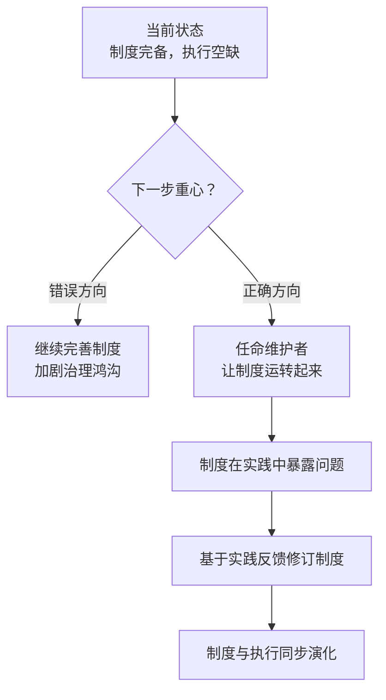

# 治理鸿沟：当制度超前于执行

制度文本的完备性与治理机制的有效性是两回事——没有执行者的制度是文本，不是机制。一个项目可以拥有最完善的 RFC 流程、最详尽的维护者权责定义、最规范的决策记录约定，但如果维护者尚未任命，所有这些制度都只是"宪法文本"，而非"治理机制"。

本文从 AgentForge 项目治理建设的现状切入，揭示一个常被忽视的风险：**制度过剩而执行不足，比制度不足更危险**。

---

## 一、现状分析：GOVERNANCE.md 完备 vs 维护者空缺

### 1.1 治理基建的"有宪法无总统"现象

AgentForge 项目当前的治理建设呈现出鲜明的"制度超前于执行"特征：

| 治理维度 | 制度完备性 | 执行完备性 | 状态 |
|----------|------------|------------|------|
| RFC 流程 | ✅ `GOVERNANCE.md`（214 行）完整定义 | ❌ 无维护者审批 | 有宪法无总统 |
| 维护者权责 | ✅ 角色与权限已定义 | ❌ 维护者尚未任命 | 角色空缺 |
| 决策记录 | ✅ 约定已建立 | ❌ 无执行者监督 | 约定空转 |
| 规则演化 | ✅ [规则生命周期](rule-lifecycle.md) 已建模 | ❌ 无仲裁者 | 流程悬空 |

### 1.2 制度超前于执行的成因

这种"有宪法无总统"的状态并非偶然，而是项目早期建设的自然结果：

制度文本的产出速度远快于执行者的培养速度——写一份 RFC 流程文档只需数小时，而培养一个能胜任维护者角色的人（或社区共识）需要数月甚至数年。这种速度差天然制造了治理鸿沟。

---

## 二、风险评估：合规幻觉的危害

### 2.1 合规幻觉的三个层面

制度过剩而执行不足，会制造一种"合规幻觉"——让外部观察者与内部协作者误以为治理机制已经生效，而实际上它从未运转：

| 幻觉层面 | 表现 | 实际后果 |
|----------|------|----------|
| **流程幻觉** | 看似有 RFC 流程可循 | 无维护者审批，RFC 无法真正通过 |
| **责任幻觉** | 看似有维护者承担责任 | 实际无人负责，问题无人兜底 |
| **共识幻觉** | 看似有决策记录机制 | 实际决策仍依赖个人意志，无社区共识 |

### 2.2 比制度不足更危险的原因

直觉上，"有制度但没执行"似乎比"完全没有制度"要好——但实际恰恰相反：

| 维度 | 制度不足 | 制度过剩而执行不足 |
|------|----------|-------------------|
| **风险可见性** | 🔴 风险显性，所有人都知道没有治理 | 🟢 风险隐性，被制度文本掩盖 |
| **改进动力** | 高，因为痛点明显 | 低，因为"看起来已经有了" |
| **外部误判** | 外部观察者知道需要谨慎 | 外部观察者误以为安全 |
| **内部自满** | 不会自满 | 容易陷入"治理已完成"的自满 |

> **制度过剩而执行不足，比制度不足更危险**——因为它制造了合规幻觉，让所有人都以为治理已经生效，而实际上它从未运转。制度不足至少让风险显性化，而制度过剩把风险藏在了文本之下。

### 2.3 与"骨架领先"的关联

治理鸿沟与 [骨架与运行时](skeleton-vs-runtime.md) 描述的现象同构——

- **骨架领先**：架构已定义但未验证；
- **治理鸿沟**：制度已建立但无执行者。

两者都是"定义超前于验证"的不同表现形式，本质都是把"假设"当成了"事实"。

---

## 三、行动建议：任命优先于制度完善

### 3.1 治理建设的优先级重排

基于治理鸿沟的分析，治理建设的下一步不应是继续完善制度，而是任命执行者：

### 3.2 任命优先于制度完善的理由

| 理由 | 说明 |
|------|------|
| **制度需要在实践中检验** | 未执行的制度无法暴露真实问题 |
| **执行者能反馈制度缺陷** | 没有执行者的制度反馈是空想的 |
| **任命是治理的"启动条件"** | 没有执行者，所有制度都是悬空的 |
| **避免制度过度设计** | 执行者能阻止制度无节制膨胀 |

### 3.3 任命的最小可行方案

任命维护者不需要等到"完美人选"出现，可以采用最小可行方案：

- **临时维护者**：由核心贡献者（如 xinetzone）暂任，明确"临时"身份；
- **权责清单**：明确维护者的最小权责（如 RFC 审批、规则仲裁）；
- **任期限制**：设定临时任期，到期重新评估；
- **公开声明**：在 `GOVERNANCE.md` 中显式记录任命状态，避免"有宪法无总统"的幻觉延续。

### 3.4 核心论点

> **治理建设的下一步不是继续完善制度，而是任命执行者。** 没有执行者的制度是文本，不是机制——制度过剩而执行不足，比制度不足更危险，因为它制造了合规幻觉，让所有人都以为治理已经生效。

---

## 四、对项目的启示

1. **任命优先于制度完善**：在维护者空缺的情况下，新增制度文本只会加剧治理鸿沟。
2. **制度应标注"执行状态"**：类似 [文档领先于实现](doc-ahead-of-implementation.md) 的标注规范，制度文本应显式标注"已生效"或"待执行者任命"。
3. **治理建设应避免"定义陷阱"**：不要把"写了制度"等同于"建立了治理"——治理是机制，不是文本。
4. **临时任命优于空缺**：即使没有完美人选，临时任命也比长期空缺更健康。
5. **复盘应包含"治理执行审计"**：检查制度是否真的在运转，而不仅仅是存在（参见 [复盘的元价值](retrospective-rethinking.md)）。

---

## 参见

- [规则生命周期](rule-lifecycle.md)：规则如何避免空转
- [骨架与运行时](skeleton-vs-runtime.md)：架构骨架与运行时验证的区分
- [复盘的元价值](retrospective-rethinking.md)：决策审计与执行审计
- [文档领先于实现](doc-ahead-of-implementation.md)：文档如何制造虚假完成感

> 来源：综合复盘报告（`retrospective-agentforge-comprehensive-20260623.md`）（2026-06-23）
