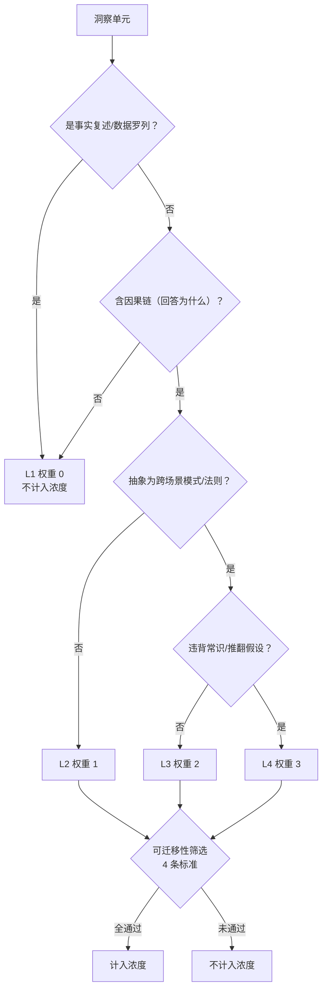
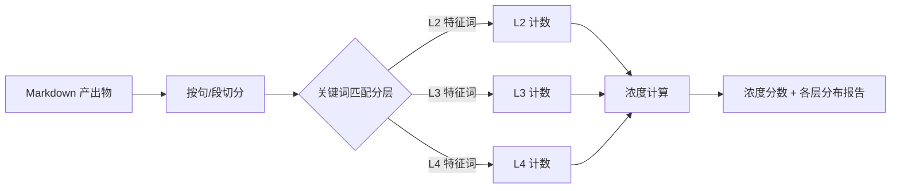

# 洞察浓度指标：从抽象理念到可操作测量

> **状态**：Active（R-03 候选的操作化定义）  
> **来源**：[`content-extraction-rule-candidates.md`](content-extraction-rule-candidates.md) 候选 R-03  
> **设计目标**：将"洞察浓度"从口号转化为可测量、可评判、可对照的指标

[`rule-lifecycle.md`](rule-lifecycle.md) 指出"规则是被印证出来的，不是被设计出来的"。但"印证"本身需要一把尺子——没有可操作的测量定义，就无法判断"这次比上次更深入"。本文为 R-03 候选"洞察浓度指标"提供操作化定义，让"快但浅 vs 慢但深"的判断从主观感觉变为可量化对照。

---

## 一、设计目标与约束

### 1.1 要解决的问题

R-03 候选在 [`content-extraction-rule-candidates.md`](content-extraction-rule-candidates.md) §3.4 的五维初判中，两个维度未通过：

| 维度 | 问题 |
|------|------|
| 可执行性 | "洞察浓度"定义需进一步操作化，阈值难定 |
| 可验证性 | 洞察浓度难以全自动校验，需人工评判 |

本文档通过给出**可操作定义 + 阈值参考 + 验证样本**，解决可执行性问题；通过**分层判定标准 + 自动化接口预留**，缓解可验证性问题。

### 1.2 设计约束

- **人工为主 + 预留自动化接口**：当前阶段人工评判，但定义结构允许未来脚本化
- **可区分产出质量**：能区分"事实摘要""合格复盘""优秀洞察""深度萃取"
- **低认知负荷**：判定流程不超过 3 步，单次评判 ≤ 5 分钟

---

## 二、核心定义

### 2.1 洞察单元（Insight Unit）

产出物中一个**独立的、可被引用的论断**。通常对应：
- 一个带标题的小节
- 一个列表项
- 一个独立段落

**反例**：过渡句、导航文本、元信息（如"参见"列表）不计入洞察单元。

### 2.2 四层分级标准

每个洞察单元按其**认知深度**归入 L1-L4 之一：

| 层级 | 定义 | 权重 | 判定示例 | 自动化特征（预留） |
|------|------|------|----------|-------------------|
| **L1 事实复述** | 原文转述、数据罗列、事件记录 | 0 | "Seed-2.1-Pro 定价 ¥6/¥30，上下文 256k" | 无因果/模式关键词 |
| **L2 因果分析** | 回答"为什么"，含因果链 | 1 | "底座未跨可用阈值时，产品优化边际收益递减" | "因为/导致/所以/根源/由于" |
| **L3 可迁移模式** | 跨场景成立的模式/法则/原则 | 2 | "水桶模型胜出法则：能力完整性 > 单项峰值" | "模式/法则/原则/适用于/可迁移" |
| **L4 反直觉洞察** | 违背常识、推翻假设、揭示暗坑 | 3 | "模型自己开发自己的功能 = 自我演化飞轮雏形" | "反直觉/违背/推翻/而非/暗坑" |

### 2.3 判定流程



### 2.4 可迁移性筛选（L2 以上才判定）

一个 L2+ 的洞察单元**必须同时满足**以下 4 条，才计入浓度：

| 标准 | 检验问题 | 不通过则 |
|------|----------|----------|
| 非事实复述 | 是否为原文/数据的转述？ | 降为 L1 |
| 含因果或模式 | 是否回答了"为什么"或抽象出"模式"？ | 降为 L1 |
| 可跨场景迁移 | 剥离具体上下文是否仍成立？ | 不计入浓度 |
| 可指导决策 | 能否改变某个行为或判断？ | 不计入浓度 |

### 2.5 浓度计算公式

```
洞察浓度 = Σ(通过筛选的洞察单元的层级权重) / (产出有效字数 / 1000)
```

**有效字数**：排除元信息、导航、参见列表、代码块后的正文字数（中文按字符计）。

---

## 三、阈值参考

| 产出类型 | 浓度阈值 | 典型层级分布 | 对应场景 |
|----------|---------|-------------|----------|
| 事实摘要 | 0-1 分/千字 | L1 为主 | 新闻转述、数据汇总 |
| 合格复盘 | ≥ 3 分/千字 | L2 为主 | 执行复盘、过程记录 |
| 优秀洞察 | ≥ 6 分/千字 | L3 为主 | 深度分析、模式提炼 |
| 深度萃取 | ≥ 10 分/千字 | L3+L4 混合 | 知识萃取、反直觉发现 |

> 阈值非硬性门禁，而是**对照基准**——用于判断产出是否达到任务类型应有的深度。

---

## 四、验证样本

用本仓库已有的两份产出物对照验证定义的区分能力：

### 4.1 样本 A：task-summary-force-conf-recap-20260624.md（第一次复盘）

| 洞察单元 | 层级 | 权重 | 可迁移 | 计入 |
|----------|------|------|--------|------|
| INSIGHT 01 "模型就是一切" | L2 | 1 | ✅ | 1 |
| INSIGHT 02 多模态护城河 | L2 | 1 | ✅ | 1 |
| INSIGHT 03 Agent 办公战场 | L2 | 1 | ✅ | 1 |
| INSIGHT 04 价格上下文短板 | L1 | 0 | — | 0 |
| **合计** | | | | **3** |

- 有效字数：~1000 字
- 浓度：3 / 1 = **3.0 分/千字**
- 级别：**合格复盘**

### 4.2 样本 B：insight-extraction.md（第二次深度萃取）

| 洞察单元 | 层级 | 权重 | 可迁移 | 计入 |
|----------|------|------|--------|------|
| 洞察 05 底座杠杆 | L3 | 2 | ✅ | 2 |
| 洞察 06 水桶模型 | L3 | 2 | ✅ | 2 |
| 洞察 07 Agent 权限三角 | L3 | 2 | ✅ | 2 |
| 洞察 08 模型自我演化 | L4 | 3 | ✅ | 3 |
| 洞察 09 多模态信息保真 | L3 | 2 | ✅ | 2 |
| 洞察 10 价格上下文终局 | L2 | 1 | ✅ | 1 |
| K-01 AI 产品杠杆法则 | L3 | 2 | ✅ | 2 |
| K-02 水桶胜出法则 | L3 | 2 | ✅ | 2 |
| K-03 Agent 权限分级设计 | L3 | 2 | ✅ | 2 |
| K-04 多模态信息保真原则 | L3 | 2 | ✅ | 2 |
| K-05 Agent 自我演化飞轮 | L3 | 2 | ✅ | 2 |
| **合计** | | | | **22** |

- 有效字数：~3000 字
- 浓度：22 / 3 = **7.3 分/千字**
- 级别：**优秀洞察**

### 4.3 验证结论

| 产出物 | 浓度 | 级别 | 印证 R-03 判断 |
|--------|------|------|---------------|
| 样本 A（第一次复盘） | 3.0 | 合格复盘 | "快但浅" ✅ |
| 样本 B（第二次萃取） | 7.3 | 优秀洞察 | "慢但深" ✅ |

**浓度差距 2.4 倍**，定义能有效区分产出质量，验证了 R-03 候选"快但浅 vs 慢但深"的核心判断。

---

## 五、自动化接口预留

当前阶段为人工评判。定义结构已预留未来脚本化的接口：

### 5.1 未来脚本设计



### 5.2 关键词清单（预留）

| 层级 | 关键词（示例，非穷举） |
|------|----------------------|
| L2 因果 | 因为、导致、所以、根源、由于、之所以、原因是 |
| L3 模式 | 模式、法则、原则、适用于、可迁移、规律、共性 |
| L4 反直觉 | 反直觉、违背、推翻、而非、暗坑、陷阱、反而 |

> 关键词匹配仅作**辅助提示**，不能替代人工判定——一个含"因为"的句子可能是 L1 事实陈述。自动化脚本应输出"建议分层"，由人工确认。

### 5.3 演进路径

| 阶段 | 评判方式 | 准确度 |
|------|---------|--------|
| 当前 | 全人工评判 | 高（但耗时） |
| 短期 | 脚本辅助分层 + 人工确认 | 中高 |
| 长期 | 脚本自动分层 + 抽样人工校验 | 中（足够用于趋势监控） |

---

## 六、对项目的启示

### 6.1 R-03 维度更新

本定义直接改善 R-03 候选的两个未通过维度：

| 维度 | 原状态 | 更新后 | 依据 |
|------|--------|--------|------|
| 可执行性 | ⚠️ 定义需操作化 | ✅ 已给出 L1-L4 分层 + 公式 + 阈值 | §二、§三 |
| 可验证性 | ❌ 难以全自动校验 | ⚠️ 人工可一致评判 + 自动化接口预留 | §五 |

### 6.2 方法论价值

本定义验证了一个元命题：**抽象理念可通过结构化分层转化为可操作指标**。这与 [`extraction-methodology.md`](extraction-methodology.md) 的"萃取 = 筛选与净化"同构——

- 萃取：从混沌态选取稳定部分重新实现
- 浓度测量：从产出中选取 L2+ 洞察单元加权计数

两者都是"筛选有价值部分"的过程。

### 6.3 适用边界

本定义**仅适用于学习类/研读类/复盘类任务**的产出物评估。不适用于：
- 代码实现（用测试覆盖率衡量）
- 文档撰写（用完整性/准确性衡量）
- 配置变更（用影响范围衡量）

强行套用会扭曲评估目标——并非所有产出都应追求"洞察浓度"。

---

## 参见

- [`content-extraction-rule-candidates.md`](content-extraction-rule-candidates.md)：R-03 候选原文（本定义的来源）
- [`retrospective-rethinking.md`](retrospective-rethinking.md)：复盘的元价值（R-03 的哲学依据）
- [`rule-lifecycle.md`](rule-lifecycle.md)：规则生命周期（R-03 的准入流程）
- [`extraction-methodology.md`](extraction-methodology.md)：萃取方法论（与本定义同构的"筛选"过程）
- 验证样本：[`task-summary-force-conf-insight-extraction-20260624.md`](../../apps/chaos/.agents/docs/superpowers/retrospectives/task-summaries/exploration/task-summary-force-conf-insight-extraction-20260624.md)
