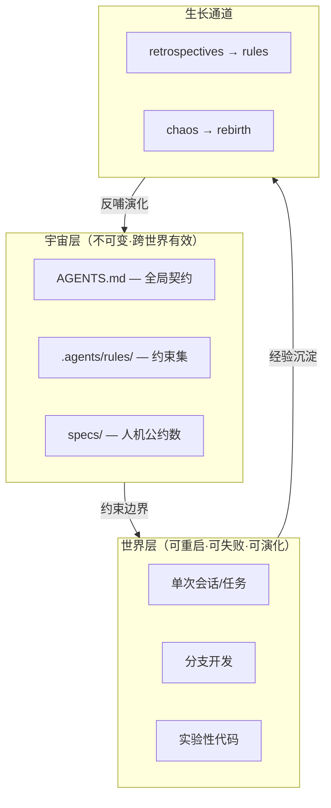
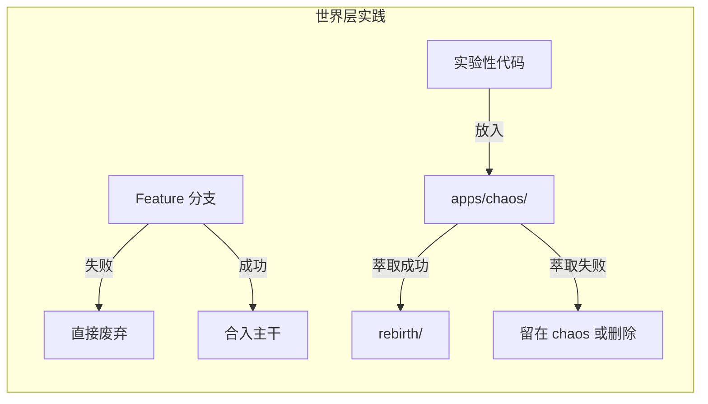
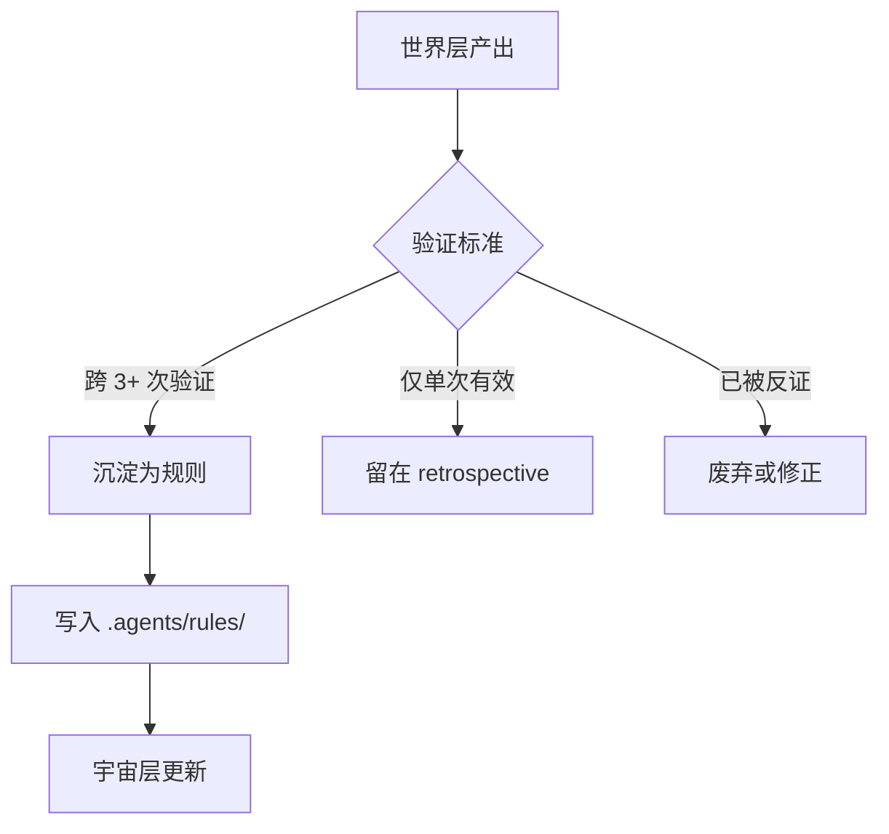
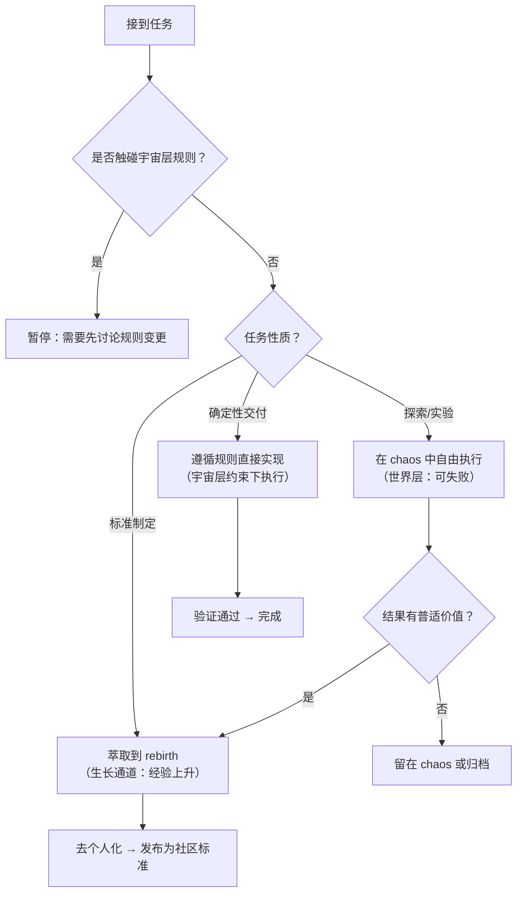

# 分层架构的开发实践：宇宙/世界/生长通道如何指导日常工作

宇宙/世界/生长通道三层架构不仅是 AgentForge 的哲学骨架，更是开发者日常决策的实用工具。本文聚焦于"这套分层如何指导实际开发流程"——不再讨论理论本身，而是**用分层思维回答每个开发者都会遇到的具体问题**。

承接 [规则生命周期](rule-lifecycle.md) 对规则诞生与演化的深度探讨，本文关注更前端的问题：**作为一个开发者/Agent，我在接到任务时，如何用三层框架做决策？**

---

## 一、核心原则回顾

---

## 二、三层如何指导日常开发

### 2.1 宇宙层决定了"什么不能动"

在日常开发中，宇宙层的规则起到**决策免疫**的作用——遇到以下问题时，不需要讨论，直接遵循：

| 场景 | 宇宙层约束 | 开发者行为 |
|------|-----------|-----------|
| 新增一个功能模块 | 路径独立性规则 | 不引入绝对路径，不跨模块硬编码依赖 |
| 写文档 | 文档边界规则 | 人类文档放 `docs/`，AI 文档放 `.agents/docs/` |
| 选技术栈 | Python 规则 | 统一用 `uv`，不引入 pip/poetry |
| 输出设计图 | Mermaid 优先 | 不用 draw.io 或图片，用代码表达关系 |

**哲学意义**：宇宙层规则消除了「重复决策的认知负荷」。正如道家所言「无为而治」——不是不做事，而是**把决策前置到规则层，让执行层无需再思考**。

### 2.2 世界层决定了"如何大胆试错"

世界层的核心特性是**可重启、可失败、成本有限**。这直接映射到：

**具体指导**：

- **每个任务/会话都是一个「世界」**：可以自由探索，不必担心污染宇宙层
- **失败不是问题，泄漏才是**：世界可以崩溃重来，但不能把未经验证的结论写入 `rules/`
- **混沌态是合法的**：`apps/chaos/` 就是「世界层」的物理容器——允许一切未精炼的探索存在

### 2.3 生长通道决定了"经验如何上升为规则"

这是最关键的流程指导——**不是所有经验都值得成为规则**：

**实际流程**：

1. 开发中遇到问题 → 在当次「世界」中解决
2. 解决方案写入复盘 → `retrospectives/`
3. 同类问题反复出现（≥3次）→ 提炼为规则
4. 规则经过团队/AI 共识 → 写入 `rules/`
5. 从此成为宇宙层约束 → 后续世界自动遵循

> 关于准入标准的五维检验与详细操作流程，参见 [规则生命周期 § 2.2](rule-lifecycle.md)。

---

## 三、开发流程决策树

当你面对一个具体任务时，分层思维给出的决策路径：

---

## 四、一句话总结

> **宇宙层让你不必重复思考「什么是对的」，世界层让你放心去试「怎么做更好」，生长通道确保试出来的好东西不会丢失。**

这三层的动态平衡，就是「道法自然」在开发流程中的具体体现：
- 不是预设一切（过度设计）
- 不是放任一切（无序混沌）
- 而是**设定边界，在边界内自由生长，让好的模式自然涌现并固化**

---

## 五、与其他文档的关系

本文聚焦"分层架构的开发实践"——即三层框架如何在日常任务中被运用。更深入的专题已在以下文档中展开：

| 专题 | 参见 |
|------|------|
| 规则的诞生、演化与废弃 | [规则生命周期](rule-lifecycle.md) |
| 多世界冲突仲裁与协议传递 | [规则生命周期 § 四](rule-lifecycle.md) |
| 约束即代码的工程落地 | [代码架构洞察](code-architecture-insights.md) |
| 三层架构的哲学源头 | [设计哲学](design-philosophy.md) |
| 东方哲学到工程模式的映射 | [哲学洞察](philosophical-insights.md) |

---

## 参见

- [规则生命周期](rule-lifecycle.md)：规则从经验到约束的完整演化路径
- [设计哲学](design-philosophy.md)：项目设计决策的哲学源头
- [代码架构洞察](code-architecture-insights.md)：约束即代码的工程实现
