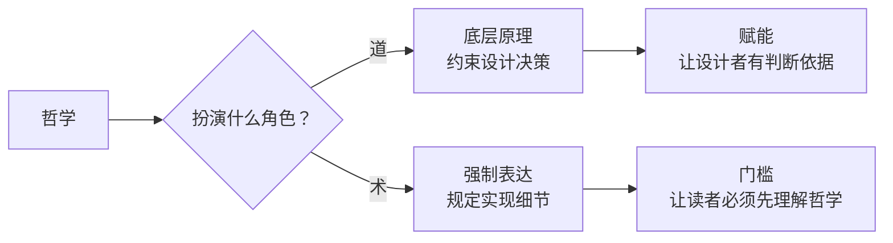
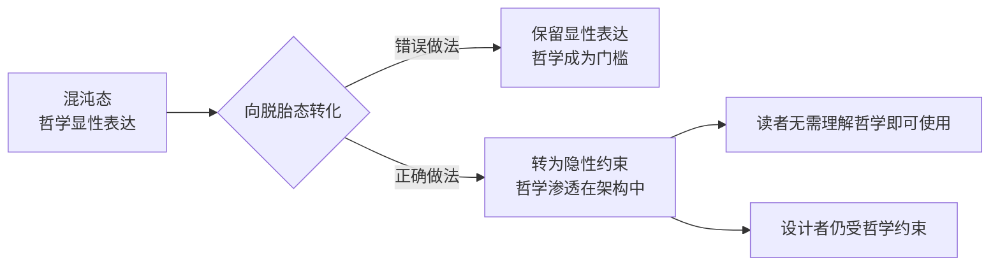

# 哲学是道非术：从显性表达到隐性约束

哲学应约束设计决策的"为什么"，而非规定实现细节的"怎么做"。当哲学从"底层原理"（道）滑向"强制表达"（术）时，它就从赋能变为门槛——读者不需要理解 `Ψ=Ψ(Ψ)` 就能使用 `sproutlib`，但设计者需要。

本文承接 [设计哲学](design-philosophy.md) 与 [哲学洞察](philosophical-insights.md) 的讨论，进一步追问：**当哲学从"道"滑向"术"时，它如何从赋能变为门槛？脱胎态的"去哲学化"究竟意味着什么？**

---

## 一、道与术的区分：哲学在工程中的两种角色

### 1.1 哲学的两种姿态

哲学在工程系统中可以扮演两种截然不同的角色：

| 角色 | 定位 | 表现 | 受众 |
|------|------|------|------|
| **道（底层原理）** | 约束设计决策的"为什么" | 隐性约束，渗透在架构中 | 设计者 |
| **术（强制表达）** | 规定实现细节的"怎么做" | 显性表达，强制出现在产物中 | 所有读者 |

### 1.2 道与术的临界点

哲学从"道"滑向"术"的临界点，在于它是否**强制出现在产物中**：

- **道**：哲学渗透在架构决策中，但产物本身不显式表达哲学——读者使用产物时无需理解哲学；
- **术**：哲学被强制写入产物，读者必须先理解哲学才能使用产物——哲学从赋能变为门槛。

> 哲学是道非术——它应该约束设计者的"为什么"，而不是规定使用者的"怎么做"。当哲学从底层原理滑向强制表达时，它就从赋能变为门槛。

---

## 二、当前问题：哲学从赋能变为门槛的临界点

### 2.1 混沌态中的哲学表达

在 AgentForge 的混沌态（`apps/chaos/`）中，哲学以显性表达的形式存在：

| 哲学表达 | 位置 | 性质 |
|----------|------|------|
| `Ψ=Ψ(Ψ)` 自指公式 | `psi-philosophy` fragment | 显性表达 |
| 道家哲学引用 | `taolib` 包名与文档 | 显性表达 |
| "反者道之动，弱者道之用" | 设计原则 | 显性表达 |
| 记忆做梦协议 | Layer 3 fragment | 显性表达 |

这些显性表达在混沌态中是**合理**的——混沌态的设计意图就是保留个人色彩与哲学内核（参见 [萃取方法论](extraction-methodology.md)）。

### 2.2 哲学滑向"术"的风险

然而，当这些显性表达被要求**保留到脱胎态**时，哲学就从"道"滑向了"术"：

| 风险 | 表现 | 后果 |
|------|------|------|
| **认知门槛** | 读者必须理解 `Ψ=Ψ(Ψ)` 才能使用 `sproutlib` | 社区采纳门槛过高 |
| **表达绑架** | 哲学表达强制出现在所有产物中 | 产物失去中立性 |
| **受众错位** | 设计者的哲学强加给使用者 | 使用者无需理解哲学即可使用 |

### 2.3 脱胎态的去哲学化：不是抛弃，而是转化

脱胎态的"去哲学化"不是抛弃哲学，而是将哲学从"显性表达"转为"隐性约束"：

---

## 三、解决方向：显性哲学 → 隐性约束

### 3.1 隐性约束的三种姿态

哲学从显性表达转为隐性约束，可以表现为三种姿态：

| 姿态 | 含义 | 例子 |
|------|------|------|
| **架构约束** | 哲学体现在架构决策中，而非文档中 | "上下文节省"体现在目录分离，而非哲学宣言 |
| **规则约束** | 哲学转化为可执行规则 | "无为而治"转化为"规则前置，执行无需思考" |
| **命名约束** | 哲学体现在命名选择中，而非显式引用 | `sproutlib` 而非 `taolib`（去个人色彩） |

### 3.2 显性哲学与隐性约束的分工

显性哲学与隐性约束并非对立，而是分工：

| 维度 | 显性哲学（混沌态） | 隐性约束（脱胎态） |
|------|-------------------|-------------------|
| **受众** | 设计者 | 所有使用者 |
| **位置** | `.agents/docs/`、fragment | 架构、规则、命名 |
| **形式** | 哲学宣言、公式、引用 | 架构决策、规则约束 |
| **作用** | 指导设计决策 | 约束执行行为 |
| **可见性** | 显性 | 隐性 |

### 3.3 萃取过程中的哲学处理

在 [萃取方法论](extraction-methodology.md) 描述的萃取过程中，哲学的处理应遵循以下原则：

- **MUST**：脱胎态资产不应显式引用混沌态的哲学表达；
- **MUST**：脱胎态的架构决策应体现哲学约束（如上下文节省、路径独立性）；
- **SHOULD**：脱胎态的规则文件应将哲学转化为可执行约束；
- **MAY**：脱胎态的设计文档可在"设计 rationale"章节隐性引用哲学。

### 3.4 核心论点

> **哲学应该是"道"（底层原理），而不是"术"（强制表达）。** 脱胎态的去哲学化不是抛弃哲学，而是将哲学从"显性表达"转为"隐性约束"——读者不需要理解 `Ψ=Ψ(Ψ)` 就能使用 `sproutlib`，但设计者需要。

---

## 四、对项目的启示

1. **混沌态保留显性哲学，脱胎态转为隐性约束**：这是双态架构在哲学层面的具体体现。
2. **哲学表达应区分受众**：面向设计者的文档可以显性表达哲学，面向使用者的产物应隐性约束。
3. **萃取过程应包含"哲学转化"环节**：从显性表达转为隐性约束（参见 [萃取方法论](extraction-methodology.md)）。
4. **避免哲学绑架产物**：使用者不应被强制理解哲学才能使用产物。
5. **哲学的"道"角色应被显式声明**：在 `.agents/docs/` 中明确哲学是设计约束，而非使用前提。

---

## 参见

- [设计哲学](design-philosophy.md)：项目设计决策的哲学源头
- [哲学洞察](philosophical-insights.md)：东方哲学到工程模式的映射
- [萃取方法论](extraction-methodology.md)：哲学在萃取过程中的处理
- [设计者偏离](designer-deviation.md)：哲学约束失效的案例

> 来源：综合复盘报告（`retrospective-agentforge-comprehensive-20260623.md`）（2026-06-23）
