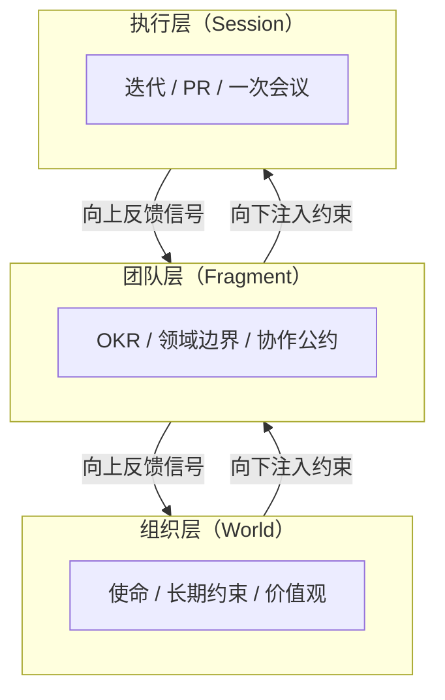
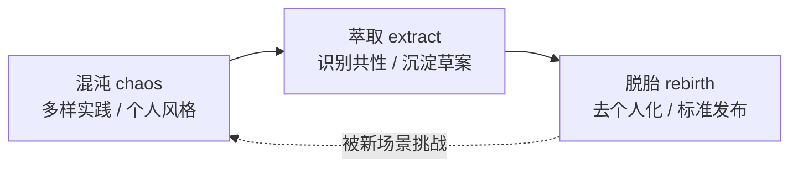

# 偏产品/组织版洞察

> "管理是把事情做对，领导是做对的事情。"——彼得·德鲁克
>
> "任何组织在设计一个系统时，所交付的设计方案在结构上都与该组织的沟通结构保持一致。"——康威定律

如果说哲学版洞察揭示了"道"，那么产品/组织版洞察则关注"器"——在真实的人、流程与产品中，"上下文失控"这一命题如何具体显形，又如何被规范所救赎。

## 洞察一：上下文即产品（Context-as-Product）

组织中信息丢失的根源不是工具不够，而是**上下文没有被当作"一等公民产品"来治理**。

很多团队会为代码写测试、为接口写文档、为数据库做备份，却从未为"上下文"本身设立维护者。需求在 PM 的脑子里、决策在某次会议的口头共识里、约束在资深工程师的肌肉记忆里——这些都是组织最昂贵的资产，却以最廉价的方式存放。当人员流动或规模扩张时，丢失的不是文件，而是"为什么这样做"。

把上下文当作产品意味着：它有版本、有 owner、有变更日志、有消费者反馈通道。AgentForge 把 `world.toml`、`AGENTS.md`、`.agents/` 抬升为仓库一等结构，本质上就是把"上下文"从口头传承的部落知识，变成了可追踪、可演化、可分发的产品形态。

## 洞察二：约束即赋能（Constraints as Enablement）

好的规范降低认知负荷，让团队成员不需要"猜"。

敏捷宣言写下"个体与互动高于流程与工具"时，反对的是僵化的官僚流程，而不是反对一切流程。但很多组织把它误读为"流程越少越好"，结果走向另一个极端：每个人都要自己重新发明协作方式，每次会议都要重新对齐基本概念，认知带宽被消耗在"我们到底怎么干"上，而不是"我们要解决什么问题"。

真正赋能的规范有三个特征：**可发现**（在需要时能找到）、**可解释**（说明为什么而不只是怎么做）、**可演化**（允许被挑战和修订）。它不是束缚创造力的镣铐，而是让创造力可以稳定释放的脚手架。一支爵士乐队不是因为没有规则才即兴，恰恰是因为共享了和声、节奏与即兴语汇这些"约束"，才能在台上心有灵犀。

## 洞察三：组织的分形结构（Fractal Organization）

团队/项目/产品的层级关系本质上是**上下文的嵌套与路由**。

康威定律告诉我们：系统结构镜像组织结构。反过来，一个能扩展的组织，其内部结构必然是分形的——每一层都有"自己的世界、自己的片段、自己的会话"。公司有公司的愿景，部门有部门的目标，小组有小组的迭代，个人有个人的待办；上层为下层提供约束与上下文，下层向上层反馈结果与异常。

这正是 AgentForge **World → Fragment → Session** 三层模型的组织学映射：

当任意一层把"上下文路由"做好，跨层协作的摩擦就降到最低；反之，任意一层断裂，都会让上层的意图无法落地，下层的反馈无法上浮。

## 洞察四：规范的生命周期（Spec Lifecycle）

规范不是写出来就完的静态文档，而是需要 **孵化(chaos) → 萃取(extract) → 脱胎(rebirth)** 的演化路径。

很多团队的"规范文档"死在 Confluence 里：写的人不再维护，读的人懒得查阅，做的人当它不存在。根因是把规范当成一次性交付物，而不是产品。健康的规范有一条清晰的生命周期：先在混沌中野蛮生长（多个团队各自实践），再被识别出共性并萃取为草案，最后脱胎为去个人化、可复用的标准。

虚线回流是关键：标准一旦发布并不意味着终结，新场景会再次冲击它，触发下一轮孵化。AgentForge 仓库中 `apps/chaos/` 与 `rebirth/` 的物理分区，正是这条生命周期在文件系统上的具象化。

## 洞察五：度量陷阱（Metrics Trap）

组织常犯的错：**度量规范执行率，而不是规范带来的价值**。

"代码评审覆盖率 100%"、"文档完成率 95%"、"流程合规率 99%"——这些数字看起来无可挑剔，却可能掩盖一个事实：规范本身已经偏离了它要服务的目标。当度量本身成为目标（古德哈特定律），人们会优化"被测量的东西"，而不是"被测量物所代表的东西"。

更健康的度量姿态是问两层问题：第一层是"规范有没有被遵守"，第二层——也是更重要的一层——是"遵守这条规范，让我们离真正的目标更近还是更远？"。如果一条规范的执行率很高但价值产出不明，它就该被重新审视；如果一条规范的执行率不高但每次执行都创造价值，它就该被改造得更易于执行而不是被强推。规范的终极 KPI 不是合规度，而是**它消除了多少不必要的认知负荷与决策摩擦**。

## 总结

从产品与组织视角看，AgentForge 试图回答的不是一个工具问题，而是一个治理问题：**当协作主体（人 + 智能体）日益异构、上下文日益碎片化时，组织如何把"约束"做成产品而非负担、做成生命体而非纪念碑**。把上下文当产品、把约束当赋能、把组织当分形、把规范当生命、把度量瞄准价值——这五点放在一起，就是用工程化的方式回答德鲁克那句老话：先做对的事情，再把事情做对。
