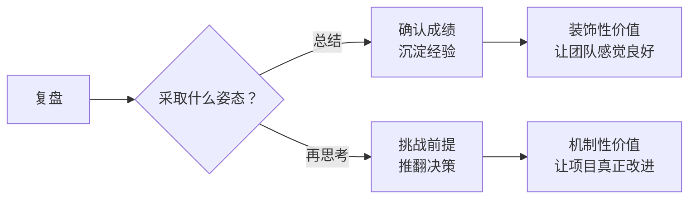
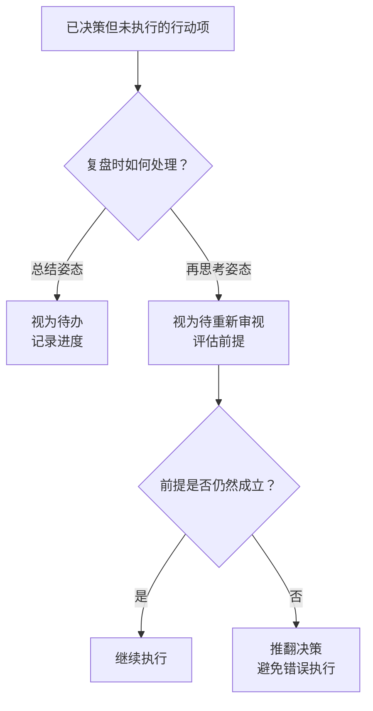
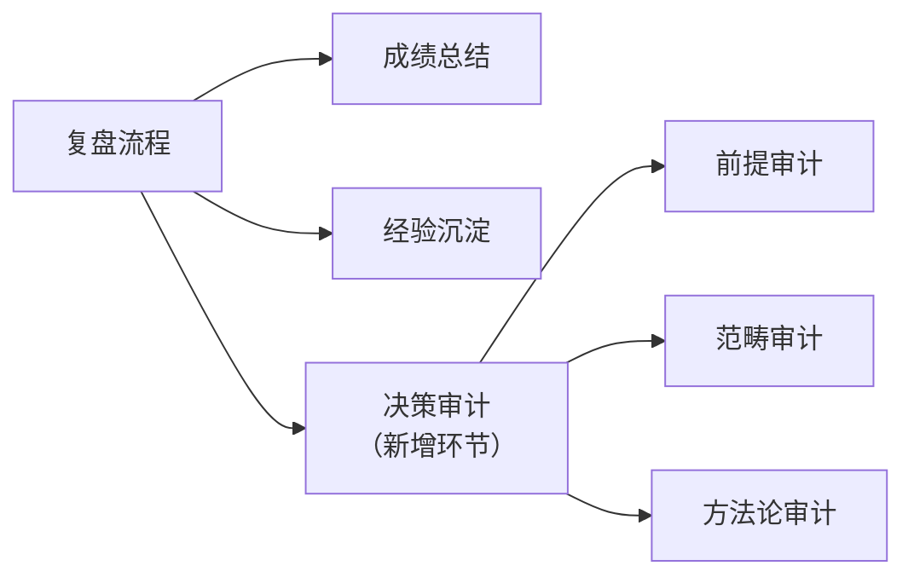

# 复盘的元价值：再思考而非总结

复盘的真正价值不是确认"做对了什么"，而是发现"以为对的可能不对"。如果复盘只是总结成绩，它就是装饰；如果复盘能推翻决策，它才是机制。

本文从 AgentForge 项目综合复盘的实际产出切入，揭示复盘的元价值所在——**它不是总结，而是再思考**。

---

## 一、复盘的两种姿态：总结 vs 再思考

### 1.1 两种复盘姿态的根本差异

复盘可以表现为两种截然不同的姿态：

| 姿态 | 目标 | 产出 | 价值 |
|------|------|------|------|
| **总结** | 确认"做对了什么" | 成绩清单、经验沉淀 | 装饰性 |
| **再思考** | 发现"以为对的可能不对" | 推翻决策、修正前提 | 机制性 |

### 1.2 总结姿态的局限

总结姿态的复盘并非毫无价值，但它有一个根本局限——

> 总结只能确认"已知的已知"，无法发现"已知的未知"。它让团队对成绩感到安心，却无法挑战那些"以为对的可能不对"的决策。

总结姿态的复盘，本质是一种"自我表扬"——它不会挑战任何已决策的行动项，只会确认它们的合理性。

---

## 二、决策审计的价值：推翻已决策但未执行的行动项

### 2.1 本次复盘的最大产出

AgentForge 项目综合复盘的最大产出，不是报告本身，而是**推翻了一个已决策但未执行的行动项**——`taolib → sproutlib` 重命名决策（参见 [设计者偏离](designer-deviation.md)）。

| 维度 | 总结姿态的复盘 | 再思考姿态的复盘 |
|------|---------------|-----------------|
| **对待已决策项** | 默认合理，记录进度 | 重新评估前提是否成立 |
| **对待未执行项** | 视为"待办" | 视为"待重新审视" |
| **产出** | 行动项追踪 | 决策审计报告 |
| **价值** | 装饰性 | 机制性 |

### 2.2 决策审计的核心逻辑

决策审计的核心逻辑是：**未执行的决策不是"待办"，而是"待重新审视"**——

### 2.3 决策审计的三个层面

决策审计应包含三个层面的重新评估：

| 层面 | 检查问题 | 本次复盘的发现 |
|------|----------|---------------|
| **前提审计** | 决策的前提是否仍然成立？ | `sproutlib` 已存在的假设是虚假的（参见 [文档领先于实现](doc-ahead-of-implementation.md)） |
| **范畴审计** | 决策是否混淆了不同世界的职责？ | 混淆了混沌态与脱胎态的职责（参见 [设计者偏离](designer-deviation.md)） |
| **方法论审计** | 决策是否遵循了正确的方法论？ | 违反了"萃取 ≠ 重命名"原则（参见 [萃取方法论](extraction-methodology.md)） |

### 2.4 核心论点

> **复盘的真正价值不是确认"做对了什么"，而是发现"以为对的可能不对"。** 如果复盘只是总结成绩，它就是装饰；如果复盘能推翻决策，它才是机制。

---

## 三、机制建议：复盘约定增加"决策审计"环节

### 3.1 决策审计作为复盘的标准环节

基于本次复盘的产出，建议将"决策审计"作为复盘的标准环节：

### 3.2 决策审计的执行原则

| 原则 | 说明 |
|------|------|
| **覆盖所有未执行项** | 已决策但未执行的行动项必须被审计 |
| **重新评估前提** | 不默认前提成立，而是重新检验 |
| **允许推翻决策** | 审计可以推翻已决策项，而非仅记录进度 |
| **记录推翻理由** | 推翻决策必须留下清晰的溯源记录 |

### 3.3 决策审计与规则生命周期的关联

决策审计与 [规则生命周期](rule-lifecycle.md) 存在关联——

- **规则生命周期**：规则从诞生到退场的状态机；
- **决策审计**：决策从制定到执行（或推翻）的审计机制。

两者共同构成了"决策与规则的演化闭环"——规则可以被挑战（Challenged），决策也可以被推翻（Overturned）。

### 3.4 决策审计的频率

决策审计不需要等到大型复盘才进行，可以嵌入日常流程：

- **日常复盘**：对最近一次决策进行轻量审计；
- **阶段复盘**：对阶段内所有未执行项进行系统审计；
- **项目复盘**：对项目级决策进行全面审计（如本次复盘）。

---

## 四、对项目的启示

1. **复盘应包含"决策审计"环节**：对未执行的已决策项重新评估前提是否仍然成立。
2. **未执行的决策不是"待办"，而是"待重新审视"**：避免错误决策被执行。
3. **复盘的元价值在于"再思考"而非"总结"**：能推翻决策的复盘才是机制。
4. **决策审计应覆盖前提、范畴、方法论三个层面**：全面评估决策的合理性。
5. **复盘本身应被复盘**：检查复盘是否真的在"再思考"，而不仅仅是"总结"。

---

## 参见

- [规则生命周期](rule-lifecycle.md)：规则如何被挑战与修订
- [设计者偏离](designer-deviation.md)：决策审计推翻的具体案例
- [文档领先于实现](doc-ahead-of-implementation.md)：决策前提的虚假性
- [萃取方法论](extraction-methodology.md)：决策方法论的正确性

> 来源：综合复盘报告（`retrospective-agentforge-comprehensive-20260623.md`）（2026-06-23）
