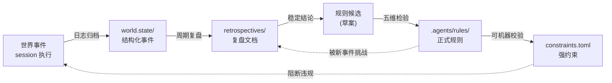
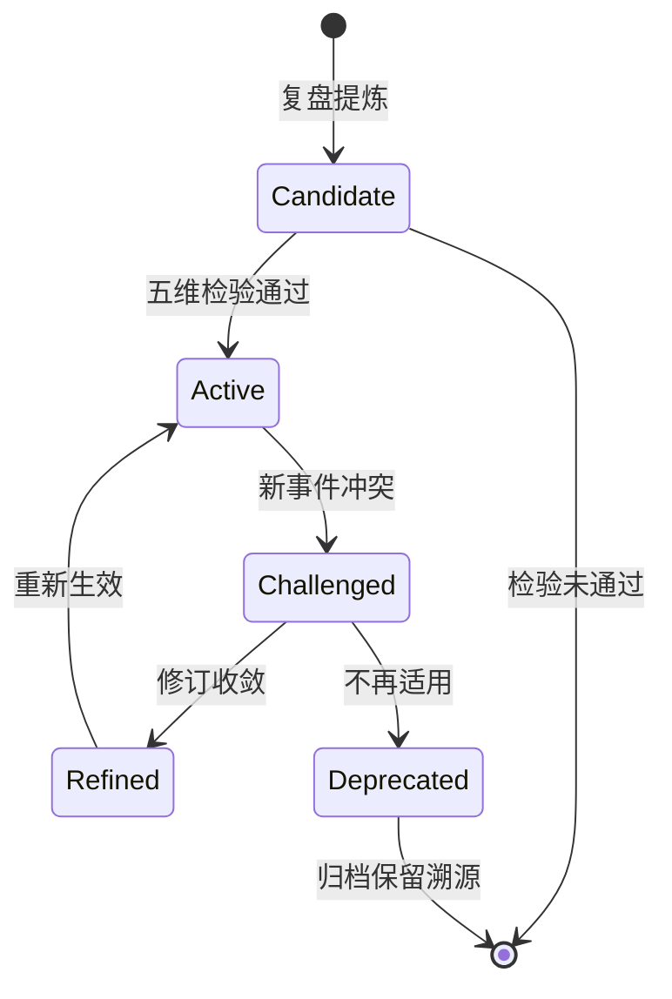

# 规则生命周期：从经验到约束的演化之道

任何以智能体协作为核心的项目，都会经历同一道魔咒：规则越来越多、文档越来越长、约束越来越细——而真正起作用的，反而越来越少。问题不在"是否要写规则"，而在**规则本身缺乏一个生命周期**。它没有诞生标准、没有成长路径、没有衰老姿态、更没有重生通道。

本文承接 [代码架构洞察](code-architecture-insights.md) 提出的"约束即代码"，进一步追问一个元层级问题：**当我们写规则时，谁在为规则立法？**

---

## 一、为什么需要"规则的规则"

规则不是越多越好，也不是越严越好。三类风险天然内嵌在规则系统中：

| 风险 | 表现 | 后果 |
|------|------|------|
| **规则通胀** | 每遇到一次问题就新增一条规则 | 规则数量指数增长，无人能完整记忆与执行 |
| **规则僵化** | 老规则从未被复盘、被替代、被废弃 | 项目演进受困于历史决策的惯性 |
| **规则空转** | 规则只写不查，违反无成本 | 文档变成装饰，行为依然失控 |

宇宙/世界分层（参见 [核心概念：双态孵化模型](../../zh/content/核心概念/双态孵化模型.md)）天然给出一个推论：**规则属于宇宙层（长期、跨世界、可继承），但它的素材必须来自世界层（瞬时、具体、可证伪）**。这意味着——

> 不存在"凭空设计"的规则，只存在"被世界反复印证后蒸馏出来的规则"。

这一推论直接决定了规则需要一套生命周期管理机制：诞生、成长、挑战、精炼或废弃。

---

## 二、经验的自然选择：生长通道模型

### 2.1 从世界到宇宙的信息蒸馏

规则不是写出来的，是被"世界事件"反复冲刷之后，凝结到通道壁上的结晶。

这条通道的核心不在"路径"，而在**门槛**——每一级跃迁都要付出代价：

- 事件 → 复盘：需要时间间隔与认知沉淀；
- 复盘 → 候选：需要至少两次独立印证；
- 候选 → 规则：需要通过五维检验；
- 规则 → 约束：需要可被代码或 CI 自动校验。

### 2.2 准入的五维检验

不是每条复盘都配得上成为规则。一条候选规则进入 `.agents/rules/` 之前，应通过五个维度的检验：

| 维度 | 检验问题 | 不通过的后果 |
|------|----------|--------------|
| **频率** | 是否在不同任务中至少出现 2-3 次？ | 进入"经验池"而非"规则集" |
| **普适性** | 是否跨子世界、跨场景成立？ | 降级为某个 fragment 内规则 |
| **可执行性** | 阅读后能否立即指导行为？ | 改写为更具体的命令式语句 |
| **无害性** | 是否会与既有规则冲突或抑制创新？ | 必须先解决冲突或限定边界 |
| **可验证性** | 违反时能否被人或机器察觉？ | 标记为"软规则"，不进 constraints |

### 2.3 不应成为规则的情况

为避免规则通胀，以下场景**不应**直接转化为规则：

- 一次性偶发问题：归档到 `retrospectives/` 即可；
- 个人偏好：进入 `user_*` 类记忆，而非项目规则；
- 工具特定行为：归入 fragment 或 skill 文档；
- 仍在演化的实验性约定：保留为"草案"状态。

---

## 三、规则的生命周期

### 3.1 状态机模型

一条规则从诞生到退场，应当被显式建模为状态机：

每一次状态迁移都应留下痕迹：哪次复盘触发、哪条事件挑战、哪次决策收敛——这些痕迹本身构成了规则的"族谱"。

### 3.2 三条元规则

为防止规则系统自身失控，需要三条凌驾于具体规则之上的元规则：

- **慢变原则**：规则的修改应慢于代码的修改。任何一周内被反复修改的规则都应回退到 `Candidate` 状态。
- **替代原则**：新增规则时，必须先尝试"修订现有规则"，只有当修订无法收敛时才允许新增。**新增是最贵的操作**。
- **溯源原则**：每条规则必须能追溯到至少一次具体的世界事件（issue、复盘、决策记录），否则视为"无根规则"，应予废弃。

### 3.3 演化触发与执行

规则演化不应是"想到就改"，而应有明确的触发条件与执行路径：

| 触发源 | 演化动作 | 执行位置 |
|--------|----------|----------|
| 新复盘出现稳定结论 | 提议 Candidate | `retrospectives/` PR |
| 现有规则与新事件冲突 | 标记为 Challenged | `.agents/rules/` 元数据 |
| 强约束被反复违反 | 重新审视必要性 | `constraints.toml` 评审会 |
| 长期未触发的规则 | 标记为休眠或废弃 | 季度规则审计 |

执行原则：**规则演化本身也是一次世界事件，必须留痕、可复盘、可挑战**。

---

## 四、多世界冲突的仲裁

随着子世界增多（chaos / rebirth / 未来更多），规则冲突不可避免。冲突仲裁不是要"消灭冲突"，而是要"让冲突可见、可协商"。

### 4.1 冲突类型

| 类型 | 表现 | 典型例子 |
|------|------|----------|
| **状态冲突** | 同一资源被不同世界声明为不同状态 | 两个世界对同一文件的所有权之争 |
| **认知冲突** | 同一概念在不同世界含义不同 | "rule" 在 chaos 是草案、在 rebirth 是规范 |
| **时序冲突** | 规则的发布顺序导致依赖倒置 | 子世界规则先于父世界规则生效 |
| **边界冲突** | 跨世界操作越权 | rebirth 试图修改 chaos 的实现细节 |

### 4.2 协议传递原则

一条核心原则贯穿所有冲突仲裁：

> **世界之间不共享状态，只传递协议。**

这意味着——

- 状态归世界私有（chaos 有自己的 `world.state/`，rebirth 不读取）；
- 协议在宇宙层公开（`AGENTS.md` / `constraints.toml` 强约束）；
- 跨世界协作通过"契约文档"完成，而非直接操作对方资产。

### 4.3 最小契约单元

任何跨世界协作都应明确四要素，作为最小契约单元：

| 要素 | 含义 | 缺失后果 |
|------|------|----------|
| **输出格式** | 交付物的结构与位置 | 接收方需反复猜测 |
| **完成声明** | 何为"完成"的可验证条件 | 无法判定任务终结 |
| **前置条件** | 启动所需的输入与状态 | 任务空转或失败 |
| **非目标声明** | 明确不在范围内的事项 | 范围蔓延、责任模糊 |

---

## 五、本项目的演化实证

AgentForge 自身的规则系统就是这套模型的活样本：

| 阶段 | 规则形态 | 代表产物 |
|------|----------|----------|
| **早期** | 散文式指导，杂糅于 README | 一份长文档承担所有约定 |
| **中期** | 规则文件分化但仍偏通用 | `core-principles.md` 单点辐射 |
| **当前** | 命令式 + 垂直领域分化 | `python.md` / `documentation.md` / `skills.md` 各司其职 |
| **演进中** | 反馈回路显性化 | `retrospectives/` → `rules/` 路径稳定运转 |

可以观察到三条清晰的演化轨迹：

1. **从描述性到命令式**：早期"建议如此"逐步演化为"必须如此 / 禁止如此"。
2. **从单一到分化**：通用规则下沉到垂直领域规则，避免一条规则承担过多语境。
3. **从孤立到闭环**：规则不再凭空诞生，而是从复盘提炼、被事件挑战、被新复盘修订。

这条轨迹本身就是一次"宇宙—世界—生长通道"的活体演练。

---

## 六、结语：让正确的规则自然涌现

回到道家最古老的命题——**道法自然**。规则的最高境界，不是写得多么严密、覆盖多么周全，而是**让正确的规则自然涌现，让过时的规则自然退场**。

AgentForge 的尝试可以归结为三句话：

1. **规则是被印证出来的，不是被设计出来的**——任何凭空写下的规则都缺少根。
2. **规则的生命周期比规则本身更重要**——一条会演化的规则，永远胜过一条"完美的"死规则。
3. **规则系统的健康，体现在它废弃规则的能力上**——只新增不退场的系统终将僵死。

> 规则不是约束自由的牢笼，而是承载经验的河床。河床由水流塑造，水流被河床引导——这才是规则与世界共生的本相。

---

## 参见

- [代码架构洞察](code-architecture-insights.md)：约束即代码的工程落地
- [设计哲学](design-philosophy.md)：项目设计决策的哲学源头
- [哲学洞察](philosophical-insights.md)：东方哲学到工程模式的映射
- [产品与组织洞察](product-organization-insights.md)：约束作为赋能的产品视角
