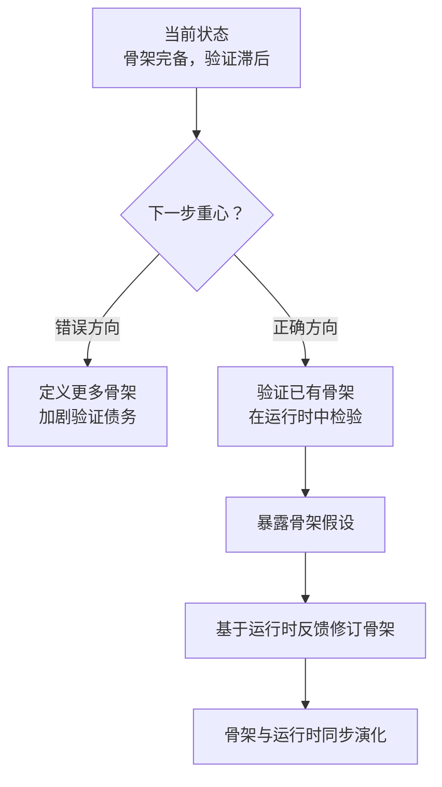

# 骨架与运行时：未经验证的架构是假设

架构骨架可以快速产出，但未经运行时验证的骨架是假设，不是架构。设计文档的完整度远超实际验证的覆盖度时，项目就陷入了"骨架领先于运行时"的状态——看起来很完整，实际上很多假设从未被检验。

本文承接 [代码架构洞察](code-architecture-insights.md) 提出的"约束即代码"，进一步追问：**当架构骨架的定义速度远超运行时验证速度时，项目面临什么风险？**

---

## 一、现状分析：Harness 6 层骨架 vs Phase 0 验证缺失

### 1.1 骨架与验证的错位

AgentForge 的 Harness 系统呈现出典型的"骨架领先于运行时"特征：

| 维度 | 骨架定义 | 运行时验证 | 错位 |
|------|----------|-----------|------|
| **架构层级** | 6 层（core/runtime/agents/pipelines/eval/devtools） | Phase 0 兼容性验证部分完成 | ⚠️ 骨架领先 |
| **跨层交互** | 三大跨层交互模式已定义 | 未在运行时验证 | ⚠️ 假设未验证 |
| **设计文档** | 完整的 6 层架构文档 | 实际运行覆盖度低 | ⚠️ 文档领先（参见 [文档领先于实现](doc-ahead-of-implementation.md)） |

### 1.2 骨架领先的成因

骨架领先于运行时，是项目早期建设的自然结果：

```mermaid
flowchart LR
    A["架构设计阶段<br/>快速产出骨架"] --> B["骨架完整度高<br/>但未验证"]
    B --> C["形成"骨架领先"状态"]
    C --> D["设计文档完整度<br/>远超运行时验证覆盖度"]
    D --> E["风险：<br/>假设被误认为事实"]
```

骨架的产出速度远快于运行时验证——定义一个 6 层架构只需数天，而验证每一层的运行时行为需要数周甚至数月。这种速度差天然制造了骨架与运行时的鸿沟。

---

## 二、风险评估：骨架领先与运行时滞后的鸿沟

### 2.1 骨架领先的三个风险

骨架领先于运行时，会带来三个层面的风险：

| 风险 | 表现 | 后果 |
|------|------|------|
| **假设误判** | 把未验证的骨架当作已验证的架构 | 后续决策基于错误前提 |
| **债务积累** | 骨架越定义越多，验证债务越积越大 | 验证工作变得不可承受 |
| **方向漂移** | 骨架定义脱离运行时反馈 | 架构设计与实际需求脱节 |

### 2.2 与"治理鸿沟"的同构性

骨架领先与 [治理鸿沟](governance-gap.md) 描述的现象同构——

- **骨架领先**：架构已定义但未验证；
- **治理鸿沟**：制度已建立但无执行者。

两者都是"定义超前于验证"的不同表现形式，本质都是把"假设"当成了"事实"。

### 2.3 骨架的"虚假完整感"

骨架领先制造了一种"虚假完整感"——

> 当一个 6 层架构的设计文档完整呈现时，它给人一种"架构已完成"的错觉。但实际上，未经运行时验证的骨架只是假设——它可能正确，也可能在第一行运行时代码面前崩塌。

---

## 三、行动建议：从"定义"转向"验证"

### 3.1 重心转移：从定义更多骨架到验证已有骨架

基于骨架领先的分析，下一阶段的重心应从"定义更多骨架"转向"验证已有骨架"：



### 3.2 验证优先于定义的理由

| 理由 | 说明 |
|------|------|
| **未验证的骨架是假设** | 假设需要被检验，而不是被扩展 |
| **验证能暴露真实问题** | 运行时会暴露骨架定义的盲点 |
| **验证是骨架的"启动条件"** | 没有验证的骨架无法支撑后续建设 |
| **避免骨架过度设计** | 运行时反馈能阻止骨架无节制膨胀 |

### 3.3 验证的最小可行方案

验证骨架不需要等到"完整运行时"出现，可以采用最小可行方案：

- **逐层验证**：从最底层（core）开始，逐层向上验证；
- **最小用例**：为每一层定义最小可验证用例；
- **兼容性验证**：优先验证 Phase 0 兼容性（如 Python 3.14 + LangGraph + Metaflow）；
- **跨层交互验证**：验证三大跨层交互模式是否真的能跑通。

### 3.4 核心论点

> **一个经过验证的 3 层架构，价值高于一个未验证的 6 层架构。** 未经验证的架构是假设，不是架构——下一阶段的重心应从"定义更多骨架"转向"验证已有骨架"。

---

## 四、对项目的启示

1. **验证优先于定义**：在骨架未验证的情况下，新增骨架定义只会加剧验证债务。
2. **骨架应标注"验证状态"**：类似 [文档领先于实现](doc-ahead-of-implementation.md) 的标注规范，骨架文档应显式标注"已验证"或"待验证"。
3. **避免"骨架完整度"陷阱**：不要把"骨架定义完整"等同于"架构已完成"。
4. **运行时反馈应驱动骨架修订**：骨架不是单向输出，而是与运行时双向演化。
5. **复盘应包含"骨架验证审计"**：检查骨架是否真的在运行时中验证过（参见 [复盘的元价值](retrospective-rethinking.md)）。

---

## 参见

- [代码架构洞察](code-architecture-insights.md)：约束即代码的工程落地
- [治理鸿沟](governance-gap.md)：制度超前于执行的同构现象
- [文档领先于实现](doc-ahead-of-implementation.md)：文档如何制造虚假完成感
- [复盘的元价值](retrospective-rethinking.md)：骨架验证的审计环节

> 来源：[综合复盘报告](../../../apps/chaos/.agents/docs/superpowers/retrospectives/retrospective-agentforge-comprehensive-20260623.md)（2026-06-23）
