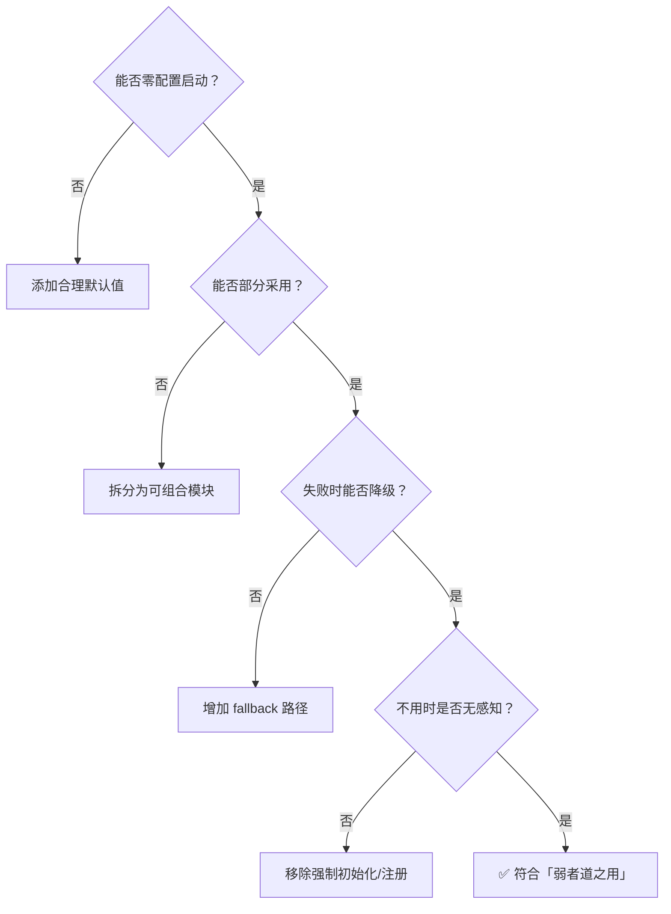

# 「弱者道之用」—— API 设计的柔性哲学

> "天下莫柔弱于水，而攻坚强者莫之能胜。" —— 《道德经》第七十八章

**核心命题**：最强大的 API 不是功能最多、约束最强的，而是**最柔、最弱、最少假设**的。

---

## 一、「弱」的五重工程语义

| 「弱」的维度 | API 设计体现 | 反面（刚性设计） |
|---|---|---|
| **弱假设** | 不假设调用者的上下文、能力、意图 | 强制要求特定环境/依赖 |
| **弱耦合** | 接口只传递协议，不传递实现 | 返回具体类、暴露内部状态 |
| **弱侵入** | 接入成本趋近于零，可渐进采用 | 全量迁移、不可部分使用 |
| **弱约束** | 给默认值，允许覆盖，不强制路径 | 必填参数过多、行为不可配置 |
| **弱存在** | 不用时无感知，用时恰到好处 | 无论用否都占据资源/注意力 |

---

## 二、具体设计模式

### 1. 零配置启动 + 渐进式深入（水之善下）

```python
# 「弱」：零参数即可运行，合理默认
client = WorldClient()

# 渐进加深，按需覆盖
client = WorldClient(
    registry="custom-registry.toml",  # 可选
    timeout=30,                        # 可选
    hooks=[MyHook()],                  # 可选
)
```

**哲学映射**：水善利万物而不争，处众人之所恶。API 不争"控制权"，只在被需要时才显现配置能力。

### 2. 空实现默认 + Hook 注入点（无为而无不为）

```python
class TokenEventHook:
    """默认空实现——不做任何事，但留下了做一切事的可能性"""
    def on_token_refresh(self, token): pass
    def on_token_expire(self, token): pass
    def on_error(self, error): pass
```

**哲学映射**：「无为」不是不能为，而是**不主动强加行为**。Hook 的默认空实现意味着：系统默认「无为」，但保留了「无不为」的通道。

### 3. 协议传递而非状态传递（大道无形）

```python
# 刚性设计：传递具体对象（强耦合）
def process(session: GitHubSession):
    repo = session.repo  # 依赖具体实现

# 柔性设计：传递协议/契约（弱耦合）
def process(context: Mapping[str, Any]):
    repo = context.get("repo")  # 只依赖协议
```

**哲学映射**：道无形无名，却运行万物。好的 API 传递的是「协议」而非「实体」——你不需要知道对方是谁，只需要知道对方遵循什么契约。

### 4. 优雅降级而非硬性失败（曲则全）

```python
# 刚性：缺少条件则直接报错
def get_token(self):
    if not self.config.app_id:
        raise ConfigError("app_id is required!")

# 柔性：缺少条件则降级，尽力而为
def get_token(self):
    if self.config.app_id:
        return self._get_app_token()
    if self.config.personal_token:
        return self._get_personal_token()
    return self._get_anonymous_access()  # 最低限度可用
```

**哲学映射**：「曲则全，枉则直」。不追求完美条件下的完美表现，而是追求**任何条件下的最佳可能**。

### 5. 可选组合而非必选继承（万物负阴而抱阳）

```python
# 刚性：强制继承，一旦接入必须全量实现
class MyAgent(BaseAgent):  # 必须实现 10 个抽象方法

# 柔性：Mixin 组合，按需接入
class MyAgent(
    RoutingMixin,      # 只要路由能力
    ContextMixin,      # 只要上下文管理
):
    pass  # 不需要的能力根本不出现
```

**哲学映射**：万物负阴而抱阳，冲气以为和。好的 API 是阴阳可拆、可合、可独立存在的——而非铁板一块。

---

## 三、「弱」的终极检验标准



---

## 四、总结

> **最强的 API 不是让你"必须怎样用"，而是让你"怎样用都行"——然后在你需要深入时，恰好有路可走。**

这就是「弱者道之用」的工程本质：**以最小的存在感，承载最大的可能性。**
